# Github CI/CD Library

Release `1.0.0` · [Compatibility](https://github.com/grootan-devops/ai-skills/blob/main/COMPATIBILITY.md) · [Security](./SECURITY.md) · [Contributing](./CONTRIBUTING.md)

Reusable GitHub Actions workflows (`workflow_call`)

---

## Contents

- [Quick Start](#quick-start)
  - [Caller-side permissions](#caller-side-permissions)
  - [Concurrency & cancellation](#concurrency--cancellation)
- [Pipeline Phases & Lifecycle](#pipeline-phases--lifecycle)
- [Caller Dependency Map](#caller-dependency-map)
- [Execution Model & Trigger Strategy](#execution-model--trigger-strategy)
  - [The Two-Tier Release Model](#the-two-tier-release-model)
  - [Available Scenario Workflows](#available-scenario-workflows)
  - [Comprehensive Execution Matrix](#comprehensive-execution-matrix)
- [End-to-End Workflow DAGs & Architecture](#end-to-end-workflow-dags--architecture)
  - [1. Automatic Pull Request Verification](#1-automatic-pull-request-verification)
  - [2. Fast-Track Production Release Tagging & OCI Promotion](#2-fast-track-production-release-tagging--oci-promotion)
  - [3. GitOps Targeted Deployment](#3-gitops-targeted-deployment)
  - [4. Standalone Quality & Security Audits](#4-standalone-quality--security-audits)
- [Module Catalog](#module-catalog)
  - [init & check](#init--check)
  - [nodejs](#nodejs)
  - [python](#python)
  - [golang](#golang)
  - [java](#java)
  - [image](#image)
    - [Dockerfile Standards & Multi-Stack Reference](#dockerfile-standards--multi-stack-reference-packaging-only--non-root-1000110001)
    - [The Inverted `.dockerignore` Allowlist Standard](#the-inverted-dockerignore-allowlist-standard-default-deny)
  - [chart](#chart)
  - [terraform](#terraform)
  - [sonarqube](#sonarqube)
  - [secret-scanning](#secret-scanning)
  - [license](#license)
  - [sbom](#sbom)
  - [deploy/gitops](#deploygitops)
  - [release & notify](#release--notify)
  - [mono](#mono)
- [Key Variables & Configuration](#key-variables--configuration)
- [Ignored CVEs & Licenses (`ignored-cves.yml`)](#ignored-cves--licenses-ignored-cvesyml)
- [Scan Exit Codes](#scan-exit-codes)
- [DevOps Reference & Platform Defaults](#devops-reference--platform-defaults)
- [Project-Level Integration Examples (All Permutations)](#project-level-integration-examples-all-permutations)
  - [1. Node.js Full Stack](#1-nodejs-full-stack-app--docker--helm--multi-env-gitops-deploy)
  - [2. Python FastAPI / Service](#2-python-fastapi--service-app--docker--helm)
  - [3. Golang Service / Binary Distribution](#3-golang-service--binary-distribution)
  - [4. Java / Spring Boot Microservice](#4-java--spring-boot-microservice)
  - [5. Pure Helm Chart Repository](#5-pure-helm-chart-repository)
  - [6. Terraform Infrastructure / Module Registry](#6-terraform-infrastructure--module-registry)
  - [7. Monorepo with Matrix Fan-Out](#7-monorepo-with-matrix-fan-out)
  - [8. Security & Code Quality Audit Only Pipeline](#8-security--code-quality-audit-only-pipeline)
  - [9. Standalone Build & Unit Test Verification](#9-standalone-build--unit-test-verification)
  - [10. Standalone Release Prerequisites & Conflict Check](#10-standalone-release-prerequisites--conflict-check)
- [Migration Guide & Standard](#migration-guide--standard)

---

## Quick Start

Two files give you a complete pipeline. `init.yml` resolves every version, tag and
repository path once; every other workflow consumes its outputs.

```yaml
# .github/workflows/pr.yml
name: CI · PR Verification
on:
  pull_request:
    branches: [master]
concurrency:
  group: "${{ github.workflow }}-${{ github.ref }}"
  cancel-in-progress: true
permissions:
  contents: read
  packages: write
  actions: write
  checks: write

jobs:
  init:
    uses: grootan-devops/github-ci-library/.github/workflows/init.yml@1.0.0
    secrets: inherit

  # Runs alongside the image chain. A linter gates nothing.
  lint:
    uses: grootan-devops/github-ci-library/.github/workflows/lint.yml@1.0.0
    secrets: inherit

  build:
    uses: grootan-devops/github-ci-library/.github/workflows/python-build.yml@1.0.0
    secrets: inherit

  # Pulls the Trivy databases once so every scan restores them.
  trivy-cache:
    needs: init
    uses: grootan-devops/github-ci-library/.github/workflows/trivy-cache.yml@1.0.0
    secrets: inherit

  image:
    needs: [init, build]
    uses: grootan-devops/github-ci-library/.github/workflows/docker.yml@1.0.0
    secrets: inherit
    with:
      image-tag: ${{ needs.init.outputs.image-push-tag }}
      image-repository: ${{ needs.init.outputs.image-push-repository }}

  scan:
    needs: [init, image, trivy-cache]
    uses: grootan-devops/github-ci-library/.github/workflows/scan.yml@1.0.0
    secrets: inherit
    with:
      scan-type: image
      image-ref: ${{ needs.image.outputs.image-ref-digest }}

  # Guards depend on init alone: they ask whether a tag, changelog entry and
  # image version are still free, which no build or scan can change.
  check:
    needs: init
    uses: grootan-devops/github-ci-library/.github/workflows/check.yml@1.0.0
    secrets: inherit
    with:
      tag: ${{ needs.init.outputs.tag }}
      image-tag: ${{ needs.init.outputs.image-tag }}
      image-repository: ${{ needs.init.outputs.image-repository }}
```

```yaml
# .github/workflows/release.yml
name: CD · Production Release
on:
  push:
    branches: [master]
concurrency:
  group: "release-${{ github.ref }}"
  cancel-in-progress: false
permissions:
  contents: write
  packages: write
  actions: write

jobs:
  init:
    uses: grootan-devops/github-ci-library/.github/workflows/init.yml@1.0.0
    secrets: inherit

  trivy-cache:
    needs: init
    uses: grootan-devops/github-ci-library/.github/workflows/trivy-cache.yml@1.0.0
    secrets: inherit

  # The candidate is scanned here, not trusted from the pull request run: it may
  # have sat in the dev repository for days.
  scan:
    needs: [init, trivy-cache]
    uses: grootan-devops/github-ci-library/.github/workflows/scan.yml@1.0.0
    secrets: inherit
    with:
      scan-type: image
      image-repository: ${{ needs.init.outputs.image-dev-repository }}
      target-version: ${{ needs.init.outputs.candidate-image-tag }}

  image:
    needs: [init, scan]
    uses: grootan-devops/github-ci-library/.github/workflows/docker.yml@1.0.0
    secrets: inherit
    with:
      is-release: true
      image-tag: ${{ needs.init.outputs.tag }}
      release-tag: ${{ needs.init.outputs.tag }}
      candidate-tag: ${{ needs.init.outputs.candidate-image-tag }}
      image-repository: ${{ needs.init.outputs.image-repository }}
      image-dev-repository: ${{ needs.init.outputs.image-dev-repository }}
      # Required. docker.yml cannot depend on a scan that lives here, so it
      # refuses to promote unless the verdict is handed to it.
      scan-result: ${{ needs.scan.result }}

  release:
    needs: [init, image]
    uses: grootan-devops/github-ci-library/.github/workflows/release.yml@1.0.0
    secrets: inherit
    with:
      tag: ${{ needs.init.outputs.tag }}
      upstream-run-id: ${{ needs.init.outputs.upstream-run-id }}
```

Before the first run, set the organisation variables and secrets listed under
[Key Variables & Configuration](#key-variables--configuration). Every caller passes
`secrets: inherit`.

### Caller-side permissions

A reusable workflow's `permissions:` block is a **ceiling request, not a grant** — the job
runs with the *caller's* token, and GitHub will not hand it a scope the caller did not have.
Declare at least the following in the calling workflow, or the library's jobs fail at
runtime with a 403 that names neither file:

| Calling scenario | Required `permissions:` |
|---|---|
| Pull request verification | `contents: read`, `packages: write`, `actions: write`, `checks: write` |
| Production release | `contents: write`, `packages: write`, `actions: write` |
| Deploy only | `contents: read`, `actions: read` |
| Audit only (scan, lint, SonarQube) | `contents: read`, `actions: write`, `checks: write` |

`contents: write` is needed only to create the git tag and GitHub Release. `packages: write`
covers image and chart pushes. `actions: write` lets the release restore the candidate run's
artifacts *and* lets `trivy-cache.yml` replace the `trivy-db` entry. `checks: write`
publishes test and scan results as Checks.

`actions: read` is enough to run, but not to refresh the Trivy cache: GitHub cache entries
are immutable, so the stable `trivy-db` key has to be deleted before it can be rewritten.
Without `actions: write` the warm job warns and leaves the existing entry in place, and
every scan re-downloads roughly 1GB of vulnerability database.

> [!IMPORTANT]
> The repository's default token scope caps all of this. If **Settings → Actions → General →
> Workflow permissions** is set to read-only, `contents: write` is denied and the release
> cannot tag, whatever the workflow declares.

### Promotion requires a scan verdict

`docker.yml` and `buildah.yml` refuse to promote an image unless the caller proves it was
scanned. The scan job lives in *your* workflow, so the library cannot make `promote` depend
on it — the verdict has to be handed over:

```yaml
  image:
    needs: [init, scan]
    uses: grootan-devops/github-ci-library/.github/workflows/docker.yml@1.0.0
    with:
      is-release: true
      scan-result: ${{ needs.scan.result }}
```

| Input | Default | Effect |
|---|---|---|
| `require-scan` | `true` | Promotion refuses unless `scan-result` is `success`. |
| `scan-result` | `""` | The scan job's `result`. Empty means refused. |

It fails closed and it fails loudly: a caller that forgets `scan-result` gets an empty
value and the promote job **errors**, naming the fix. It is a failing step rather than a
job condition on purpose — a skipped job reads as success to the caller's graph, so
refusing by condition would let a release carry on having promoted nothing.

Set `require-scan: false` only for an artifact with no scan in its pipeline.

### Concurrency & cancellation

GitLab pins `interruptible: false` on the release jobs (`release/.gitlab-ci.yml:7`) and on
both deploy jobs (`deploy/gitops/.argocd.gitlab-ci.yml:148`,
`deploy/gitops/.komodo.gitlab-ci.yml:78`), so the project-level
`auto_cancel.on_new_commit: conservative` can never cancel a promotion or a deploy that is
already running.

**A reusable workflow cannot declare `concurrency:`** — the key is only valid on the
calling workflow. The guarantee therefore does not survive the port on its own; it is the
caller's to reinstate.

| Calling scenario | `group:` | `cancel-in-progress:` |
|---|---|:--:|
| Pull request verification | `${{ github.workflow }}-${{ github.ref }}` | `true` |
| Production release (`release.yml`) | `release-${{ github.ref }}` | **`false`** |
| GitOps deploy (`deploy-*-gitops.yml`) | `deploy-${{ inputs.environment }}` | **`false`** |

A release caller that carries `workflow_dispatch` should also refuse a ref that is not the
default branch. GitLab forbids a manual release outright (`.release-rules` sends `web` and
`api` pipelines to `when: never`); a GitHub dispatch is looser still, because it can target
any ref, so without that guard a release can be cut from a feature branch. `self-cd.yml`'s
`guard-ref` job is the reference implementation.

> [!WARNING]
> Leave a release or deploy caller at `cancel-in-progress: true` and the next push or
> dispatch cancels the run already in flight. A release cancelled between `publish` and
> `notify` leaves the git tag and the GitHub Release created but the assets and the Teams
> card never sent — and the next run will not re-cut it, because the tag is now taken. A
> deploy cancelled between the GitOps commit and the Komodo or ArgoCD sync leaves the
> cluster on the old image while the GitOps repository claims the new one. Cancelling PR
> verification costs a rebuild; cancelling a promotion costs a broken release.

---

## Pipeline Phases & Lifecycle

GitHub Actions has no `stages:` keyword. The GitLab stage order is expressed as `needs:`
edges between jobs, which means a job starts the moment its own inputs are ready rather
than waiting for an entire stage to drain.

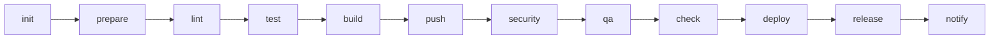

| Phase | Purpose | Workflow · Job |
|---|---|---|
| `init` | Version discovery, registry target resolution, promotion provenance | `init.yml` · `initialize` |
| `prepare` | Warm package manager and Trivy database caches | `*-build.yml` · `dependency`, `trivy-cache.yml` · `warm` |
| `lint` | Style, syntax, YAML, Dockerfile and chart linting | `lint.yml`, `python-lint.yml`, `golang-lint.yml`, `node-lint.yml`, `terraform-lint.yml`, `chart.yml` · `lint` |
| `test` | Unit tests and coverage, published as GitHub Checks | `*-build.yml` · `test` |
| `build` | Compile, package images and charts, generate SBOM | `*-build.yml` · `build`, `docker.yml`, `buildah.yml`, `chart.yml` · `build`, `sbom.yml` · `generate` |
| `push` | Publish candidate artifacts to the dev repositories | `docker.yml` · `build`, `chart.yml` · `push` |
| `security` | Trivy CVE, misconfiguration, license and secret scans | `scan.yml`, `sbom.yml` · `scan`, `secret-scanning.yml` |
| `qa` | Quality gates and container verification | `sonarqube.yml`, `docker.yml` · `test`, `terraform-test.yml` |
| `check` | Release prerequisite guards | `check.yml` · six guards + `verdict` |
| `deploy` | GitOps repository updates and sync | `deploy-argocd-gitops.yml`, `deploy-komodo-gitops.yml` |
| `release` | Tag, GitHub Release, OCI promotion | `release.yml`, `docker.yml` · `promote`, `chart.yml` · `promote` |
| `notify` | Microsoft Teams Adaptive Card | `release.yml` · `notify`, `notify.yml` |

> [!NOTE]
> There is no `trigger` phase. GitHub cannot call a reusable workflow from a matrix, so the
> monorepo child-pipeline pattern is replaced by `mono.yml`, which returns a matrix the
> caller fans out over. See [mono](#mono).

---

## Caller Dependency Map

In GitLab every job carried its own `needs:`, so the dependency graph shipped **inside** the
library. In GitHub the library ships jobs, but the edges *between* library workflows belong
to the calling workflow. This table gives, for each library workflow, the GitLab job it
ports and the `needs:` a caller must declare — derived from the GitLab `needs:` graph rather
than guessed.

Edges marked *internal* are already declared inside the library workflow; a caller must not
repeat them.

| Library workflow · job | GitLab job(s) | Caller must declare | Derived from |
|---|---|---|---|
| `init.yml` · `initialize` | `Common:Init` | *(nothing — it is the root)* | — |
| `trivy-cache.yml` · `warm` | `Trivy:Cache:Warm` | `needs: init` | `Common:Init` |
| `lint.yml` | `.YAML:Lint`, `Changelog:Lint`, Dockerfile & chart-values lint | `needs: init` | `Common:Init` |
| `node-lint.yml` | `Node:Lint` | `needs: init` | `Common:Init` |
| `python-lint.yml` | `.python-lint-common` | `needs: [init, build]` | `Python:Dependency:Download` |
| `golang-lint.yml` | `.go-lint-common` | `needs: [init, build]` | `Go:Dependency:Download` |
| `*-build.yml` · `dependency` → `build` ∥ `test` | `.Node:Build`, `.Python:Build`, `.Go`, `.java-common` | `needs: init` | `Common:Init`; the `*:Dependency:Download` edge is *internal* |
| `docker.yml` / `buildah.yml` · `lint` → `build` → `test` / `promote` | `Image:Build`, `Image:Push`, `.Image:Test`, `Image:Promote` | `needs: [init, build]` when the image copies build output, else `needs: init` | `Common:Init`; `Image:Push` → `Image:Build` is *internal* |
| `chart.yml` · `docs` ∥ `lint` → `build` → `push` / `promote` | `Chart:Check:README`, `Chart:Lint`, `Chart:Build`, `Chart:Push`, `Chart:Promote` | `needs: init` | `Common:Init`; `Chart:Build` → `Chart:Lint` is *internal* |
| `scan.yml` (`scan-type: image`) | `Image:Scan` | `needs: [init, image, trivy-cache]` | `Common:Init`, `Image:Build`, `Trivy:Cache:Warm` |
| `scan.yml` (`scan-type: config`) | `Chart:Scan` | `needs: [init, chart, trivy-cache]` | `Common:Init`, `Chart:Lint`, `Trivy:Cache:Warm` |
| `scan.yml` (`scan-type: license`) | `License:Scan` | `needs: [init, trivy-cache]` | `Common:Init` |
| `sbom.yml` · `generate` → `scan` | `SBOM:Generate`, `SBOM:Scan` | `needs: [init, trivy-cache]` | `Common:Init`, `Trivy:Cache:Warm`, `Java:Dependency:Download`; `SBOM:Scan` → `SBOM:Generate` is *internal* |
| `secret-scanning.yml` | `Git:Secret:Scan` | `needs: init` | `Common:Init` |
| `sonarqube.yml` | `Sonarqube` | `needs: [init, build]` | `Common:Init`, `Project:Build`, `Project:Unit:Test` |
| `terraform-lint.yml` | `Terraform:Init`, `Terraform:Validate`, `Terraform:Lint`, `Terraform:Check:README` | `needs: init` | `Common:Init`; `Terraform:Init` → `Validate` / `Lint` is *internal* |
| `terraform-test.yml` | `Terraform:Scan` | `needs: [init, terraform-lint, trivy-cache]` | `Terraform:Validate` **(required)**, `Trivy:Cache:Warm` |
| `check.yml` · six guards → `verdict` | `Tag:Tag Existence`, `Changelog:Check Existence`, `Migration:Check Existence`, `Chart:Check Existence`, `Chart:Check:Dependency`, `Image:Check Existence` | **`needs: init` — and nothing else** | `.check-job-common` → `Common:Init`. See the warning below. |
| `deploy-komodo-gitops.yml` · `validate` → `komodo-deploy` | `Deploy:Komodo:Validate:Image:<env>`, `Deploy:Komodo:<env>` | `needs: init`; add `image` when the same run pushed it | `Common:Init`, `Image:Push`; the `Validate:Image` edge is now *internal* |
| `deploy-argocd-gitops.yml` · `validate` → `gitops-commit` → `sync` | `Deploy:ArgoCD:Validate:Chart/Image:<env>`, `Deploy:ArgoCD:<env>` | `needs: init`; add `image` / `chart` when the same run published them | `Common:Init`, `Image:Push`, `Chart:Push`; the `Validate:*` edges are *internal* |
| `release.yml` · `collect` → `publish` → `notify` | `Release:Upload`, `Release`, `Release:Notification:Teams` | `needs: [init, image, chart]` — whichever of `image` / `chart` this run promotes | `Release:Upload` → `Common:Init`, `Image:Promote`, `Chart:Promote`; `Release` → `Release:Upload` **(required)** is *internal* |
| `notify.yml` | `Release:Notification:Teams` | `needs: init` **(required, not optional)**; add `check` for the changelog artifact | `Common:Init` — the library's only `optional: false` edge |
| `mono.yml` · `discover` | `Trigger:*` child pipelines | *(nothing — it is a root)* | — |

> [!WARNING]
> **`check.yml` depends on `init` alone. Never write `needs: [init, build]` or
> `needs: [init, scan]` for it.** Every guard extends GitLab's `.check-job-common`
> (`common/.gitlab-ci.yml:405`), whose only edge is `Common:Init` — not `build`, not `scan`,
> not `image`. The guards ask questions about the *repository*: does this git tag already
> exist, is this chart version taken, does a chart dependency still point at a dev
> repository. Nothing a build or a scan does can change any of those answers. Chaining the
> guards behind `build` delays the one signal that should fail fastest and, because
> `Verdict` is the required status check, holds the pull request open on a verdict
> that was knowable in seconds.

A note on the GitLab edges the table is derived from: `optional: true` there means *"ignore
this edge if the job is not in this pipeline"*, **not** *"ignore it if the job failed"*. The
GitHub equivalent is to list a job in `needs:` only when the caller actually includes it —
which is why the single-focus scenario files declare `needs: init` and nothing more. Where
the library tolerates a skipped upstream *within* its own graph it uses
`needs.<job>.result != 'failure'` rather than dropping the edge.

---

## Execution Model & Trigger Strategy

### The Two-Tier Release Model

The library implements the same **Two-Tier Release Model** as the GitLab library: maximum
developer velocity, zero redundant builds, and complete supply-chain traceability.

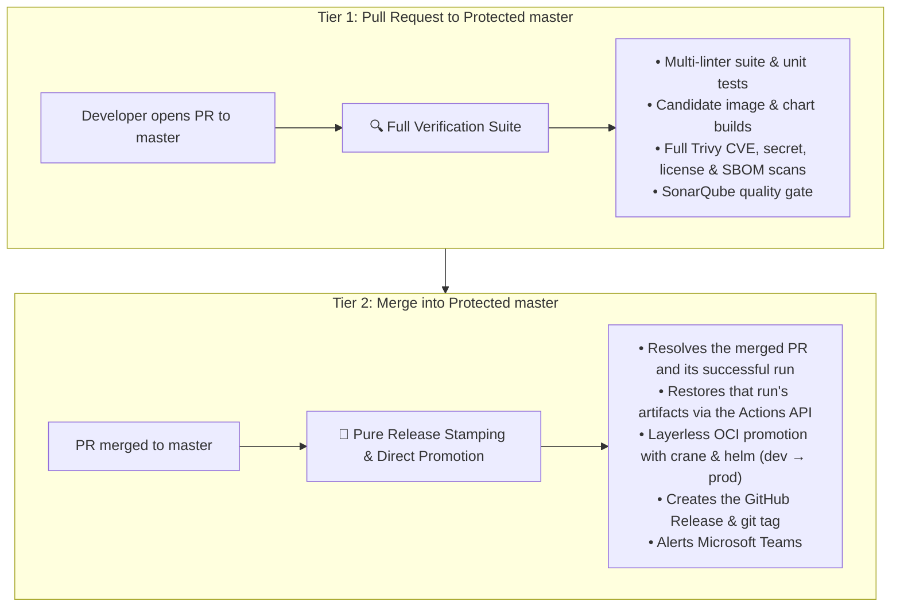

- **Silenced feature branches.** `on: pull_request: branches: [master]` and
  `on: push: branches: [master]` mean pushes to `dev` or `feature/*`, and pull requests
  between non-release branches, produce **zero runs**.
- **Release-branch protection on manual runs.** When a workflow is dispatched manually on
  `master` or a protected `*/master`, `init.yml` forces a
  `-<run_number>.r<run_attempt>` candidate suffix and routes every push to the **dev**
  repositories. A manual run can never overwrite a published artifact.
- **Nothing is rebuilt for production.** `docker.yml` and `chart.yml` in `is-release: true`
  mode do not build. They resolve the candidate the pull request scanned and promote it by
  digest, so the released bytes are provably the scanned bytes.
- **Every dependency is explicit.** Jobs declare `needs:`, and optional upstreams are
  tolerated with `needs.<job>.result != 'failure'` so single-focus workflows run without
  waiting on skipped jobs.

---

### Available Scenario Workflows

GitLab exposes a `WORKFLOW` dropdown on manual runs. GitHub greys out skipped jobs in the
run graph, so **one workflow file per scenario** keeps each graph clean and lets `run-name`
be specific. Add `workflow_dispatch` to any of these for on-demand runs.

| Scenario file | Calls | Description | Key dispatch inputs |
|---|---|---|---|
| `pr.yml` | `init` + `lint` + `*-build` + `docker` + `scan` + `check` | Full pre-merge verification. | — |
| `release.yml` | `init` + `docker`/`chart` promote + `release` | Tag, promote, publish, notify. | — |
| `deploy.yml` | `deploy-argocd-gitops` / `deploy-komodo-gitops` | Targeted GitOps deployment without building. | `environment` *(required)*, `target-version` |
| `image-scan.yml` | `scan` (`scan-type: image`) | Scans an existing remote image tag. | `target-version` *(required)* |
| `chart-scan.yml` | `scan` (`scan-type: config`) | Renders and scans a local or remote chart. | `target-version`, `helm-values` |
| `license-scan.yml` | `scan` (`scan-type: license`) | Dependency licence compliance audit. | — |
| `sbom.yml` | `sbom` | CycloneDX SBOM generation + CVE scan. | — |
| `secret-scan.yml` | `secret-scanning` | Betterleaks git-history audit. | `full-history` |
| `sonarqube.yml` | `sonarqube` | Analysis and quality gate. | — |
| `lint.yml` | `lint` + language linters | Multi-linter suite. | — |
| `build.yml` | `init` + `*-build` | Build and unit test only. | — |
| `check.yml` | `init` + `check` | Release prerequisite guards only. | — |

---

### Comprehensive Execution Matrix

| # | Scenario | Trigger | Automatic? | Jobs | Scope & Primary Purpose |
|---|---|---|:---:|:---:|---|
| **1** | **PR to protected master** | `pull_request` → `master` | ✅ Yes | ~30 | **Full verification suite**: linters, unit tests, candidate image and chart builds, CVE scans, SonarQube gate. |
| **2** | **Production release** | `push` → `master` | ✅ Yes | 6 | **Release stamping & OCI promotion**: resolves the PR's run, promotes candidate image/chart by digest, creates the GitHub Release and tag, alerts Teams. Zero builds, tests or scans. |
| **3** | **Branch push / non-release PR** | `push` → `dev`, `feature/*` | ❌ No | 0 | **Silenced**: no runner minutes consumed on developer branches. |
| **4** | **Deploy (ArgoCD / Komodo)** | `workflow_dispatch` | 🔘 Manual | 3 | **Targeted GitOps deployment**: validates inputs, verifies the image and chart exist, commits to the GitOps repository, syncs. |
| **5** | **Container image scan** | `workflow_dispatch` | 🔘 Manual | 1 | **Remote image scan**: resolves the tag against the prod or dev repository and runs Trivy. |
| **6** | **Helm chart scan** | `workflow_dispatch` | 🔘 Manual | 1 | **Chart security scan**: `helm template` render, then Trivy config scan. |
| **7** | **Git secret scan** | `workflow_dispatch` | 🔘 Manual | 1 | **Secret audit**: full git history via betterleaks. |
| **8** | **Licence compliance scan** | `workflow_dispatch` | 🔘 Manual | 1 | **Open-source audit** against the licence classification policy. |
| **9** | **SBOM generation & scan** | `workflow_dispatch` | 🔘 Manual | 2 | **SBOM audit**: CycloneDX generation, then component CVE scan. |
| **10** | **SonarQube analysis** | `workflow_dispatch` | 🔘 Manual | 1 | **Code quality gate**. |
| **11** | **Multi-linter suite** | `workflow_dispatch` | 🔘 Manual | 5–9 | **Unified linting**: Dockerfile, YAML, chart values, changelog, migration guide, plus language linters in parallel. |
| **12** | **Image build & push** | `workflow_dispatch` | 🔘 Manual | 4 | **Isolated image pipeline**: lint, build, push to dev, scan. |
| **13** | **Chart build & push** | `workflow_dispatch` | 🔘 Manual | 4 | **Isolated chart pipeline**: docs check, lint, package, push. |
| **14** | **Build & unit test** | `workflow_dispatch` | 🔘 Manual | 3 | **Isolated build**: dependency resolution, build, unit tests. |
| **15** | **Release prerequisites check** | `workflow_dispatch` | 🔘 Manual | 7 | **Pre-flight verification**: git tag, changelog, migration guide, chart version, chart dependencies, image tag, verdict. |

---

## End-to-End Workflow DAGs & Architecture

### 1. Automatic Pull Request Verification

> **Trigger:** `pull_request` targeting protected `master`.

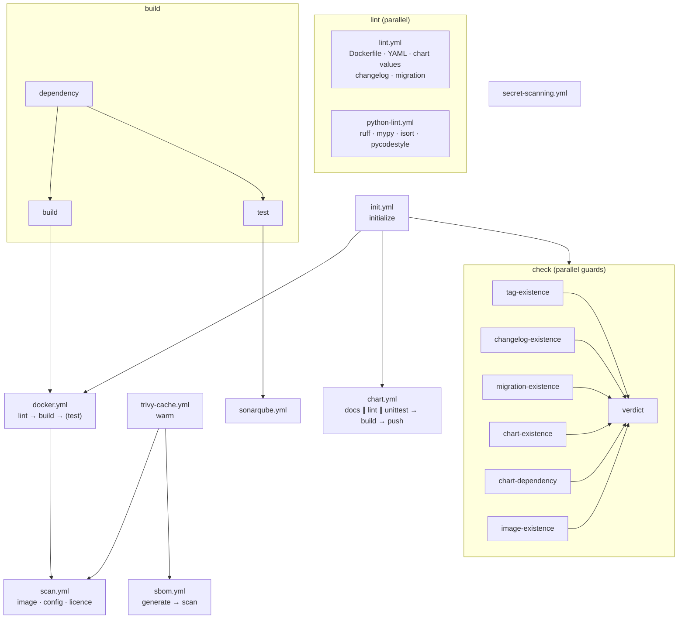

Every leaf publishes a step summary and, where applicable, GitHub Check annotations on the
changed lines. `fail-fast: false` on every matrix means one run reports every problem
rather than the first.

---

### 2. Fast-Track Production Release Tagging & OCI Promotion

> **Trigger:** `push` to `master` (a merged pull request).

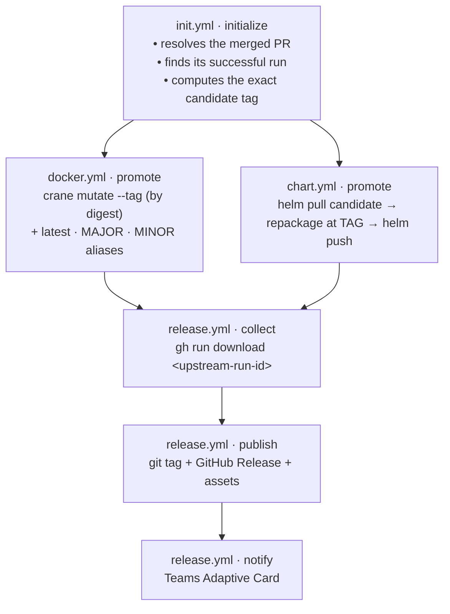

Nothing is compiled, tested or scanned in this graph. The scan reports attached to the
release are the ones the pull request produced, restored from that run.

---

### 3. GitOps Targeted Deployment

> **Trigger:** `workflow_dispatch` with an `environment` input.

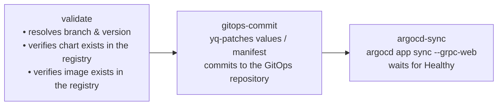

The validate job refuses to commit a GitOps change that cannot resolve, so a typo in a
version never reaches the cluster as a broken `Application`.

---

### 4. Standalone Quality & Security Audits

Each audit is a single reusable workflow with no `init.yml` dependency, so it runs in
isolation with no version-resolution overhead.

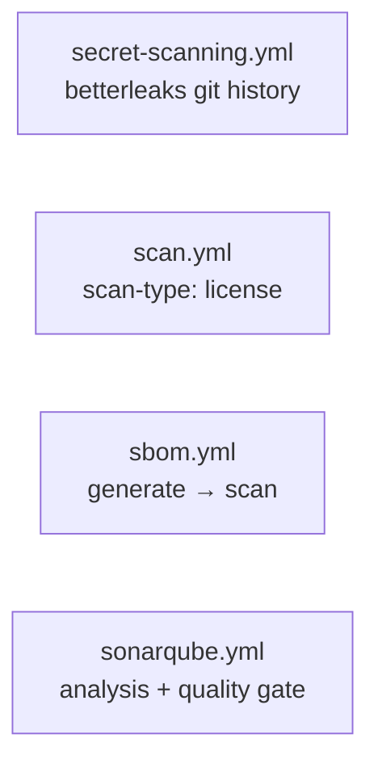

---

## Module Catalog

### init & check

Environment initialisation, version discovery and the release prerequisite guards.

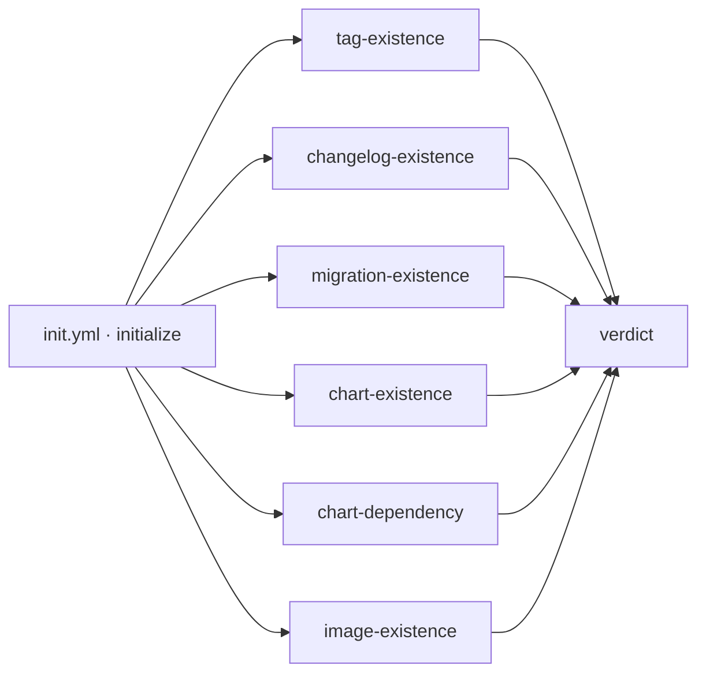

| Workflow · Job | Description |
|---|---|
| `init.yml` · `initialize` | Discovers the application version from `package.json`, `pyproject.toml`, `pom.xml` or `Chart.yaml`; computes the candidate suffix; resolves dev/production repositories; and on a release resolves the merged pull request and its successful run. **26 outputs.** |
| `check.yml` · `tag-existence` | Fails when the git tag already exists on a different commit. A tag already on *this* commit is treated as a re-run, not a collision. |
| `check.yml` · `changelog-existence` | Extracts the `## [x.y.z]` section from `CHANGELOG.md` and renders it as an Adaptive Card fragment. Uploads `release-changelog`. |
| `check.yml` · `migration-existence` | Extracts the `previous...current` section from `MIGRATION.md`. Skipped for an initial release, or disabled with `check-migration: false` for artifacts that intentionally have no migration contract. Uploads `release-migration`. |
| `check.yml` · `chart-existence` | Fails when the chart version is already published. Candidate versions skip the collision check. |
| `check.yml` · `chart-dependency` | Fails when a chart dependency resolves to a development repository. |
| `check.yml` · `image-existence` | Fails when the image tag is already published. |
| `check.yml` · `verdict` | Consolidates every guard into one table and one required status check. |

> [!TIP]
> Set the branch protection **required status check** to `Verdict`. It reports
> `success` only when every applicable guard passed, and names the failures when not.

#### `init.yml` outputs

| Output | Example | Used by |
|---|---|---|
| `tag` | `1.4.0` | `check`, `release`, promote jobs |
| `release-version` | `1.4.0` | scan target resolution |
| `is-release` | `true` | promote vs build routing |
| `version-suffix` | `-42.891` | diagnostics |
| `image-tag` / `image-push-tag` | `1.4.0` / `1.4.0-42.891` | `docker`, `buildah` |
| `image-repository` / `image-dev-repository` / `image-push-repository` | `contoso/order-backend[-dev]` on Docker Hub | `docker`, `check`, promote |
| `chart-name` / `chart-version` / `chart-app-version` / `chart-push-version` | `order-backend` / `1.4.0` / `1.4.0-42.891` | `chart` |
| `chart-repository` / `chart-dev-repository` / `chart-push-repository` | `helm[/dev]` | `chart`, `check` |
| `ignore-chart` / `ignore-docker` | `false` | conditional job gating |
| `upstream-run-id` / `merged-pr-number` | `18234567` / `891` | `release` artifact restore |
| `candidate-image-tag` / `candidate-chart-version` | `1.4.0-42.891` | exact promotion source |
| `major-version` / `minor-version` | `1` / `1.4` | image aliases |

---

### nodejs

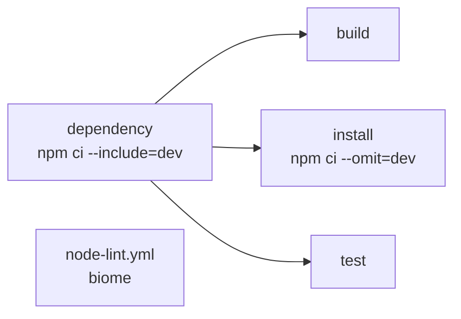

| Workflow · Job | Description |
|---|---|
| `node-build.yml` · `dependency` | `npm ci --include=dev --prefer-offline`. Caches `.npm` keyed by `package-lock.json`. |
| `node-build.yml` · `build` | Runs `build-command` (default `npm run build`). Uploads `node-dist`. |
| `node-build.yml` · `test` | Runs `test-command`, publishes JUnit as a GitHub Check. |
| `node-lint.yml` · `lint` | Biome. Fails with a starter `biome.json` in the summary when the config is missing. |

---

### python

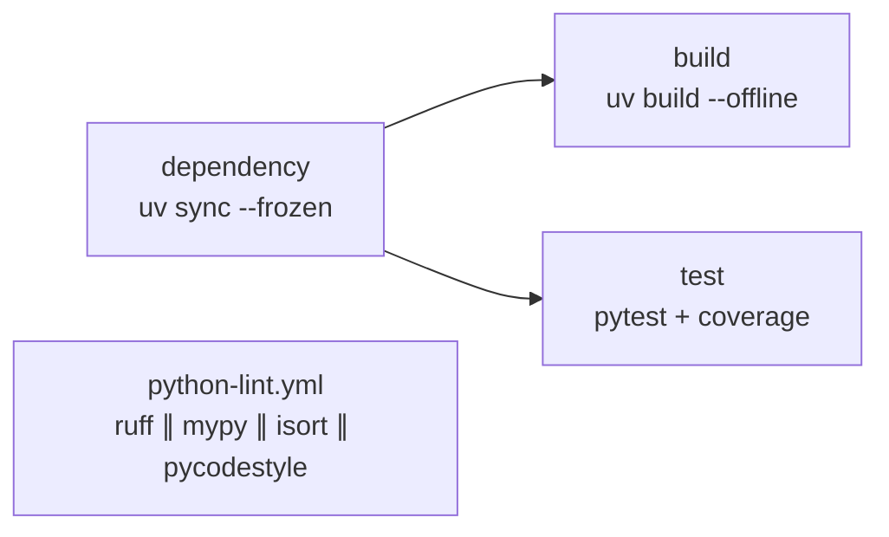

| Workflow · Job | Description |
|---|---|
| `python-build.yml` · `dependency` | `uv sync --frozen --no-install-project`. Caches `.uv-cache` keyed by `uv.lock`. Strictly frozen — never mutates the lockfile. |
| `python-build.yml` · `build` | `uv build --offline`. Uploads `python-dist`. |
| `python-build.yml` · `test` | `pytest --junitxml --cov`, published as a GitHub Check. |
| `python-lint.yml` · `lint` | Matrix of `ruff`, `mypy`, `isort`, `pycodestyle`, all in parallel. |

---

### golang

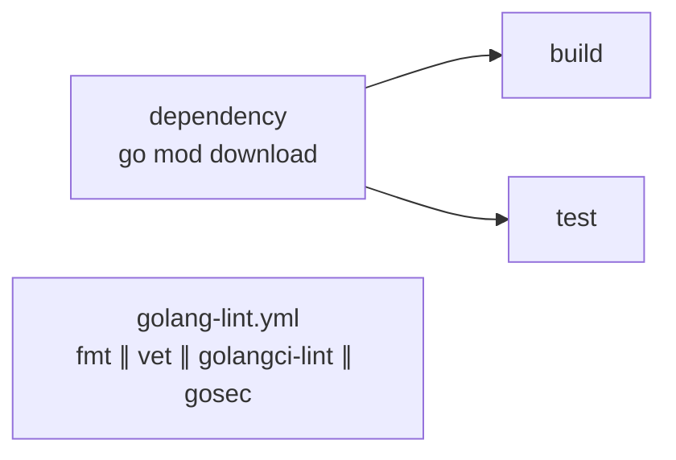

| Workflow · Job | Description |
|---|---|
| `golang-build.yml` · `dependency` | `go mod download`. Caches `.go-cache` keyed by `go.sum`. |
| `golang-build.yml` · `build` | `go build -trimpath -o bin/ ./...`. Uploads `go-binaries`. |
| `golang-build.yml` · `test` | `go test` piped through `go-junit-report`. |
| `golang-lint.yml` · `fmt` | `go fmt ./...`, then fails on a dirty tree. |
| `golang-lint.yml` · `vet` | `go vet`, honouring a `// govet:ignore` pragma on the preceding line. |
| `golang-lint.yml` · `golangci-lint` | Full linter aggregate. |
| `golang-lint.yml` · `gosec` | Security static analysis, excluding generated code. |

---

### java

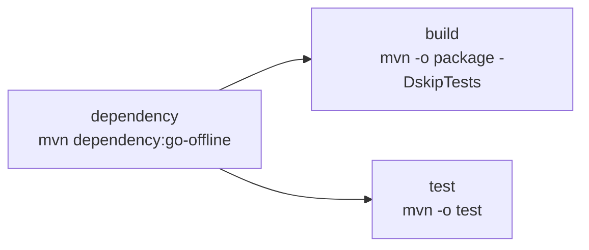

| Workflow · Job | Description |
|---|---|
| `java-build.yml` · `dependency` | `mvn dependency:go-offline`. Caches `.m2` keyed by `pom.xml`. |
| `java-build.yml` · `build` | Offline `mvn package`. Uploads `java-artifacts` (`*.jar`, `*.war`). |
| `java-build.yml` · `test` | Offline `mvn test`; Surefire XML published as a GitHub Check. |

---

### image

Container image building and registry management, supporting both Docker/BuildKit and
Buildah.

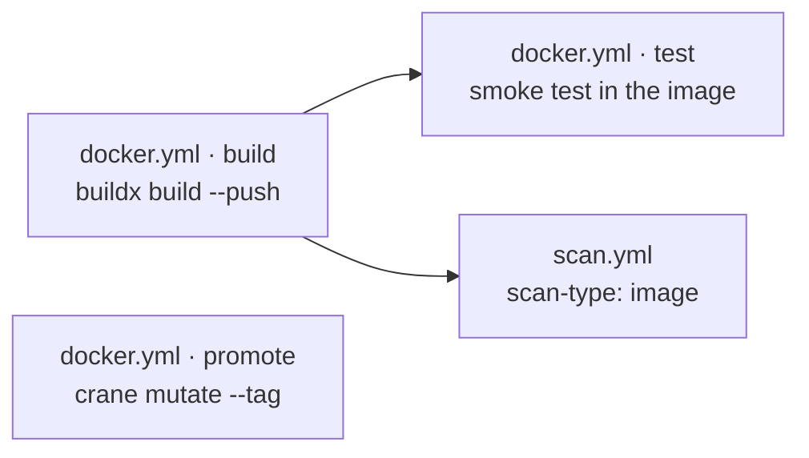

| Workflow · Job | Description |
|---|---|
| `docker.yml` · `build` | Buildx build and push, with every organisation base image injected as a build argument and registry layer cache. Outputs `image-ref-digest`. |
| `docker.yml` · `test` | Optional smoke test executed **inside** the built image. Off by default. |
| `docker.yml` · `promote` | Release-mode only. Refuses unless the caller passes a successful `scan-result`. Resolves the candidate and copies it by digest with `crane mutate --tag`, then tags `latest`, `MAJOR`, `MINOR`. |
| `buildah.yml` · `build` | Dockerfile-free minimal image assembly from a base image: `microdnf install`, package-manager purge, documentation/systemd/PAM strip, `USER 10001`. |
| `buildah.yml` · `promote` | Same digest-preserving promotion as `docker.yml`. |

> [!IMPORTANT]
> `docker.yml` · `build` is the **only** job in the library that does not run inside an
> organisation build container. Building an image needs the daemon and BuildKit on the
> runner itself. Every other job, `docker.yml` · `promote` included, is
> containerised.

#### Dockerfile Standards & Multi-Stack Reference (Packaging-Only & Non-Root 10001:10001)

Every image built by this platform adheres strictly to the **Packaging-Only Standard** and
**Non-Root Runtime Enforcement**:

1. **Packaging-Only Standard (zero compilation in the Dockerfile).**
   All compiling, bundling and transpiling (`npm run build`, `mvn package`, `go build`,
   `uv build`), linting and tests **MUST** execute in the `*-build.yml` workflows. The
   `Dockerfile` is purely an artifact packaging manifest; it copies pre-built output.
2. **Non-root user and group (10001:10001).**
   - Containers must never run as `root` (UID `0`). Every Dockerfile declares `USER 10001:10001`.
   - All copied files must be owned by the non-root user: `COPY --chown=10001:10001 ...`.
   - If the application writes logs, cache or PID files at runtime, create and chown those
     directories **before** the `USER` directive.
   - Standard non-privileged listening port: `EXPOSE 8080`.
3. **Automatic build-arg base images.**
   `docker.yml` resolves and injects the following build arguments automatically. A
   Dockerfile pins nothing itself — bumping a base image is a change to one organisation
   variable.

| Tech stack | Injected build arg | Organisation variable | Description |
|---|---|---|---|
| **Java** | `JAVA_25_MICRO_BASE_IMAGE` | `vars.JAVA_25_MICRO_BASE_IMAGE` | Minimal hardened Java 25 JRE runtime |
| **Golang** | `MICRO_ROOT_BASE_IMAGE` | `vars.MICRO_ROOT_BASE_IMAGE` | Distroless minimal root container for static binaries |
| **Python** | `PYTHON_312_MICRO_BASE_IMAGE` | `vars.PYTHON_312_MICRO_BASE_IMAGE` | Minimal Python 3.12 micro runtime |
| **Node.js backend** | `NODE_JS_24_MICRO_BASE_IMAGE` | `vars.NODE_JS_24_MICRO_BASE_IMAGE` | Minimal Node.js 24 micro runtime |
| **Node.js frontend** | `NGINX_MICRO_BASE_IMAGE` | `vars.NGINX_MICRO_BASE_IMAGE` | Non-root Nginx static SPA server |
| **All** | `VERSION` | — | `init.yml`'s `image-push-tag` |

Each is passed as `${{ vars.IMAGE_REGISTRY }}/<value>`.

##### 1. Java / Spring Boot Microservice

```dockerfile
ARG JAVA_25_MICRO_BASE_IMAGE
FROM ${JAVA_25_MICRO_BASE_IMAGE}

WORKDIR /app
COPY --chown=10001:10001 target/*.jar /app/app.jar

USER 10001:10001
EXPOSE 8080

ENTRYPOINT ["java", "-XX:+UseContainerSupport", "-XX:MaxRAMPercentage=75.0", "-jar", "/app/app.jar"]
```

```dockerignore
**
*
!target/*.jar
!build/libs/*.jar
```

##### 2. Golang Static Binary

```dockerfile
ARG MICRO_ROOT_BASE_IMAGE
FROM ${MICRO_ROOT_BASE_IMAGE}

WORKDIR /app
COPY --chown=10001:10001 bin/app /app/app

USER 10001:10001
EXPOSE 8080

ENTRYPOINT ["/app/app"]
```

```dockerignore
**
*
!bin/
!bin/*
```

##### 3. Python (uv + `src/` layout)

```dockerfile
ARG PYTHON_312_MICRO_BASE_IMAGE
FROM ${PYTHON_312_MICRO_BASE_IMAGE}

WORKDIR /app

COPY --chown=10001:10001 pyproject.toml uv.lock ./
RUN --mount=type=bind,source=.uv-cache,target=/root/.cache/uv \
    uv sync --frozen --no-dev --offline && chown -R 10001:10001 /app/.venv

COPY --chown=10001:10001 src/ /app/src/

USER 10001:10001
EXPOSE 8080

ENTRYPOINT ["/app/.venv/bin/python", "-m", "src.main"]
```

```dockerignore
**
*
!pyproject.toml
!uv.lock
!.uv-cache
!.uv-cache/**
!src
!src/**
```

##### 4. Node.js Backend (Express / NestJS)

```dockerfile
ARG NODE_JS_24_MICRO_BASE_IMAGE
FROM ${NODE_JS_24_MICRO_BASE_IMAGE}

WORKDIR /app
COPY --chown=10001:10001 package.json package-lock.json ./
COPY --chown=10001:10001 node_modules/ /app/node_modules/
COPY --chown=10001:10001 dist/ /app/dist/

USER 10001:10001
EXPOSE 8080

ENTRYPOINT ["node", "/app/dist/main.js"]
```

```dockerignore
**
*
!package.json
!package-lock.json
!node_modules/
!node_modules/**
!dist/
!dist/**
```

##### 5. Node.js Frontend (Nginx SPA)

```dockerfile
ARG NGINX_MICRO_BASE_IMAGE
FROM ${NGINX_MICRO_BASE_IMAGE}

COPY --chown=10001:10001 dist/ /usr/share/nginx/html/
COPY --chown=10001:10001 nginx.conf /etc/nginx/conf.d/default.conf

USER 10001:10001
EXPOSE 8080
```

```dockerignore
**
*
!dist/
!dist/**
!nginx.conf
```

#### The Inverted `.dockerignore` Allowlist Standard (Default Deny)

To enforce packaging hygiene, keep the build context under ~100 KB, and guarantee that no
sensitive local file (`.git/`, `.env`, secrets, test caches, local virtualenvs) leaks into
an image, every project uses an **inverted allowlist**:

1. **Default deny.** Block everything recursively with `**` and `*` at the top of the file.
2. **Explicit allowlist (`!`).** Unignore only the exact files the Dockerfile copies.

| Tech stack | Allowlisted packaging targets |
|---|---|
| **Python** (`uv` + `src/`) | `pyproject.toml`, `uv.lock`, `.uv-cache/`, `src/` |
| **Java** (Spring Boot fat JAR) | `target/*.jar` or `build/libs/*.jar` |
| **Golang** (static binary) | `bin/` |
| **Node.js frontend** (Nginx SPA) | `dist/`, `nginx.conf` |
| **Node.js backend** | `dist/`, production `node_modules/`, `package*.json` |

---

### chart

Helm chart packaging and publishing over **OCI**, the registry protocol both platforms
share.

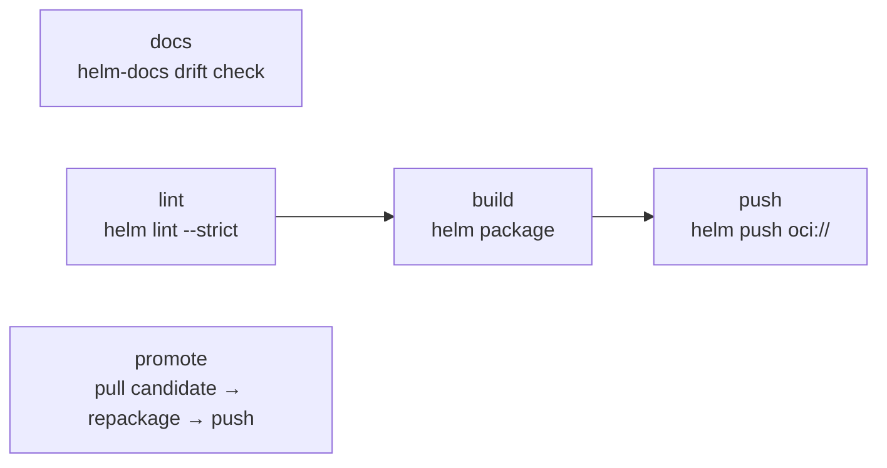

| Workflow · Job | Description |
|---|---|
| `chart.yml` · `docs` | Regenerates `chart/README.md` with `helm-docs` and fails on drift, showing the diff and the exact command in the summary. |
| `chart.yml` · `lint` | `helm lint --strict`, with optional inline value overrides. |
| `chart.yml` · `unittest` | **Optional, opt-in** (`run-unittest: true`, default `false`). Renders the mock consumer chart at `mock-chart` (default `test`) with `helm unittest --strict` and uploads `chart-unittest-report`. For repositories that *ship* a chart others depend on; requires the `unittest` Helm plugin in the job image. |
| `chart.yml` · `build` | `helm package --version --app-version`. Uploads `chart-package`. |
| `chart.yml` · `push` | `helm push` to the OCI repository. Writes `CHART_INFO.md`. |
| `chart.yml` · `promote` | Release-mode only. Pulls the exact candidate, repackages at the release tag, pushes to production. |
| `scan.yml` (`scan-type: config`, `config-type: chart`) | Renders templates, then runs a Trivy misconfiguration scan. |
| `check.yml` · `chart-existence` / `chart-dependency` | Version collision and development-dependency guards. |

---

### terraform

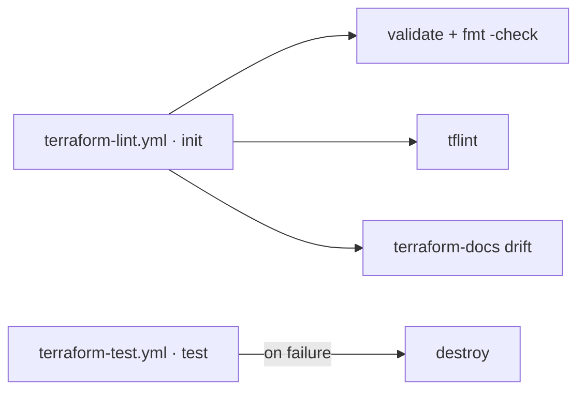

| Workflow · Job | Description |
|---|---|
| `terraform-lint.yml` · `init` | `terraform init` with the backend workspace key prefix. Caches providers by `.terraform.lock.hcl`. |
| `terraform-lint.yml` · `validate` | `terraform validate` and `terraform fmt -recursive -check`. |
| `terraform-lint.yml` · `tflint` | Recursive `tflint` across all module call types. |
| `terraform-lint.yml` · `docs` | `terraform-docs` drift check for the root and every `modules/*`. |
| `terraform-test.yml` · `test` | `go test` module suite with a configurable timeout. |
| `terraform-test.yml` · `destroy` | Runs **only on test failure**, so a crashed test cannot strand real infrastructure. |
| `scan.yml` (`scan-type: config`, `config-type: terraform`) | Trivy IaC misconfiguration scan. |

#### Consuming a module — no packaging step

Modules are consumed directly from git. There is no package, no registry upload and no
publish job to maintain: the git ref *is* the version.

```hcl
module "vpc" {
  source = "git::git@github.com:grootan-devops/terraform-modules.git//modules/vpc?ref=1.0.0"
}

module "eks" {
  # git::<repo_url>//<sub_folder>?ref=<tag | branch | commit>
  source = "git::git@github.com:grootan-devops/terraform-modules.git//modules/eks?ref=b4f8d29"
}
```

> [!IMPORTANT]
> Always pin `?ref=` to a tag or commit SHA. A branch ref (`?ref=main`) re-resolves on every
> `terraform init`, so a plan can change without the consuming repository changing.

---

### sonarqube

| Workflow · Job | Description |
|---|---|
| `sonarqube.yml` · `sonarqube` | Runs in the SonarSource scanner container. Fetches full history (Sonar attributes issues to authors and measures new code against a baseline), downloads any `*-test-reports` artifacts for coverage, and waits on the quality gate. A monorepo child analyses as its own project, keyed by its subpath. |

---

### secret-scanning

| Workflow · Job | Description |
|---|---|
| `secret-scanning.yml` · `secret-scan` | betterleaks over git history. On a pull request only the branch range is scanned; elsewhere the full history. Findings are redacted in the log. |

---

### license

Licence compliance is a mode of the shared scanner rather than a separate workflow:

```yaml
uses: grootan-devops/github-ci-library/.github/workflows/scan.yml@1.0.0
with:
  scan-type: license
```

Dependencies are classified as `notice`, `permissive`, `reciprocal`, `restricted` or
`unrecognized`. **Restricted** licences fail the scan; **reciprocal** and **unrecognized**
warn. Suppress per package in `ignored-cves.yml` under `license:`.

---

### sbom

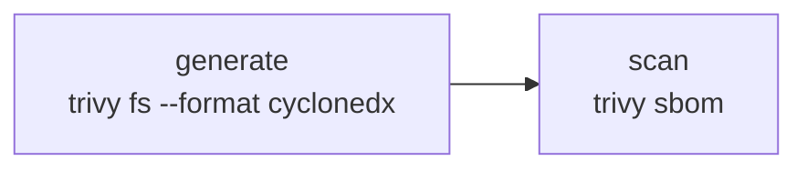

| Workflow · Job | Description |
|---|---|
| `sbom.yml` · `generate` | CycloneDX `sbom.cdx.json`. Links the Maven cache into place first so Java components resolve completely. Uploads `sbom`. |
| `sbom.yml` · `scan` | Scans the generated document for CVEs. Separate job, so a scan failure is distinguishable from a generation failure and the SBOM is published either way. |

---

### deploy/gitops

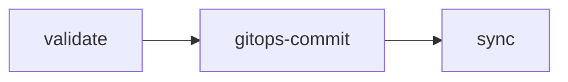

#### Komodo (`deploy-komodo-gitops.yml`)

Docker Compose stacks. Verifies the image exists, patches the compose file in the GitOps
repository, and triggers a Komodo stack redeploy.

| Input | Required | Description |
|---|:--:|---|
| `environment` | ✅ | Target environment |
| `stack-name` | ✅ | Komodo stack to redeploy |
| `gitops-repo` | ✅ | GitOps repository holding the compose file |
| `compose-file` | ✅ | Path to the compose file within it |
| `image-repository`, `image-tag` | ✅ | Image to deploy |
| `komodo-server` | | Defaults to `vars.KOMODO_SERVER` |

#### ArgoCD (`deploy-argocd-gitops.yml`)

Kubernetes. Supports both **Helm mode** (patch `targetRevision` / values) and **manifest
mode** (patch an image reference), then syncs and waits for `Healthy`.

| Input | Required | Description |
|---|:--:|---|
| `environment` | ✅ | Target environment |
| `gitops-repo` | ✅ | GitOps repository |
| `app-path` | ✅ | Path to the application within it |
| `chart-name` / `chart-version` | | Helm mode |
| `manifest-file` / `new-image` | | Manifest mode |
| `argocd-server` | | Defaults to `vars.ARGOCD_SERVER` |

---

### release & notify

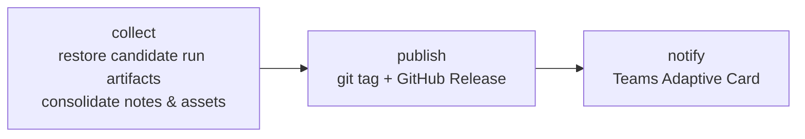

| Workflow · Job | Description |
|---|---|
| `release.yml` · `collect` | Downloads this run's artifacts and, via `gh run download`, the candidate run's. Consolidates `RELEASE_CHANGELOG.md`, `RELEASE_MIGRATION.md`, image/chart/Terraform info and every scan report into the release body, and stages the assets. |
| `release.yml` · `publish` | Creates the git tag and the GitHub Release with all staged assets. |
| `release.yml` · `notify` | Microsoft Teams Adaptive Card with the rendered release notes and links. |
| `notify.yml` | The same card, standalone. |

Release assets: the Trivy report bundle, `installed_pkgs.txt`, `sbom.cdx.json`, the chart
`.tgz`, the test report archive, `RELEASE_CHANGELOG.md`, `RELEASE_MIGRATION.md`, plus
anything named in `additional-artifacts`.

---

### mono

GitHub cannot call a reusable workflow from a matrix, so there is no child-pipeline
equivalent. `mono.yml` answers the question the parent pipeline existed to answer — which
projects changed — and returns a matrix the caller fans out over.

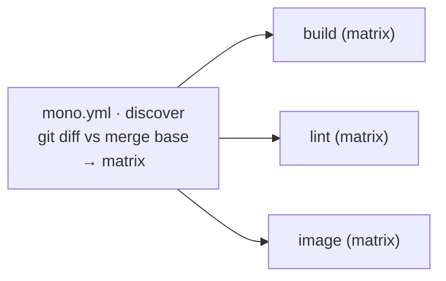

| Output | Description |
|---|---|
| `matrix` | `strategy.matrix` object covering only the changed projects |
| `any-changed` | `true` when at least one project changed |
| `changed-count` | Number of projects selected |

Declare projects once in `vars.MONO_PROJECTS`:

```json
[{"name":"api","path":"services/api"},{"name":"web","path":"services/web"}]
```

Pass `always-run-all: true` on release runs so a release never skips a project.

---

## Key Variables & Configuration

The GitLab library sets everything once in a group-level `variables:` block and each project
overrides almost nothing. This library does the same with **organisation variables**, which
is why callers pass so few inputs.

Set these under **Settings → Secrets and variables → Actions**, at organisation level
wherever possible.

### Required variables

| Variable | Description |
|---|---|
| `IMAGE_REGISTRY` | Container and chart registry host, e.g. `registry.domain.local`. |
| `IMAGE_REPOSITORY` | Image repository path, e.g. `myapp/order-backend`. |
| `TOOLKIT_BUILD_IMAGE` | Default build container, e.g. `devops/build-containers/bt-container:3.2.1`. |

> [!IMPORTANT]
> Build and base image coordinates carry **no library defaults**. A container variable that
> is unset produces a pull failure naming the empty reference, which is a better failure
> than silently running a plausible-but-wrong image version. Set them at organisation level
> once and every repository inherits them.

### Build & base image variables

| Variable | Used by | Description |
|---|---|---|
| `GO_BUILD_IMAGE` | `golang-*`, `terraform-test` | Go toolchain container |
| `JAVA_BUILD_IMAGE` | `java-build` | JDK + Maven container |
| `BUILDAH_BUILD_IMAGE` | `buildah` | buildah/podman container |
| `PYTHON_BUILD_IMAGE`, `NODE_BUILD_IMAGE` | `python-*`, `node-*` | Optional per-language override; falls back to `TOOLKIT_BUILD_IMAGE` |
| `SONAR_SCANNER_IMAGE` | `sonarqube` | SonarSource scanner container |
| `BUILDKIT_IMAGE` | `docker` | Buildx driver image |
| `MICRO_ROOT_BASE_IMAGE` | `docker`, `buildah` | Golang / scratch base, injected as a build arg |
| `PYTHON_312_MICRO_BASE_IMAGE` | `docker` | Python runtime base |
| `NODE_JS_24_MICRO_BASE_IMAGE` | `docker` | Node runtime base |
| `NGINX_MICRO_BASE_IMAGE` | `docker` | Nginx SPA base |
| `JAVA_25_MICRO_BASE_IMAGE` | `docker` | JRE runtime base |

### Behavioural variables

| Variable | Default | Description |
|---|---|---|
| `CI_RUNNER` | `ubuntu-26.04` | Runner label for every job. Pinned rather than tracking `ubuntu-latest`, so a platform migration cannot change the build environment under a release. |
| `PROJECT_PATH` | `.` | Root directory of the application inside the repository. |
| `CHART_DIR` | `./chart` | Path to the Helm chart folder. |
| `CHART_FILE` | `Chart.yaml` | Chart manifest filename. |
| `CHART_REPOSITORY` | `helm` | Chart repository path in the registry. |
| `DOCKERFILE` | `Dockerfile` | Dockerfile path for linting and building. |
| `MASTER_BRANCH_REGEX` | `^(.*/)?master$` | Which protected branches are treated as release branches. |
| `IMAGE_DEV_REPOSITORY_SUFFIX` | automatic | Appended for candidate images: `-dev` on Docker Hub and `/dev` on other registries. Set an explicit value to override. |
| `CHART_DEV_REPOSITORY_SUFFIX` | `/dev` | Appended for candidate charts. |
| `RELEASE_VERSION_SUFFIX` | — | Suffix appended to the version, e.g. `backend` → `1.5.0-backend`. |
| `CHANGELOG_FILE_NAME` | `./CHANGELOG.md` | Changelog path. |
| `MIGRATION_FILE_NAME` | `./MIGRATION.md` | Migration guide path. |
| `UPSTREAM_WORKFLOW` | `pr.yml` | Workflow file whose successful run produced the candidate artifacts. |
| `MONO_PROJECTS` | — | JSON array of `{name, path}` for monorepos. |
| `HADOLINT_IGNORE` | — | Comma-separated extra hadolint rules to ignore. |
| `MD_LINT_IGNORE_RULE` | — | Space-separated extra markdownlint rules to exclude. |

### Security & quality variables

| Variable | Default | Description |
|---|---|---|
| `TRIVY_HOST` | — | Shared Trivy server. **Unset means every scan downloads the ~1.2 GB database.** |
| `TRIVY_TIMEOUT` | `60m` | Scan timeout. |
| `TRIVY_IGNORE_CONFIG_FILE` | `ignored-cves.yml` | Suppression configuration path. |
| `TRIVY_IGNORE_CVES` | `KSV-0011 KSV-0014 KSV-0015 KSV-0016 KSV-0018 KSV-0110 KSV-0113 KSV-0125` | Space-separated misconfiguration IDs suppressed platform-wide (set by the platform at deploy time, not by the chart). |
| `TRIVY_IGNORED_LICENSE_CLASSIFICATIONS` | `notice,permissive,unencumbered` | Licence classes that never warn. |
| `SKIP_CVE_SCAN` | `false` | Emergency global scan bypass. |
| `SONAR_URL` / `SONAR_EXTERNAL_URL` / `SONAR_PROJECT_KEY` | — | SonarQube server, dashboard link and project key. |
| `ARGOCD_SERVER` / `KOMODO_SERVER` | — | GitOps endpoints. |

### Secrets

| Secret | Required | Description |
|---|:--:|---|
| `IMAGE_REGISTRY_USERNAME` / `IMAGE_REGISTRY_PASSWORD` | ✅ | Pull the build containers; push images and charts. Every job needs these because every job is containerised. |
| `CI_LIBRARY_TOKEN` | | Only when this library lives in a repository `GITHUB_TOKEN` cannot read. |
| `TRIVY_TOKEN` | | Authenticate to a shared Trivy server. |
| `SONARQUBE_TOKEN` | | SonarQube analysis. |
| `RELEASE_MESSAGE_TEAMS_WORKFLOWS_URL` | | Comma-separated Power Automate webhook URLs. |
| `ARGOCD_AUTH_TOKEN` | | ArgoCD API token. |
| `KOMODO_API_KEY` / `KOMODO_API_SECRET` | | Komodo API credentials. |
| `GITOPS_TOKEN` | | GitOps repository write access. Falls back to `GITHUB_TOKEN`. |

> [!NOTE]
> **Organisation limits.** GitHub allows up to 1,000 organisation variables and 1,000
> organisation secrets, each up to 48 KB. A single workflow can read at most **100
> organisation secrets** — if a repository is granted access to more, only the first 100
> alphabetically are visible. This library uses 44 variables and 11 secrets, so the caps
> are not a practical constraint. Verify current limits in the GitHub documentation.

---

## Ignored CVEs & Licenses (`ignored-cves.yml`)

Create `ignored-cves.yml` in your project root to suppress verified findings:

```yaml
image:
  - id: CVE-2023-12345
    reason: "Vulnerability does not affect our usage — we do not call the affected code path"
  - id: CVE-2024-99999
    reason: "No upstream fix available; mitigated by network policy restricting inbound traffic"

iac:
  chart:
    - id: KSV-0016
      reason: "Memory requests not required for batch workloads"
  terraform:
    - id: AVD-AWS-0001
      reason: "S3 bucket is private and only accessed via VPC endpoint"

license:
  - id: LGPL-3.0-or-later
    package: "org.hibernate.orm:hibernate-core"
    reason: "Dynamically linked backend ORM library compliant with server architecture"
  - id: MPL-2.0
    package: "*"
    reason: "File-level copyleft unmodified library used as standalone module"

sbom:
  - id: CVE-2024-11111
    reason: "Dev-only dependency not bundled in production artifact"
```

> [!IMPORTANT]
> **Reason validation.** Every `reason` must be at least **10 characters** and must not be a
> placeholder (`todo`, `tbd`, `n/a`, `fix`, `fixme`, `later`, `wip`, `none`, `unknown`,
> `ignore`, `skip`, `test`, `temp`). A failing reason fails the scan.
>
> **Stale suppressions fail the scan.** An entry for a finding that is no longer present is
> an error, not a warning — the file cannot rot.
>
> **Licence scoping.** Set `package` to scope a copyleft exception to one package, so a
> future dependency under the same licence is not silently ignored. Use `package: "*"` or
> omit for a global exception.

When a scan finds something not yet suppressed, it prints a ready-to-paste
`ignored-cves.yml` fragment at the end of the job log.

---

## Scan Exit Codes

All scanning jobs evaluate results with the same status codes:

| Exit code | Meaning | Job result |
|---|---|---|
| `0` | Clean scan — all checks passed. | Success ✅ |
| `1` | Fixable vulnerabilities, stale ignore entries, or invalid reasons. | Failed ❌ |
| `2` | Warnings only — unfixable vulnerabilities or approved suppressions. | Success with warning ⚠️ |

GitHub has no equivalent of GitLab's `allow_failure: exit_codes: [2]`, so exit code 2 is
handled in the workflow: it annotates and summarises but does not fail. Pass
`fail-on-warnings: true` to `scan.yml` or `sbom.yml` to make warnings blocking.

---

## DevOps Reference & Platform Defaults

### Organisation-injected configuration

Configure once at the GitHub organisation level to propagate to every repository:

- **Registries** — `vars.IMAGE_REGISTRY`, `secrets.IMAGE_REGISTRY_USERNAME`,
  `secrets.IMAGE_REGISTRY_PASSWORD`. One registry serves both images and charts; OCI is the
  protocol for both.
- **Build containers** — `vars.TOOLKIT_BUILD_IMAGE`, `vars.GO_BUILD_IMAGE`,
  `vars.JAVA_BUILD_IMAGE`, `vars.BUILDAH_BUILD_IMAGE`, `vars.SONAR_SCANNER_IMAGE`.
- **Base images** — the `*_MICRO_BASE_IMAGE` set, injected into image builds as build args.
- **Security & quality** — `vars.SONAR_URL`, `vars.SONAR_EXTERNAL_URL`,
  `secrets.SONARQUBE_TOKEN`, `vars.TRIVY_HOST`, `secrets.TRIVY_TOKEN`.
- **Deployment** — `vars.ARGOCD_SERVER`, `secrets.ARGOCD_AUTH_TOKEN`, `vars.KOMODO_SERVER`,
  `secrets.KOMODO_API_KEY`, `secrets.KOMODO_API_SECRET`, `secrets.GITOPS_TOKEN`.
- **Notifications** — `secrets.RELEASE_MESSAGE_TEAMS_WORKFLOWS_URL`.

### Helm chart publishing & authentication

Charts publish over **OCI** to `oci://${IMAGE_REGISTRY}/${CHART_REPOSITORY}`.

- **Auth**: `helm registry login` with `IMAGE_REGISTRY_USERNAME` / `IMAGE_REGISTRY_PASSWORD`.
  The same credential covers images and charts.
- **Dev vs production**: candidates publish to `${CHART_REPOSITORY}${CHART_DEV_REPOSITORY_SUFFIX}`.
  At release, `chart.yml` · `promote` pulls the exact candidate, repackages it at the release
  version and pushes to the production repository.
- **Consuming a published chart**:

  ```bash
  helm registry login "${IMAGE_REGISTRY}" --username "${USER}" --password-stdin
  helm pull "oci://${IMAGE_REGISTRY}/helm/order-backend" --version 1.4.0
  ```

### Container image publishing & authentication

- **Target**: `${IMAGE_REGISTRY}/${IMAGE_REPOSITORY}${IMAGE_DEV_REPOSITORY_SUFFIX}:${TAG}`
  for candidates, `${IMAGE_REGISTRY}/${IMAGE_REPOSITORY}:${TAG}` for releases.
- **Auth**: `docker/login-action` for the build job, `crane auth login` for the containerised
  promote and check jobs.
- **Dev vs production**: `docker.yml` · `promote` uses `crane mutate --tag` to copy the
  manifest **layerlessly** from the dev path to the production path, rewriting only the
  version label, then tags `${TAG}`, `latest`, `${MAJOR}` and `${MINOR}`. The released
  digest is the scanned digest.
- **Digest pinning**: `docker.yml` and `buildah.yml` output `image-ref-digest`
  (`registry/repo@sha256:...`). Feed it to `scan.yml` as `image-ref` so the scan cannot
  resolve a different tag than the one that was built.

---

## Project-Level Integration Examples (All Permutations)

Every example assumes the organisation variables and secrets above are set, and pins the
library with `@1.0.0`.

### 1. Node.js Full Stack (App + Docker + Helm + Multi-Env GitOps Deploy)

```yaml
# .github/workflows/pr.yml
name: CI · PR Verification
on:
  pull_request:
    branches: [master]
concurrency:
  group: "${{ github.workflow }}-${{ github.ref }}"
  cancel-in-progress: true
permissions: { contents: read, packages: write, actions: read, checks: write }

jobs:
  init:
    uses: grootan-devops/github-ci-library/.github/workflows/init.yml@1.0.0
    secrets: inherit

  trivy-cache:
    uses: grootan-devops/github-ci-library/.github/workflows/trivy-cache.yml@1.0.0
    secrets: inherit

  check:
    needs: init
    uses: grootan-devops/github-ci-library/.github/workflows/check.yml@1.0.0
    secrets: inherit
    with:
      tag: ${{ needs.init.outputs.tag }}
      chart-name: ${{ needs.init.outputs.chart-name }}
      chart-version: ${{ needs.init.outputs.chart-version }}
      chart-repository: ${{ needs.init.outputs.chart-repository }}
      image-tag: ${{ needs.init.outputs.image-tag }}
      image-repository: ${{ needs.init.outputs.image-repository }}

  lint:
    uses: grootan-devops/github-ci-library/.github/workflows/lint.yml@1.0.0
    secrets: inherit

  node-lint:
    uses: grootan-devops/github-ci-library/.github/workflows/node-lint.yml@1.0.0
    secrets: inherit

  build:
    uses: grootan-devops/github-ci-library/.github/workflows/node-build.yml@1.0.0
    secrets: inherit
    with:
      build-command: npm run build
      test-command: npm run test:ci

  image:
    needs: [init, build]
    uses: grootan-devops/github-ci-library/.github/workflows/docker.yml@1.0.0
    secrets: inherit
    with:
      image-tag: ${{ needs.init.outputs.image-push-tag }}
      image-repository: ${{ needs.init.outputs.image-push-repository }}

  chart:
    needs: init
    uses: grootan-devops/github-ci-library/.github/workflows/chart.yml@1.0.0
    secrets: inherit
    with:
      chart-name: ${{ needs.init.outputs.chart-name }}
      chart-version: ${{ needs.init.outputs.chart-push-version }}
      chart-app-version: ${{ needs.init.outputs.chart-app-version }}
      chart-repository: ${{ needs.init.outputs.chart-push-repository }}

  image-scan:
    needs: [image, trivy-cache]
    uses: grootan-devops/github-ci-library/.github/workflows/scan.yml@1.0.0
    secrets: inherit
    with:
      scan-type: image
      image-ref: ${{ needs.image.outputs.image-ref-digest }}

  chart-scan:
    needs: [chart, trivy-cache]
    uses: grootan-devops/github-ci-library/.github/workflows/scan.yml@1.0.0
    secrets: inherit
    with:
      scan-type: config
      config-type: chart

  license-scan:
    needs: trivy-cache
    uses: grootan-devops/github-ci-library/.github/workflows/scan.yml@1.0.0
    secrets: inherit
    with:
      scan-type: license

  sbom:
    needs: trivy-cache
    uses: grootan-devops/github-ci-library/.github/workflows/sbom.yml@1.0.0
    secrets: inherit

  secret-scan:
    uses: grootan-devops/github-ci-library/.github/workflows/secret-scanning.yml@1.0.0
    secrets: inherit

  sonarqube:
    needs: build
    uses: grootan-devops/github-ci-library/.github/workflows/sonarqube.yml@1.0.0
    secrets: inherit
```

```yaml
# .github/workflows/deploy.yml
name: CD · GitOps Deploy
on:
  workflow_dispatch:
    inputs:
      environment:
        description: Target environment
        required: true
        type: choice
        options: [dev, staging, production]
      target-version:
        description: Version to deploy (defaults to the current chart version)
        required: false
        type: string
concurrency:
  group: "deploy-${{ inputs.environment }}"
  cancel-in-progress: false
permissions: { contents: read, actions: read }

jobs:
  init:
    uses: grootan-devops/github-ci-library/.github/workflows/init.yml@1.0.0
    secrets: inherit

  deploy:
    needs: init
    uses: grootan-devops/github-ci-library/.github/workflows/deploy-argocd-gitops.yml@1.0.0
    secrets: inherit
    with:
      environment: ${{ inputs.environment }}
      gitops-repo: contoso/app-gitops
      app-path: apps/${{ inputs.environment }}/order-backend
      chart-name: ${{ needs.init.outputs.chart-name }}
      chart-version: ${{ inputs.target-version || needs.init.outputs.chart-version }}
      chart-repository: ${{ needs.init.outputs.chart-repository }}
      image-repository: ${{ needs.init.outputs.image-repository }}
      github-environment-name: ${{ inputs.environment }}
```

---

### 2. Python FastAPI / Service (App + Docker + Helm)

```yaml
# .github/workflows/pr.yml
name: CI · PR Verification
on: { pull_request: { branches: [master] } }
permissions: { contents: read, packages: write, actions: read, checks: write }

jobs:
  init:
    uses: grootan-devops/github-ci-library/.github/workflows/init.yml@1.0.0
    secrets: inherit

  lint:
    uses: grootan-devops/github-ci-library/.github/workflows/lint.yml@1.0.0
    secrets: inherit

  python-lint:
    uses: grootan-devops/github-ci-library/.github/workflows/python-lint.yml@1.0.0
    secrets: inherit
    with:
      linters: '["ruff","mypy"]'

  build:
    uses: grootan-devops/github-ci-library/.github/workflows/python-build.yml@1.0.0
    secrets: inherit

  image:
    needs: [init, build]
    uses: grootan-devops/github-ci-library/.github/workflows/docker.yml@1.0.0
    secrets: inherit
    with:
      image-tag: ${{ needs.init.outputs.image-push-tag }}
      image-repository: ${{ needs.init.outputs.image-push-repository }}
      test: true

  scan:
    needs: [init, image]
    uses: grootan-devops/github-ci-library/.github/workflows/scan.yml@1.0.0
    secrets: inherit
    with:
      scan-type: image
      image-ref: ${{ needs.image.outputs.image-ref-digest }}
```

The Dockerfile and `.dockerignore` for this stack are in
[Dockerfile Standards](#3-python-uv--src-layout).

---

### 3. Golang Service / Binary Distribution

```yaml
# .github/workflows/pr.yml
name: CI · PR Verification
on: { pull_request: { branches: [master] } }
permissions: { contents: read, packages: write, actions: read, checks: write }

jobs:
  init:
    uses: grootan-devops/github-ci-library/.github/workflows/init.yml@1.0.0
    secrets: inherit

  golang-lint:
    uses: grootan-devops/github-ci-library/.github/workflows/golang-lint.yml@1.0.0
    secrets: inherit

  build:
    uses: grootan-devops/github-ci-library/.github/workflows/golang-build.yml@1.0.0
    secrets: inherit
    with:
      build-command: go build -trimpath -ldflags="-s -w" -o bin/ ./cmd/...

  image:
    needs: [init, build]
    uses: grootan-devops/github-ci-library/.github/workflows/docker.yml@1.0.0
    secrets: inherit
    with:
      image-tag: ${{ needs.init.outputs.image-push-tag }}
      image-repository: ${{ needs.init.outputs.image-push-repository }}

  scan:
    needs: [init, image]
    uses: grootan-devops/github-ci-library/.github/workflows/scan.yml@1.0.0
    secrets: inherit
    with:
      scan-type: image
      image-ref: ${{ needs.image.outputs.image-ref-digest }}
```

---

### 4. Java / Spring Boot Microservice

```yaml
# .github/workflows/pr.yml
name: CI · PR Verification
on: { pull_request: { branches: [master] } }
permissions: { contents: read, packages: write, actions: read, checks: write }

jobs:
  init:
    uses: grootan-devops/github-ci-library/.github/workflows/init.yml@1.0.0
    secrets: inherit

  trivy-cache:
    uses: grootan-devops/github-ci-library/.github/workflows/trivy-cache.yml@1.0.0
    secrets: inherit
    with:
      enable-java-db: "true"

  lint:
    uses: grootan-devops/github-ci-library/.github/workflows/lint.yml@1.0.0
    secrets: inherit

  build:
    uses: grootan-devops/github-ci-library/.github/workflows/java-build.yml@1.0.0
    secrets: inherit

  image:
    needs: [init, build]
    uses: grootan-devops/github-ci-library/.github/workflows/docker.yml@1.0.0
    secrets: inherit
    with:
      image-tag: ${{ needs.init.outputs.image-push-tag }}
      image-repository: ${{ needs.init.outputs.image-push-repository }}

  sbom:
    needs: [build, trivy-cache]
    uses: grootan-devops/github-ci-library/.github/workflows/sbom.yml@1.0.0
    secrets: inherit
```

> [!TIP]
> Set `enable-java-db: "true"` on `trivy-cache.yml` so the Java vulnerability database is
> downloaded once for the whole run rather than by each scan.

---

### 5. Pure Helm Chart Repository

A chart-only repository has no image and no application build. `init.yml` detects the
absence of a Dockerfile and reads the version from `Chart.yaml`.

```yaml
# .github/workflows/pr.yml
name: CI · PR Verification
on: { pull_request: { branches: [master] } }
permissions: { contents: read, packages: write, actions: read }

jobs:
  init:
    uses: grootan-devops/github-ci-library/.github/workflows/init.yml@1.0.0
    secrets: inherit
    with:
      ignore-docker: "true"

  check:
    needs: init
    uses: grootan-devops/github-ci-library/.github/workflows/check.yml@1.0.0
    secrets: inherit
    with:
      tag: ${{ needs.init.outputs.tag }}
      chart-name: ${{ needs.init.outputs.chart-name }}
      chart-version: ${{ needs.init.outputs.chart-version }}
      chart-repository: ${{ needs.init.outputs.chart-repository }}

  lint:
    uses: grootan-devops/github-ci-library/.github/workflows/lint.yml@1.0.0
    secrets: inherit

  chart:
    needs: init
    uses: grootan-devops/github-ci-library/.github/workflows/chart.yml@1.0.0
    secrets: inherit
    with:
      chart-name: ${{ needs.init.outputs.chart-name }}
      chart-version: ${{ needs.init.outputs.chart-push-version }}
      chart-app-version: ${{ needs.init.outputs.chart-app-version }}
      chart-repository: ${{ needs.init.outputs.chart-push-repository }}

  chart-scan:
    needs: chart
    uses: grootan-devops/github-ci-library/.github/workflows/scan.yml@1.0.0
    secrets: inherit
    with:
      scan-type: config
      config-type: chart
```

> A `type: library` chart (such as `tpllib`) is exempt from the application-chart standard:
> no `values.schema.json`, no `manifest.yaml`, and `check-docs: false` if it ships no
> `README.gotmpl`.

---

### 6. Terraform Infrastructure / Module Registry

```yaml
# .github/workflows/pr.yml
name: CI · PR Verification
on: { pull_request: { branches: [master] } }
permissions: { contents: read, actions: read }

jobs:
  init:
    uses: grootan-devops/github-ci-library/.github/workflows/init.yml@1.0.0
    secrets: inherit
    with:
      ignore-docker: "true"
      ignore-chart: "true"
      tag: "1.2.0"

  terraform-lint:
    uses: grootan-devops/github-ci-library/.github/workflows/terraform-lint.yml@1.0.0
    secrets: inherit
    with:
      state-name: network

  terraform-scan:
    uses: grootan-devops/github-ci-library/.github/workflows/scan.yml@1.0.0
    secrets: inherit
    with:
      scan-type: config
      config-type: terraform
      scan-path: "."

  terraform-test:
    needs: terraform-lint
    uses: grootan-devops/github-ci-library/.github/workflows/terraform-test.yml@1.0.0
    secrets: inherit
    with:
      test-timeout: 45m

```

`terraform-test.yml` tears down on failure automatically, so a crashed test never strands
real infrastructure.

There is no publish step: the release tags the repository, and consumers pin that tag.

```hcl
module "network" {
  source = "git::git@github.com:grootan-devops/terraform-modules.git//modules/network?ref=1.0.0"
}
```

---

### 7. Monorepo with Matrix Fan-Out

```yaml
# .github/workflows/pr.yml
name: CI · PR Verification
on: { pull_request: { branches: [master] } }
permissions: { contents: read, packages: write, actions: read, checks: write }

jobs:
  discover:
    uses: grootan-devops/github-ci-library/.github/workflows/mono.yml@1.0.0
    secrets: inherit

  build:
    needs: discover
    if: ${{ needs.discover.outputs.any-changed == 'true' }}
    strategy:
      fail-fast: false
      matrix: ${{ fromJSON(needs.discover.outputs.matrix) }}
    uses: grootan-devops/github-ci-library/.github/workflows/node-build.yml@1.0.0
    secrets: inherit
    with:
      project-path: ${{ matrix.path }}

  lint:
    needs: discover
    if: ${{ needs.discover.outputs.any-changed == 'true' }}
    strategy:
      fail-fast: false
      matrix: ${{ fromJSON(needs.discover.outputs.matrix) }}
    uses: grootan-devops/github-ci-library/.github/workflows/lint.yml@1.0.0
    secrets: inherit
    with:
      project-path: ${{ matrix.path }}
```

With `vars.MONO_PROJECTS` set to:

```json
[{"name":"api","path":"services/api"},{"name":"web","path":"services/web"}]
```

A pull request touching only `services/api/**` builds and lints `api` alone. On the release
workflow, pass `always-run-all: true` so a release never skips a project.

---

### 8. Security & Code Quality Audit Only Pipeline

For a repository that ships no artifact but must still be audited — or as a nightly sweep.

```yaml
# .github/workflows/audit.yml
name: Audit · Security & Quality
on:
  workflow_dispatch:
  schedule:
    - cron: "0 2 * * 1"
permissions: { contents: read, actions: read, checks: write }

jobs:
  trivy-cache:
    uses: grootan-devops/github-ci-library/.github/workflows/trivy-cache.yml@1.0.0
    secrets: inherit

  secret-scan:
    uses: grootan-devops/github-ci-library/.github/workflows/secret-scanning.yml@1.0.0
    secrets: inherit
    with:
      full-history: true

  license-scan:
    needs: trivy-cache
    uses: grootan-devops/github-ci-library/.github/workflows/scan.yml@1.0.0
    secrets: inherit
    with:
      scan-type: license

  sbom:
    needs: trivy-cache
    uses: grootan-devops/github-ci-library/.github/workflows/sbom.yml@1.0.0
    secrets: inherit

  sonarqube:
    uses: grootan-devops/github-ci-library/.github/workflows/sonarqube.yml@1.0.0
    secrets: inherit
```

---

### 9. Standalone Build & Unit Test Verification

```yaml
# .github/workflows/build.yml
name: Build · Verify
on:
  workflow_dispatch:
permissions: { contents: read, actions: read, checks: write }

jobs:
  init:
    uses: grootan-devops/github-ci-library/.github/workflows/init.yml@1.0.0
    secrets: inherit

  build:
    uses: grootan-devops/github-ci-library/.github/workflows/python-build.yml@1.0.0
    secrets: inherit
```

Resolves the version, warms the dependency cache, builds and unit-tests — no image, chart
or scan. The fastest signal that a change compiles and passes tests.

---

### 10. Standalone Release Prerequisites & Conflict Check

```yaml
# .github/workflows/check.yml
name: Check · Release Prerequisites
on:
  workflow_dispatch:
permissions: { contents: read, actions: read }

jobs:
  init:
    uses: grootan-devops/github-ci-library/.github/workflows/init.yml@1.0.0
    secrets: inherit

  check:
    needs: init
    uses: grootan-devops/github-ci-library/.github/workflows/check.yml@1.0.0
    secrets: inherit
    with:
      tag: ${{ needs.init.outputs.tag }}
      chart-name: ${{ needs.init.outputs.chart-name }}
      chart-version: ${{ needs.init.outputs.chart-version }}
      chart-repository: ${{ needs.init.outputs.chart-repository }}
      image-tag: ${{ needs.init.outputs.image-tag }}
      image-repository: ${{ needs.init.outputs.image-repository }}
```

Answers "can this version be released?" without building anything: git tag availability,
changelog section, migration section, chart version collision, chart dependency hygiene and
image tag collision, consolidated into one verdict.

---

## Migration Guide & Standard

Breaking changes between library versions are documented in [MIGRATION.md](MIGRATION.md),
and every change is recorded in [CHANGELOG.md](CHANGELOG.md).

Consuming projects are expected to follow the same standard the library applies to itself:

- **`CHANGELOG.md`** — Keep a Changelog format. Every release needs a `## [x.y.z]` section;
  `check.yml` extracts it as the release notes and fails without it.
- **`MIGRATION.md`** — every release needs a section covering the upgrade path, headed
  `## [previous...current]`, `## [current]` or `## [prevMajor...currentMajor]`. State
  "No migration required" when there is nothing to do; an empty section fails the check.
- **Semantic versioning** — the version lives in the project manifest (`package.json`,
  `pyproject.toml`, `pom.xml`) or `Chart.yaml`. `init.yml` discovers it; nothing is
  hand-stamped.

### The library's own pipeline

`self-ci.yml` (pull request) and `self-cd.yml` (push to master) are this library's counterpart of
`ci-templates/.gitlab-ci.yml`. They run the library against itself:

| Phase | Jobs |
|---|---|
| Lint | `actionlint`, `shellcheck`, plus `lint.yml` for YAML, changelog and migration guide |
| Check | `check.yml` — git tag availability, changelog section, migration section |
| Release | `self-cd.yml` → `release.yml` — tags the repository, publishes the GitHub Release with the extracted notes, posts the Teams card |

The released version is the contents of `VERSION`. Bump it in the pull request that ships
the change, the same way `RELEASE_VERSION` is bumped in the GitLab library's own
`.gitlab-ci.yml`.

## License

Copyright 2026 Grootan Technologies Pvt Ltd.

Licensed under the [GNU Affero General Public License v3.0](./LICENSE.md)
(`AGPL-3.0-only`). External contributions are not accepted; see
[CONTRIBUTING.md](./CONTRIBUTING.md) for bug and security reporting.
