# Github CI/CD Library

Release `1.0.0` · [Compatibility](https://github.com/grootan-devops/ai-skills/blob/main/COMPATIBILITY.md) · [Security](./SECURITY.md) · [Contributing](./CONTRIBUTING.md)

Reusable GitHub Actions workflows (`workflow_call`)

---

## Contents

- [Quick Start](#quick-start)
  - [Caller-side permissions](#caller-side-permissions)
  - [Concurrency & cancellation](#concurrency--cancellation)
- [Pipeline Phases & Lifecycle](#pipeline-phases--lifecycle)
- [Caller Dependency Map](#caller-dependency-map)
- [Execution Model & Trigger Strategy](#execution-model--trigger-strategy)
  - [The Two-Tier Release Model](#the-two-tier-release-model)
  - [Available Scenario Workflows](#available-scenario-workflows)
  - [Comprehensive Execution Matrix](#comprehensive-execution-matrix)
- [End-to-End Workflow DAGs & Architecture](#end-to-end-workflow-dags--architecture)
  - [1. Automatic Pull Request Verification](#1-automatic-pull-request-verification)
  - [2. Fast-Track Production Release Tagging & OCI Promotion](#2-fast-track-production-release-tagging--oci-promotion)
  - [3. GitOps Targeted Deployment](#3-gitops-targeted-deployment)
  - [4. Standalone Quality & Security Audits](#4-standalone-quality--security-audits)
- [Module Catalog](#module-catalog)
  - [init & check](#init--check)
  - [nodejs](#nodejs)
  - [python](#python)
  - [golang](#golang)
  - [java](#java)
  - [image](#image)
    - [Dockerfile Standards & Multi-Stack Reference](#dockerfile-standards--multi-stack-reference-packaging-only--non-root-1000110001)
    - [The Inverted `.dockerignore` Allowlist Standard](#the-inverted-dockerignore-allowlist-standard-default-deny)
  - [chart](#chart)
  - [terraform](#terraform)
  - [sonarqube](#sonarqube)
  - [secret-scanning](#secret-scanning)
  - [license](#license)
  - [sbom](#sbom)
  - [deploy/gitops](#deploygitops)
  - [release & notify](#release--notify)
  - [mono](#mono)
- [Key Variables & Configuration](#key-variables--configuration)
- [Ignored CVEs & Licenses (`ignored-cves.yml`)](#ignored-cves--licenses-ignored-cvesyml)
- [Scan Exit Codes](#scan-exit-codes)
- [DevOps Reference & Platform Defaults](#devops-reference--platform-defaults)
- [Project-Level Integration Examples (All Permutations)](#project-level-integration-examples-all-permutations)
  - [1. Language + Docker Image + Helm Chart](#1-language--docker-image--helm-chart)
  - [2. Terraform Infrastructure / Module Registry](#2-terraform-infrastructure--module-registry)
  - [3. Helm Chart Only](#3-helm-chart-only)
  - [4. Image Only, Built With Docker](#4-image-only-built-with-docker)
  - [5. Image Only, Built with Buildah](#5-image-only-built-with-buildah)
  - [6. Language Library (No Image, No Chart)](#6-language-library-no-image-no-chart)
  - [7. Monorepo with Matrix Fan-Out](#7-monorepo-with-matrix-fan-out)
  - [8. Security & Code Quality Audit Only](#8-security--code-quality-audit-only)
  - [9. GitOps Deploy Entry Point](#9-gitops-deploy-entry-point)
- [Migration Guide & Standard](#migration-guide--standard)

---

## Quick Start

Two files give you a complete pipeline. `init.yml` resolves every version, tag and
repository path once; every other workflow consumes its outputs.

```yaml
# .github/workflows/pr.yml
name: CI · PR Verification

on:
  pull_request:
    branches: [main]

concurrency:
  group: "${{ github.workflow }}-${{ github.ref }}"
  cancel-in-progress: true

permissions:
  contents: read

jobs:
  init:
    permissions:
      contents: read
      actions: read
      pull-requests: read
    uses: grootan-devops/github-ci-library/.github/workflows/init.yml@1.0.0
    secrets: inherit

  # Runs alongside the image chain. A linter gates nothing.
  lint:
    uses: grootan-devops/github-ci-library/.github/workflows/lint.yml@1.0.0
    secrets: inherit

  build:
    permissions:
      contents: read
      checks: write
    uses: grootan-devops/github-ci-library/.github/workflows/python-build.yml@1.0.0
    secrets: inherit

  # Pulls the Trivy databases once so every scan restores them.
  trivy-cache:
    needs: init
    permissions:
      contents: read
      actions: write
    uses: grootan-devops/github-ci-library/.github/workflows/trivy-cache.yml@1.0.0
    secrets: inherit

  image:
    needs: [init, build]
    permissions:
      contents: read
      packages: write
    uses: grootan-devops/github-ci-library/.github/workflows/docker.yml@1.0.0
    secrets: inherit
    with:
      image-tag: ${{ needs.init.outputs.image-push-tag }}
      image-repository: ${{ needs.init.outputs.image-push-repository }}

  scan:
    needs: [init, image, trivy-cache]
    permissions:
      contents: read
      checks: write
    uses: grootan-devops/github-ci-library/.github/workflows/scan.yml@1.0.0
    secrets: inherit
    with:
      scan-type: image
      image-ref: ${{ needs.image.outputs.image-ref-digest }}

  # Guards depend on init alone: they ask whether a tag, changelog entry and
  # image version are still free, which no build or scan can change.
  check:
    needs: init
    uses: grootan-devops/github-ci-library/.github/workflows/check.yml@1.0.0
    secrets: inherit
    with:
      tag: ${{ needs.init.outputs.tag }}
      image-tag: ${{ needs.init.outputs.image-tag }}
      image-repository: ${{ needs.init.outputs.image-repository }}
```

```yaml
# .github/workflows/release.yml
name: CD · Production Release

on:
  push:
    branches: [main]

concurrency:
  group: "release-${{ github.ref }}"
  cancel-in-progress: false

permissions:
  contents: read

jobs:
  init:
    permissions:
      contents: read
      actions: read
      pull-requests: read
    uses: grootan-devops/github-ci-library/.github/workflows/init.yml@1.0.0
    secrets: inherit

  trivy-cache:
    needs: init
    permissions:
      contents: read
      actions: write
    uses: grootan-devops/github-ci-library/.github/workflows/trivy-cache.yml@1.0.0
    secrets: inherit

  # Guards depend on init alone, and promotion waits for them: without that the
  # production image publishes past a failed tag or changelog check.
  check:
    needs: init
    uses: grootan-devops/github-ci-library/.github/workflows/check.yml@1.0.0
    secrets: inherit
    with:
      tag: ${{ needs.init.outputs.tag }}
      image-tag: ${{ needs.init.outputs.image-tag }}
      image-repository: ${{ needs.init.outputs.image-repository }}

  # The candidate is scanned here, not trusted from the pull request run: it may
  # have sat in the dev repository for days.
  scan:
    needs: [init, trivy-cache]
    permissions:
      contents: read
      checks: write
    uses: grootan-devops/github-ci-library/.github/workflows/scan.yml@1.0.0
    secrets: inherit
    with:
      scan-type: image
      # Production repository, not the dev one: for a candidate tag
      # trivy-scan.sh appends the dev suffix itself.
      image-repository: ${{ needs.init.outputs.image-repository }}
      target-version: ${{ needs.init.outputs.candidate-image-tag }}

  image:
    needs: [init, check, scan]
    permissions:
      contents: read
      packages: write
    uses: grootan-devops/github-ci-library/.github/workflows/docker.yml@1.0.0
    secrets: inherit
    with:
      is-release: true
      image-tag: ${{ needs.init.outputs.tag }}
      release-tag: ${{ needs.init.outputs.tag }}
      candidate-tag: ${{ needs.init.outputs.candidate-image-tag }}
      image-repository: ${{ needs.init.outputs.image-repository }}
      image-dev-repository: ${{ needs.init.outputs.image-dev-repository }}
      # Required. docker.yml cannot depend on a scan that lives here, so it
      # refuses to promote unless the verdict is handed to it.
      scan-result: ${{ needs.scan.result }}

  release:
    needs: [init, image]
    permissions:
      contents: write
      actions: read
    uses: grootan-devops/github-ci-library/.github/workflows/release.yml@1.0.0
    secrets: inherit
    with:
      tag: ${{ needs.init.outputs.tag }}
      upstream-run-id: ${{ needs.init.outputs.upstream-run-id }}
```

Before the first run, set the organisation variables and secrets listed under
[Key Variables & Configuration](#key-variables--configuration). Every caller passes
`secrets: inherit`.

### Which branch releases

`init.yml` treats the repository's **own default branch** as the release branch — `main`,
`master` or anything else — by comparing `github.ref` against
`github.event.repository.default_branch`. Nothing needs configuring for that, and a repo on
`main` does not need `MASTER_BRANCH_REGEX` changed.

`MASTER_BRANCH_REGEX` is the *second* path: a protected branch that is **not** the default
and should still release, such as a maintenance `release/master`. Its default of
`^(.*/)?master$` matches nothing on a `main`-only repository, which is the intended no-op.

A push to any other branch gets a candidate suffix and the dev repositories, so it cannot
overwrite a published artifact.

### Caller-side permissions

A reusable workflow's `permissions:` block is a **ceiling request, not a grant** — the job
runs with the *caller's* token, and GitHub will not hand it a scope the caller did not have.
Under-grant and the call fails at **startup**, before any job runs.

**Declare `permissions: contents: read` at the workflow level and elevate on the individual
`uses:` job.** A job calling a reusable workflow takes a `permissions:` block like any other.
Putting the union at the top instead hands `packages: write` to the lint job and the secret
scan, which never push anything — and those are the jobs most likely to execute third-party
code.

Each workflow needs exactly this, and nothing else:

| Called workflow | `permissions:` on the calling job |
|---|---|
| `init` | `contents: read`, `actions: read`, `pull-requests: read` |
| `release` | `contents: write`, `actions: read` |
| `docker`, `buildah`, `chart` | `contents: read`, `packages: write` |
| `scan` | `contents: read`, `checks: write` |
| `<lang>-build` | `contents: read`, `checks: write` |
| `trivy-cache` | `contents: read`, `actions: write` |
| `lint`, `<lang>-lint`, `check`, `sbom`, `sonarqube`, `secret-scanning`, `mono`, `notify`, `terraform-*`, `deploy-*` | `contents: read` |

`contents: write` creates the git tag and GitHub Release. `packages: write` covers image and
chart pushes. `actions: read` lets `init` and `release` reach the upstream candidate run;
`actions: write` lets `trivy-cache` replace the immutable `trivy-db` entry. `checks: write`
publishes test and scan results as Checks.

`actions: read` is not enough for any caller of `trivy-cache.yml`. GitHub cache entries are
immutable, so the stable `trivy-db` key has to be deleted before it can be rewritten, and the
warm job declares `actions: write` for it. A reusable workflow cannot request a permission its
caller did not grant, so a caller that stops at `actions: read` fails at startup before any
job begins.

> [!IMPORTANT]
> The repository's default token scope caps all of this. If **Settings → Actions → General →
> Workflow permissions** is set to read-only, `contents: write` is denied and the release
> cannot tag, whatever the workflow declares.

### Promotion requires a scan verdict

`docker.yml` and `buildah.yml` refuse to promote an image unless the caller proves it was
scanned. The scan job lives in *your* workflow, so the library cannot make `promote` depend
on it — the verdict has to be handed over:

```yaml
  image:
    needs: [init, scan]
    permissions:
      contents: read
      packages: write
    uses: grootan-devops/github-ci-library/.github/workflows/docker.yml@1.0.0
    with:
      is-release: true
      scan-result: ${{ needs.scan.result }}
```

| Input | Default | Effect |
|---|---|---|
| `require-scan` | `true` | Promotion refuses unless `scan-result` is `success`. |
| `scan-result` | `""` | The scan job's `result`. Empty means refused. |

It fails closed and it fails loudly: a caller that forgets `scan-result` gets an empty
value and the promote job **errors**, naming the fix. It is a failing step rather than a
job condition on purpose — a skipped job reads as success to the caller's graph, so
refusing by condition would let a release carry on having promoted nothing.

Set `require-scan: false` only for an artifact with no scan in its pipeline.

### Image smoke test — off unless asked for

`docker.yml` and `buildah.yml` can run a script **inside the built image** before anything
pushes or scans it. It is `test: false` by default, so a pipeline that never sets it builds
an artifact nobody executed.

| Input | Default | Meaning |
|---|---|---|
| `test` | `false` | Run the smoke test at all. |
| `test-script` | `ci_image_test.sh` | Script executed inside the image, relative to `test-path`. |
| `test-path` | the project path | Directory mounted into the image at `/tmp`. |
| `test-shell` | `bash` | Interpreter the image runs it with. |

```yaml
  image:
    needs: [init, build]
    permissions:
      contents: read
      packages: write
    uses: grootan-devops/github-ci-library/.github/workflows/docker.yml@1.0.0
    secrets: inherit
    with:
      test: true
      image-tag: ${{ needs.init.outputs.image-push-tag }}
      image-repository: ${{ needs.init.outputs.image-push-repository }}
```

Assert the contract the image publishes, not the base image's contents: the entrypoint is
on `PATH` and reports the expected version, the port named in `EXPOSE` is listening, the
process is running as `10001`. A test that greps the package manifest passes on any image
and tells you nothing. GitLab's equivalent is `.Image:Test`, on the same script name.

### Concurrency & cancellation

GitLab pins `interruptible: false` on the release jobs (`release/.gitlab-ci.yml:7`) and on
both deploy jobs (`deploy/gitops/.argocd.gitlab-ci.yml:148`,
`deploy/gitops/.komodo.gitlab-ci.yml:78`), so the project-level
`auto_cancel.on_new_commit: conservative` can never cancel a promotion or a deploy that is
already running.

**A reusable workflow cannot declare `concurrency:`** — the key is only valid on the
calling workflow. The guarantee therefore does not survive the port on its own; it is the
caller's to reinstate.

| Calling scenario | `group:` | `cancel-in-progress:` |
|---|---|:--:|
| Pull request verification | `${{ github.workflow }}-${{ github.ref }}` | `true` |
| Production release (`release.yml`) | `release-${{ github.ref }}` | **`false`** |
| GitOps deploy (`deploy-*-gitops.yml`) | `deploy-${{ inputs.environment }}` | **`false`** |

A release caller that carries `workflow_dispatch` should also refuse a ref that is not the
default branch. GitLab forbids a manual release outright (`.release-rules` sends `web` and
`api` pipelines to `when: never`); a GitHub dispatch is looser still, because it can target
any ref, so without that guard a release can be cut from a feature branch. `self-cd.yml`'s
`guard-ref` job is the reference implementation.

> [!WARNING]
> Leave a release or deploy caller at `cancel-in-progress: true` and the next push or
> dispatch cancels the run already in flight. A release cancelled between `publish` and
> `notify` leaves the git tag and the GitHub Release created but the assets and the Teams
> card never sent — and the next run will not re-cut it, because the tag is now taken. A
> deploy cancelled between the GitOps commit and the Komodo or ArgoCD sync leaves the
> cluster on the old image while the GitOps repository claims the new one. Cancelling PR
> verification costs a rebuild; cancelling a promotion costs a broken release.

---

## Pipeline Phases & Lifecycle

GitHub Actions has no `stages:` keyword. The GitLab stage order is expressed as `needs:`
edges between jobs, which means a job starts the moment its own inputs are ready rather
than waiting for an entire stage to drain.

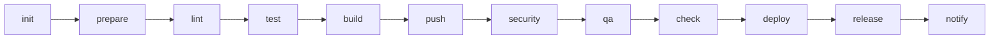

| Phase | Purpose | Workflow · Job |
|---|---|---|
| `init` | Version discovery, registry target resolution, promotion provenance | `init.yml` · `initialize` |
| `prepare` | Warm package manager and Trivy database caches | `*-build.yml` · `dependency`, `trivy-cache.yml` · `warm` |
| `lint` | Style, syntax, YAML, Dockerfile and chart linting | `lint.yml`, `python-lint.yml`, `golang-lint.yml`, `node-lint.yml`, `terraform-lint.yml`, `chart.yml` · `lint` |
| `test` | Unit tests and coverage, published as GitHub Checks | `*-build.yml` · `test` |
| `build` | Compile, package images and charts, generate SBOM | `*-build.yml` · `build`, `docker.yml`, `buildah.yml`, `chart.yml` · `build`, `sbom.yml` · `generate` |
| `push` | Publish candidate artifacts to the dev repositories | `docker.yml` · `build`, `chart.yml` · `push` |
| `security` | Trivy CVE, misconfiguration, license and secret scans | `scan.yml`, `sbom.yml` · `scan`, `secret-scanning.yml` |
| `qa` | Quality gates and container verification | `sonarqube.yml`, `docker.yml` · `test`, `terraform-test.yml` |
| `check` | Release prerequisite guards | `check.yml` · six guards + `verdict` |
| `deploy` | GitOps repository updates and sync | `deploy-argocd-gitops.yml`, `deploy-komodo-gitops.yml` |
| `release` | Tag, GitHub Release, OCI promotion | `release.yml`, `docker.yml` · `promote`, `chart.yml` · `promote` |
| `notify` | Microsoft Teams Adaptive Card | `release.yml` · `notify`, `notify.yml` |

> [!NOTE]
> There is no `trigger` phase. GitHub cannot call a reusable workflow from a matrix, so the
> monorepo child-pipeline pattern is replaced by `mono.yml`, which returns a matrix the
> caller fans out over. See [mono](#mono).

---

## Caller Dependency Map

In GitLab every job carried its own `needs:`, so the dependency graph shipped **inside** the
library. In GitHub the library ships jobs, but the edges *between* library workflows belong
to the calling workflow. This table gives, for each library workflow, the GitLab job it
ports and the `needs:` a caller must declare — derived from the GitLab `needs:` graph rather
than guessed.

Edges marked *internal* are already declared inside the library workflow; a caller must not
repeat them.

| Library workflow · job | GitLab job(s) | Caller must declare | Derived from |
|---|---|---|---|
| `init.yml` · `initialize` | `Common:Init` | *(nothing — it is the root)* | — |
| `trivy-cache.yml` · `warm` | `Trivy:Cache:Warm` | `needs: init` | `Common:Init` |
| `lint.yml` | `.YAML:Lint`, `Changelog:Lint`, Dockerfile & chart-values lint | `needs: init` | `Common:Init` |
| `node-lint.yml` | `Node:Lint` | `needs: init` | `Common:Init` |
| `python-lint.yml` | `.python-lint-common` | `needs: [init, build]` | `Python:Dependency:Download` |
| `golang-lint.yml` | `.go-lint-common` | `needs: [init, build]` | `Go:Dependency:Download` |
| `*-build.yml` · `dependency` → `build` ∥ `test` | `.Node:Build`, `.Python:Build`, `.Go`, `.java-common` | `needs: init` | `Common:Init`; the `*:Dependency:Download` edge is *internal* |
| `docker.yml` / `buildah.yml` · `lint` → `build` → `test` / `promote` | `Image:Build`, `Image:Push`, `.Image:Test`, `Image:Promote` | `needs: [init, build]` when the image copies build output, else `needs: init` | `Common:Init`; `Image:Push` → `Image:Build` is *internal* |
| `chart.yml` · `docs` ∥ `lint` → `build` → `push` / `promote` | `Chart:Check:README`, `Chart:Lint`, `Chart:Build`, `Chart:Push`, `Chart:Promote` | `needs: init` | `Common:Init`; `Chart:Build` → `Chart:Lint` is *internal* |
| `scan.yml` (`scan-type: image`) | `Image:Scan` | `needs: [init, image, trivy-cache]` | `Common:Init`, `Image:Build`, `Trivy:Cache:Warm` |
| `scan.yml` (`scan-type: config`) | `Chart:Scan` | `needs: [init, chart, trivy-cache]` | `Common:Init`, `Chart:Lint`, `Trivy:Cache:Warm` |
| `scan.yml` (`scan-type: license`) | `License:Scan` | `needs: [init, trivy-cache]` | `Common:Init` |
| `sbom.yml` · `generate` → `scan` | `SBOM:Generate`, `SBOM:Scan` | `needs: [init, trivy-cache]` | `Common:Init`, `Trivy:Cache:Warm`, `Java:Dependency:Download`; `SBOM:Scan` → `SBOM:Generate` is *internal* |
| `secret-scanning.yml` | `Git:Secret:Scan` | `needs: init` | `Common:Init` |
| `sonarqube.yml` | `Sonarqube` | `needs: [init, build]` | `Common:Init`, `Project:Build`, `Project:Unit:Test` |
| `terraform-lint.yml` | `Terraform:Init`, `Terraform:Validate`, `Terraform:Lint`, `Terraform:Check:README` | `needs: init` | `Common:Init`; `Terraform:Init` → `Validate` / `Lint` is *internal* |
| `terraform-test.yml` | `Terraform:Scan` | `needs: [init, terraform-lint, trivy-cache]` | `Terraform:Validate` **(required)**, `Trivy:Cache:Warm` |
| `check.yml` · six guards → `verdict` | `Tag:Tag Existence`, `Changelog:Check Existence`, `Migration:Check Existence`, `Chart:Check Existence`, `Chart:Check:Dependency`, `Image:Check Existence` | **`needs: init` — and nothing else** | `.check-job-common` → `Common:Init`. See the warning below. |
| `deploy-komodo-gitops.yml` · `validate` → `komodo-deploy` | `Deploy:Komodo:Validate:Image:<env>`, `Deploy:Komodo:<env>` | `needs: init`; add `image` when the same run pushed it | `Common:Init`, `Image:Push`; the `Validate:Image` edge is now *internal* |
| `deploy-argocd-gitops.yml` · `validate` → `gitops-commit` → `sync` | `Deploy:ArgoCD:Validate:Chart/Image:<env>`, `Deploy:ArgoCD:<env>` | `needs: init`; add `image` / `chart` when the same run published them | `Common:Init`, `Image:Push`, `Chart:Push`; the `Validate:*` edges are *internal* |
| `release.yml` · `collect` → `publish` → `notify` | `Release:Upload`, `Release`, `Release:Notification:Teams` | `needs: [init, image, chart]` — whichever of `image` / `chart` this run promotes | `Release:Upload` → `Common:Init`, `Image:Promote`, `Chart:Promote`; `Release` → `Release:Upload` **(required)** is *internal* |
| `notify.yml` | `Release:Notification:Teams` | `needs: init` **(required, not optional)**; add `check` for the changelog artifact | `Common:Init` — the library's only `optional: false` edge |
| `mono.yml` · `discover` | `Trigger:*` child pipelines | *(nothing — it is a root)* | — |

> [!WARNING]
> **`check.yml` depends on `init` alone. Never write `needs: [init, build]` or
> `needs: [init, scan]` for it.** Every guard extends GitLab's `.check-job-common`
> (`common/.gitlab-ci.yml:405`), whose only edge is `Common:Init` — not `build`, not `scan`,
> not `image`. The guards ask questions about the *repository*: does this git tag already
> exist, is this chart version taken, does a chart dependency still point at a dev
> repository. Nothing a build or a scan does can change any of those answers. Chaining the
> guards behind `build` delays the one signal that should fail fastest and, because
> `Verdict` is the required status check, holds the pull request open on a verdict
> that was knowable in seconds.

A note on the GitLab edges the table is derived from: `optional: true` there means *"ignore
this edge if the job is not in this pipeline"*, **not** *"ignore it if the job failed"*. The
GitHub equivalent is to list a job in `needs:` only when the caller actually includes it —
which is why the single-focus scenario files declare `needs: init` and nothing more. Where
the library tolerates a skipped upstream *within* its own graph it uses
`needs.<job>.result != 'failure'` rather than dropping the edge.

---

## Execution Model & Trigger Strategy

### The Two-Tier Release Model

The library implements the same **Two-Tier Release Model** as the GitLab library: maximum
developer velocity, zero redundant builds, and complete supply-chain traceability.

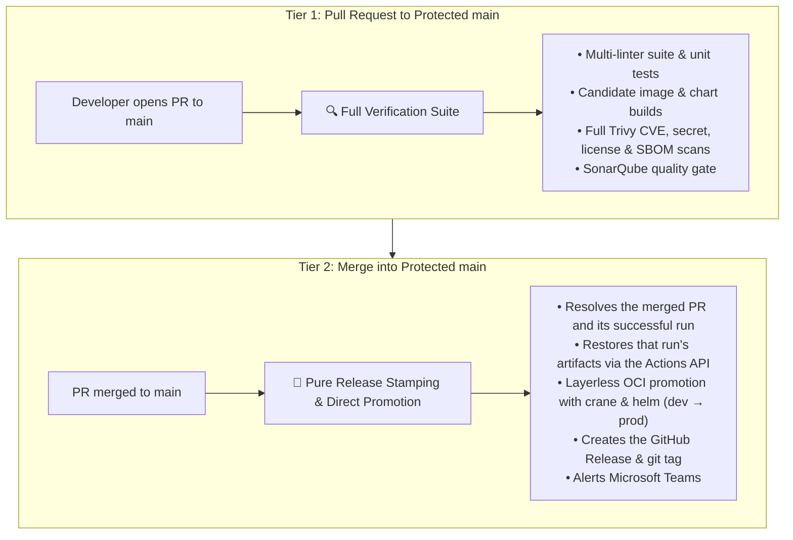

- **Silenced feature branches.** `on: pull_request: branches: [main]` and
  `on: push: branches: [main]` mean pushes to `dev` or `feature/*`, and pull requests
  between non-release branches, produce **zero runs**.
- **Release-branch protection on manual runs.** When a workflow is dispatched manually on
  the default branch or a protected `*/master`, `init.yml` forces a
  `-<run_number>.r<run_attempt>` candidate suffix and routes every push to the **dev**
  repositories. A manual run can never overwrite a published artifact.
- **Nothing is rebuilt for production.** `docker.yml` and `chart.yml` in `is-release: true`
  mode do not build. They resolve the candidate the pull request scanned and promote it by
  digest, so the released bytes are provably the scanned bytes.
- **Every dependency is explicit.** Jobs declare `needs:`, and optional upstreams are
  tolerated with `needs.<job>.result != 'failure'` so single-focus workflows run without
  waiting on skipped jobs.

---

### Available Scenario Workflows

GitLab exposes a `WORKFLOW` dropdown on manual runs. GitHub greys out skipped jobs in the
run graph, so **one workflow file per scenario** keeps each graph clean and lets `run-name`
be specific. Add `workflow_dispatch` to any of these for on-demand runs.

| Scenario file | Calls | Description | Key dispatch inputs |
|---|---|---|---|
| `pr.yml` | `init` + `lint` + `*-build` + `docker` + `scan` + `check` | Full pre-merge verification. | — |
| `release.yml` | `init` + `docker`/`chart` promote + `release` | Tag, promote, publish, notify. | — |
| `deploy.yml` | `deploy-argocd-gitops` / `deploy-komodo-gitops` | Targeted GitOps deployment without building. | `environment` *(required)*, `target-version` |
| `image-scan.yml` | `scan` (`scan-type: image`) | Scans an existing remote image tag. | `target-version` *(required)* |
| `chart-scan.yml` | `scan` (`scan-type: config`) | Renders and scans a local or remote chart. | `target-version`, `helm-values` |
| `license-scan.yml` | `scan` (`scan-type: license`) | Dependency licence compliance audit. | — |
| `sbom.yml` | `sbom` | CycloneDX SBOM generation + CVE scan. | — |
| `secret-scan.yml` | `secret-scanning` | Betterleaks git-history audit. | `full-history` |
| `sonarqube.yml` | `sonarqube` | Analysis and quality gate. | — |
| `lint.yml` | `lint` + language linters | Multi-linter suite. | — |
| `build.yml` | `init` + `*-build` | Build and unit test only. | — |
| `check.yml` | `init` + `check` | Release prerequisite guards only. | — |

---

### Comprehensive Execution Matrix

| # | Scenario | Trigger | Automatic? | Jobs | Scope & Primary Purpose |
|---|---|---|:---:|:---:|---|
| **1** | **PR to the default branch** | `pull_request` → `main` | ✅ Yes | ~30 | **Full verification suite**: linters, unit tests, candidate image and chart builds, CVE scans, SonarQube gate. |
| **2** | **Production release** | `push` → `main` | ✅ Yes | 6 | **Release stamping & OCI promotion**: resolves the PR's run, promotes candidate image/chart by digest, creates the GitHub Release and tag, alerts Teams. Zero builds, tests or scans. |
| **3** | **Branch push / non-release PR** | `push` → `dev`, `feature/*` | ❌ No | 0 | **Silenced**: no runner minutes consumed on developer branches. |
| **4** | **Deploy (ArgoCD / Komodo)** | `workflow_dispatch` | 🔘 Manual | 3 | **Targeted GitOps deployment**: validates inputs, verifies the image and chart exist, commits to the GitOps repository, syncs. |
| **5** | **Container image scan** | `workflow_dispatch` | 🔘 Manual | 1 | **Remote image scan**: resolves the tag against the prod or dev repository and runs Trivy. |
| **6** | **Helm chart scan** | `workflow_dispatch` | 🔘 Manual | 1 | **Chart security scan**: `helm template` render, then Trivy config scan. |
| **7** | **Git secret scan** | `workflow_dispatch` | 🔘 Manual | 1 | **Secret audit**: full git history via betterleaks. |
| **8** | **Licence compliance scan** | `workflow_dispatch` | 🔘 Manual | 1 | **Open-source audit** against the licence classification policy. |
| **9** | **SBOM generation & scan** | `workflow_dispatch` | 🔘 Manual | 2 | **SBOM audit**: CycloneDX generation, then component CVE scan. |
| **10** | **SonarQube analysis** | `workflow_dispatch` | 🔘 Manual | 1 | **Code quality gate**. |
| **11** | **Multi-linter suite** | `workflow_dispatch` | 🔘 Manual | 5–9 | **Unified linting**: Dockerfile, YAML, chart values, changelog, migration guide, plus language linters in parallel. |
| **12** | **Image build & push** | `workflow_dispatch` | 🔘 Manual | 4 | **Isolated image pipeline**: lint, build, push to dev, scan. |
| **13** | **Chart build & push** | `workflow_dispatch` | 🔘 Manual | 4 | **Isolated chart pipeline**: docs check, lint, package, push. |
| **14** | **Build & unit test** | `workflow_dispatch` | 🔘 Manual | 3 | **Isolated build**: dependency resolution, build, unit tests. |
| **15** | **Release prerequisites check** | `workflow_dispatch` | 🔘 Manual | 7 | **Pre-flight verification**: git tag, changelog, migration guide, chart version, chart dependencies, image tag, verdict. |

---

## End-to-End Workflow DAGs & Architecture

### 1. Automatic Pull Request Verification

> **Trigger:** `pull_request` targeting the protected default branch (`main`).

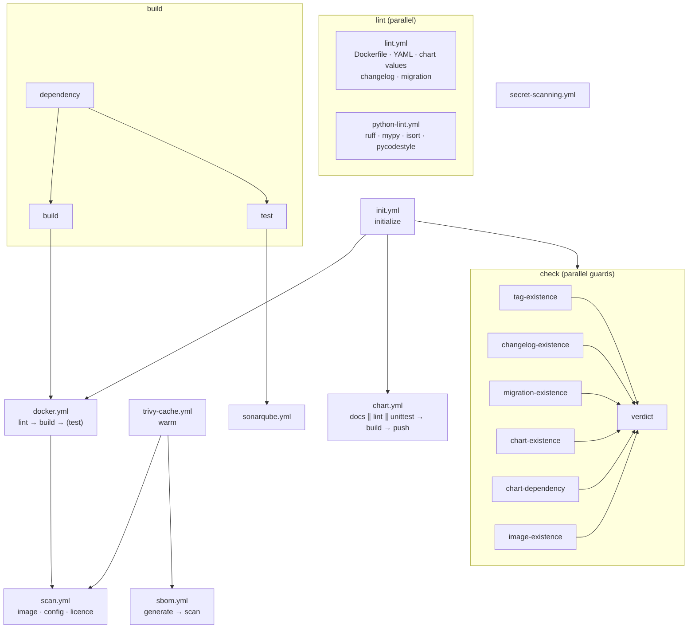

Every leaf publishes a step summary and, where applicable, GitHub Check annotations on the
changed lines. `fail-fast: false` on every matrix means one run reports every problem
rather than the first.

---

### 2. Fast-Track Production Release Tagging & OCI Promotion

> **Trigger:** `push` to the default branch (a merged pull request).

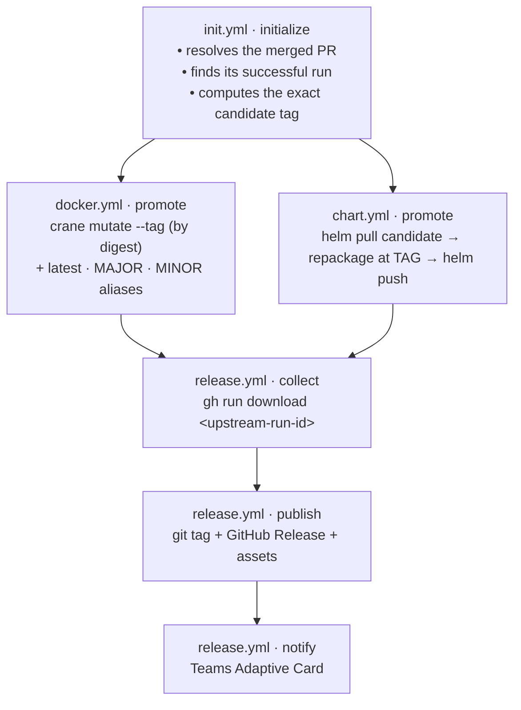

Nothing is compiled, tested or scanned in this graph. The scan reports attached to the
release are the ones the pull request produced, restored from that run.

---

### 3. GitOps Targeted Deployment

> **Trigger:** `workflow_dispatch` with an `environment` input.

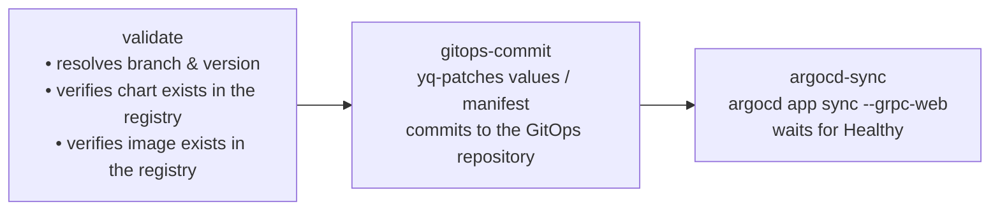

The validate job refuses to commit a GitOps change that cannot resolve, so a typo in a
version never reaches the cluster as a broken `Application`.

---

### 4. Standalone Quality & Security Audits

Each audit is a single reusable workflow with no `init.yml` dependency, so it runs in
isolation with no version-resolution overhead.

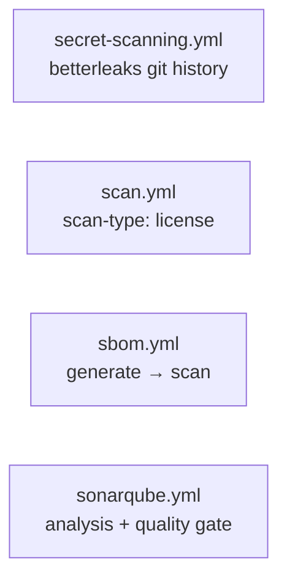

---

## Module Catalog

### init & check

Environment initialisation, version discovery and the release prerequisite guards.

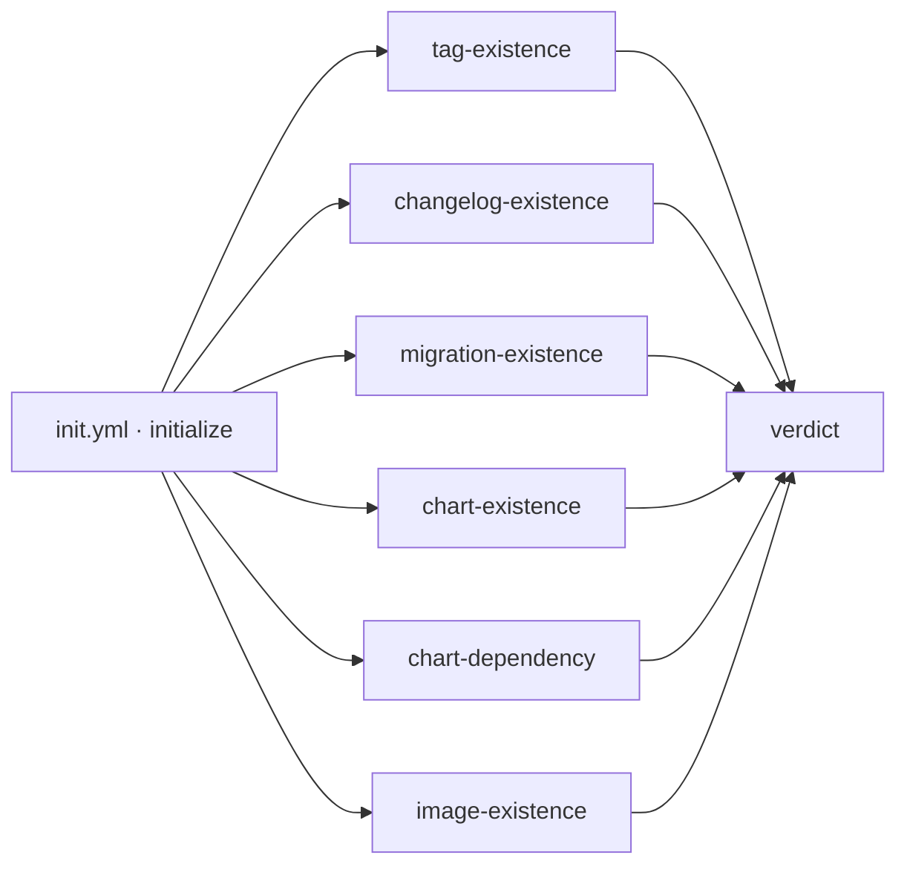

| Workflow · Job | Description |
|---|---|
| `init.yml` · `initialize` | Discovers the application version from `VERSION`, `package.json`, `pyproject.toml`, `pom.xml` or `Chart.yaml`; computes the candidate suffix; resolves dev/production repositories; and on a release resolves the merged pull request and its successful run. **26 outputs.** |
| `check.yml` · `tag-existence` | Fails when the git tag already exists on a different commit. A tag already on *this* commit is treated as a re-run, not a collision. |
| `check.yml` · `changelog-existence` | Extracts the `## [x.y.z]` section from `CHANGELOG.md` and renders it as an Adaptive Card fragment. Uploads `release-changelog`. |
| `check.yml` · `migration-existence` | Extracts the `previous...current` section from `MIGRATION.md`. Skipped for an initial release, or disabled with `check-migration: false` for artifacts that intentionally have no migration contract. Uploads `release-migration`. |
| `check.yml` · `chart-existence` | Fails when the chart version is already published. Candidate versions skip the collision check. |
| `check.yml` · `chart-dependency` | Fails when a chart dependency resolves to a development repository. |
| `check.yml` · `image-existence` | Fails when the image tag is already published. |
| `check.yml` · `verdict` | Consolidates every guard into one table and one required status check. |

> [!TIP]
> Set the branch protection **required status check** to `Verdict`. It reports
> `success` only when every applicable guard passed, and names the failures when not.

#### `init.yml` outputs

| Output | Example | Used by |
|---|---|---|
| `tag` | `1.4.0` | `check`, `release`, promote jobs |
| `release-version` | `1.4.0` | scan target resolution |
| `is-release` | `true` | promote vs build routing |
| `version-suffix` | `-42.891` | diagnostics |
| `image-tag` / `image-push-tag` | `1.4.0` / `1.4.0-42.891` | `docker`, `buildah` |
| `image-repository` / `image-dev-repository` / `image-push-repository` | `contoso/order-backend[-dev]` on Docker Hub | `docker`, `check`, promote |
| `chart-name` / `chart-version` / `chart-app-version` / `chart-push-version` | `order-backend` / `1.4.0` / `1.4.0-42.891` | `chart` |
| `chart-repository` / `chart-dev-repository` / `chart-push-repository` | `helm[/dev]` | `chart`, `check` |
| `ignore-chart` / `ignore-docker` | `false` | conditional job gating |
| `upstream-run-id` / `merged-pr-number` | `18234567` / `891` | `release` artifact restore |
| `candidate-image-tag` / `candidate-chart-version` | `1.4.0-42.891` | exact promotion source |
| `major-version` / `minor-version` | `1` / `1.4` | image aliases |

---

### nodejs

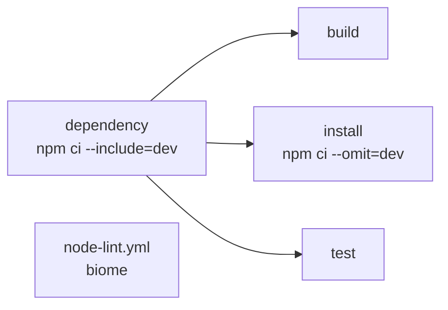

| Workflow · Job | Description |
|---|---|
| `node-build.yml` · `dependency` | `npm ci --include=dev --prefer-offline`. Caches `.npm` keyed by `package-lock.json`. |
| `node-build.yml` · `build` | Runs `build-command` (default `npm run build`). Uploads `node-dist`. |
| `node-build.yml` · `test` | Runs `test-command`, publishes JUnit as a GitHub Check. |
| `node-lint.yml` · `lint` | Biome. Fails with a starter `biome.json` in the summary when the config is missing. |

---

### python

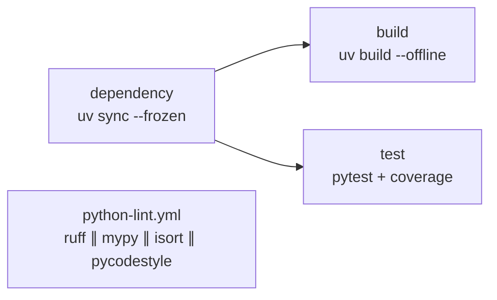

| Workflow · Job | Description |
|---|---|
| `python-build.yml` · `dependency` | `uv sync --frozen --no-install-project`. Caches `.uv-cache` keyed by `uv.lock`. Strictly frozen — never mutates the lockfile. |
| `python-build.yml` · `build` | `uv build --offline`. Uploads `python-dist`. Not created when `build-command` is empty — an interpreted service goes `dependency` → `test`. |
| `python-build.yml` · `test` | `pytest --junitxml --cov`, published as a GitHub Check. |
| `python-lint.yml` · `lint` | Matrix of `ruff`, `mypy`, `isort`, `pycodestyle`, all in parallel. |

---

### golang

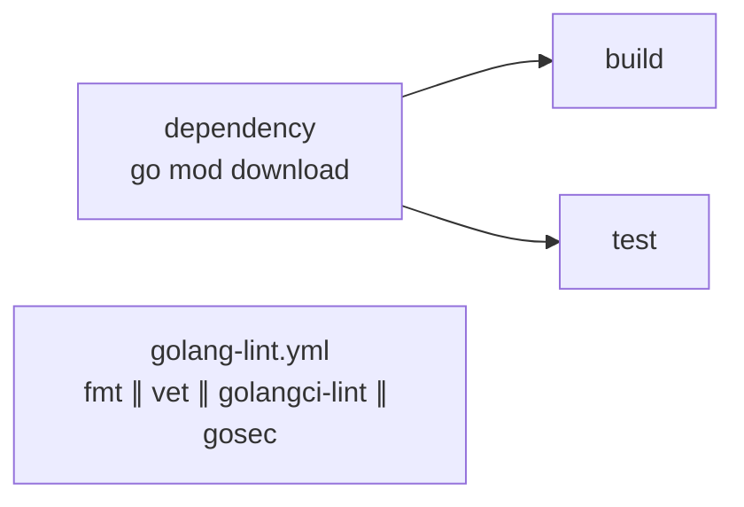

| Workflow · Job | Description |
|---|---|
| `golang-build.yml` · `dependency` | `go mod download`. Caches `.go-cache` keyed by `go.sum`. |
| `golang-build.yml` · `build` | `go build -trimpath -o bin/ ./...`. Uploads `go-binaries`. |
| `golang-build.yml` · `test` | `go test` piped through `go-junit-report`. |
| `golang-lint.yml` · `fmt` | `go fmt ./...`, then fails on a dirty tree. |
| `golang-lint.yml` · `vet` | `go vet`, honouring a `// govet:ignore` pragma on the preceding line. |
| `golang-lint.yml` · `golangci-lint` | Full linter aggregate. |
| `golang-lint.yml` · `gosec` | Security static analysis, excluding generated code. |

---

### java

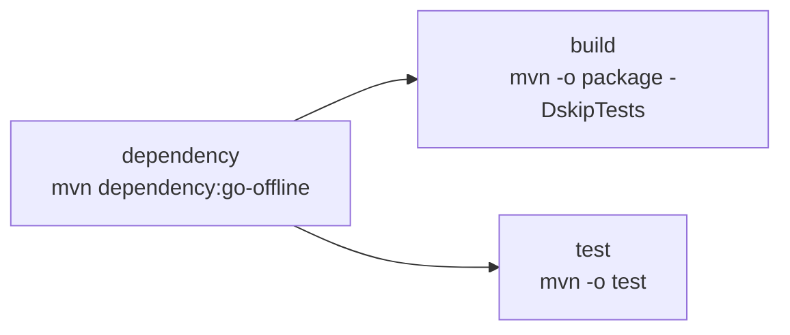

| Workflow · Job | Description |
|---|---|
| `java-build.yml` · `dependency` | `mvn dependency:go-offline`. Caches `.m2` keyed by `pom.xml`. |
| `java-build.yml` · `build` | Offline `mvn package`. Uploads `java-artifacts` (`*.jar`, `*.war`). |
| `java-build.yml` · `test` | Offline `mvn test`; Surefire XML published as a GitHub Check. |

---

### image

Container image building and registry management, supporting both Docker/BuildKit and
Buildah.

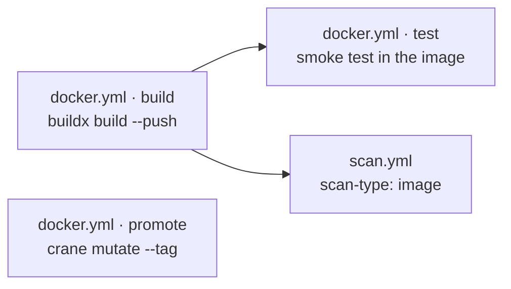

| Workflow · Job | Description |
|---|---|
| `docker.yml` · `build` | Buildx build and push, with every organisation base image injected as a build argument and registry layer cache. Outputs `image-ref-digest`. |
| `docker.yml` · `test` | Optional smoke test executed **inside** the built image. Off by default. |
| `docker.yml` · `promote` | Release-mode only. Refuses unless the caller passes a successful `scan-result`. Resolves the candidate and copies it by digest with `crane mutate --tag`, then tags `latest`, `MAJOR`, `MINOR`. |
| `buildah.yml` · `build` | Dockerfile-free minimal image assembly from a base image: `microdnf install`, package-manager purge, documentation/systemd/PAM strip, `USER 10001`. |
| `buildah.yml` · `promote` | Same digest-preserving promotion as `docker.yml`. |

> [!IMPORTANT]
> `docker.yml` · `build` is the **only** job in the library that does not run inside an
> organisation build container. Building an image needs the daemon and BuildKit on the
> runner itself. Every other job, `docker.yml` · `promote` included, is
> containerised.

#### Dockerfile Standards & Multi-Stack Reference (Packaging-Only & Non-Root 10001:10001)

Every image built by this platform adheres strictly to the **Packaging-Only Standard** and
**Non-Root Runtime Enforcement**:

1. **Packaging-Only Standard (zero compilation in the Dockerfile).**
   All compiling, bundling and transpiling (`npm run build`, `mvn package`, `go build`,
   `uv build`), linting and tests **MUST** execute in the `*-build.yml` workflows. The
   `Dockerfile` is purely an artifact packaging manifest; it copies pre-built output.
   Where an interpreted stack must install dependencies, it installs **offline** from the
   CI package cache, bind-mounted by BuildKit — never resolving over the network, which
   would re-resolve what the pipeline already pinned and scanned. The `--mount` source must
   name the directory the pipeline actually cached (`.uv-cache` for `python-build.yml`,
   `.npm` for `node-build.yml`), and `.dockerignore` must admit it.
2. **Non-root user and group (10001:10001).**
   - Containers must never run as `root` (UID `0`). Every Dockerfile declares `USER 10001:10001`.
   - All copied files must be owned by the non-root user: `COPY --chown=10001:10001 ...`.
   - If the application writes logs, cache or PID files at runtime, create and chown those
     directories **before** the `USER` directive.
   - Standard non-privileged listening port: `EXPOSE 8080`.
3. **Automatic build-arg base images.**
   `docker.yml` resolves and injects the following build arguments automatically. A
   Dockerfile pins nothing itself — bumping a base image is a change to one organisation
   variable.

   | Tech stack | Injected build arg | Organisation variable | Description |
   |---|---|---|---|
   | **Java** | `JAVA_25_MICRO_BASE_IMAGE` | `vars.JAVA_25_MICRO_BASE_IMAGE` | Minimal hardened Java 25 JRE runtime |
   | **Golang** | `MICRO_ROOT_BASE_IMAGE` | `vars.MICRO_ROOT_BASE_IMAGE` | Distroless minimal root container for static binaries |
   | **Python** | `PYTHON_312_MICRO_BASE_IMAGE` | `vars.PYTHON_312_MICRO_BASE_IMAGE` | Minimal Python 3.12 micro runtime |
   | **Node.js backend** | `NODE_JS_24_MICRO_BASE_IMAGE` | `vars.NODE_JS_24_MICRO_BASE_IMAGE` | Minimal Node.js 24 micro runtime |
   | **Node.js frontend** | `NGINX_MICRO_BASE_IMAGE` | `vars.NGINX_MICRO_BASE_IMAGE` | Non-root Nginx static SPA server |
   | **Multi-stage builder** | `TOOLKIT_BUILD_IMAGE` | `vars.TOOLKIT_BUILD_IMAGE` | The one build container, for a builder stage only. Every toolchain is baked into it. |
   | **All** | `VERSION` | — | `init.yml`'s `image-push-tag` |

   Each is passed as `${{ vars.IMAGE_REGISTRY }}/<value>`.

   > [!NOTE]
   > GitLab additionally injects `CI_DEPENDENCY_PROXY_GROUP_IMAGE_PREFIX`. GitHub has no
   > Dependency Proxy and injects no equivalent, so a Dockerfile ported from GitLab must give
   > that ARG a default (`ARG CI_DEPENDENCY_PROXY_GROUP_IMAGE_PREFIX=`) or drop it.

4. **Base image selection.**
   Use the runtime image matching the project language; fall back to `MICRO_ROOT_BASE_IMAGE`
   when no language image fits. **A runtime stage is never built `FROM` a build image.** A
   `*_BUILD_IMAGE` carries compilers, package managers and credential helpers, all of which
   would ship to production — it belongs in a builder stage only.

5. **Tags are pinned, never floating.**
   No `:latest`, and no untagged reference. A literal image carries an explicit tag with a
   `# renovate:` annotation on the line above so the bot can bump it. A `FROM ${VAR}`
   reference needs no tag: CI resolves it from the organisation variable.

6. **Runtime instructions.**
   - `EXPOSE` is required on a service image. It is the image's only self-describing
     contract, and the chart's `containerPort` is unverifiable without it.
   - **Prefer `CMD`.** It states the default command while leaving an operator free to
     override it with `docker run <image> <cmd>`.
   - Use `ENTRYPOINT` only to invoke a pre-start shim — a script that must substitute
     configuration before the service starts. If that shim `exec`s the service as its last
     action it becomes PID 1 and needs nothing further. If it forks, or leaves children
     running, `exec` through `dumb-init` so signals and zombie reaping work:
     `exec /usr/bin/dumb-init -- nginx -g "daemon off;"`.

7. **Layout: the `USER` bracket, grouping and layers.**
   - `USER 0` immediately after the runtime stage's `FROM`, opening the root setup phase.
     `USER 10001:10001` closes it, before the runtime instructions. A builder stage is
     discarded and needs no `USER 0` — declaring one there trips hadolint `DL3002`
     ("last USER should not be root"), which is evaluated per stage and gates `lint.yml`.
   - Group by instruction kind and separate groups with one blank line. Instructions that
     form a single unit — a run of `COPY`s, one install-and-chown `RUN` — stay together with
     no blank line between them, under one comment saying what the group is for.
   - **Merge consecutive `RUN`s.** Each one is a layer, and a layer keeps whatever the
     previous one left behind. Chain with `&& \` instead.
   - Group related `ARG`s into one continued statement. The exception is a version pin: an
     `ARG` carrying a `# renovate:` annotation stays on its own line, because the annotation
     binds to the line below it.
   - Copy source **after** the dependency install, never before, or every source edit
     invalidates the dependency layer.

##### 1. Java / Spring Boot Microservice

```dockerfile
ARG JAVA_25_MICRO_BASE_IMAGE
FROM ${JAVA_25_MICRO_BASE_IMAGE}

USER 0

WORKDIR /app

# Copy the fat JAR produced by java-build.yml
COPY --chown=10001:10001 target/*.jar /app/app.jar

USER 10001:10001

EXPOSE 8080

CMD ["java", "-XX:+UseContainerSupport", "-XX:MaxRAMPercentage=75.0", "-jar", "/app/app.jar"]
```

```dockerignore
**
*
!target/*.jar
!build/libs/*.jar
```

##### 2. Golang Static Binary

```dockerfile
ARG MICRO_ROOT_BASE_IMAGE
FROM ${MICRO_ROOT_BASE_IMAGE}

USER 0

WORKDIR /app

# Copy the static binary produced by golang-build.yml
COPY --chown=10001:10001 bin/app /app/app

USER 10001:10001

EXPOSE 8080

CMD ["/app/app"]
```

```dockerignore
**
*
!bin/
!bin/*
```

##### 3. Python (uv + `src/` layout)

```dockerfile
ARG PYTHON_312_MICRO_BASE_IMAGE
FROM ${PYTHON_312_MICRO_BASE_IMAGE}

USER 0

WORKDIR /app

ENV PATH="/app/.venv/bin:$PATH"

# Copy locked dependency manifests
COPY --chown=10001:10001 pyproject.toml uv.lock ./

# Mount the pre-warmed CI cache via Buildx, install production dependencies offline,
# and set ownership. The mount source is the directory python-build.yml cached.
RUN --mount=type=bind,source=.uv-cache,target=/tmp/.uv-cache \
    uv sync --frozen --no-dev --no-install-project --no-install-workspace --offline --cache-dir /tmp/.uv-cache && \
    chown -R 10001:10001 /app

# Copy application source code with non-root ownership
COPY --chown=10001:10001 src/ /app/src/

USER 10001:10001

EXPOSE 8080

CMD ["uvicorn", "src.main:app", "--host", "0.0.0.0", "--port", "8080"]
```

```dockerignore
**
*
!pyproject.toml
!uv.lock
!.uv-cache
!.uv-cache/**
!src
!src/**
```

##### 4. Node.js Backend (Express / NestJS)

```dockerfile
ARG NODE_JS_24_MICRO_BASE_IMAGE
FROM ${NODE_JS_24_MICRO_BASE_IMAGE}

USER 0

WORKDIR /app

ENV NODE_ENV=production \
    PORT=8080

# Copy locked dependency manifests
COPY --chown=10001:10001 package*.json /app/

# Mount the cache node-build.yml warmed, install production dependencies offline,
# and set ownership
RUN --mount=type=bind,source=.npm,target=/tmp/.npm,rw \
    npm ci --omit=dev --offline --no-audit --no-fund --cache /tmp/.npm && \
    chown -R 10001:10001 /app

# Copy pre-compiled dist/ with non-root ownership
COPY --chown=10001:10001 dist/ /app/dist/

USER 10001:10001

EXPOSE 8080

CMD ["node", "/app/dist/main.js"]
```

```dockerignore
**
*
!package*.json
!.npm
!.npm/**
!dist/
!dist/**
```

##### 5. Node.js Frontend (Nginx SPA)

```dockerfile
ARG NGINX_MICRO_BASE_IMAGE
FROM ${NGINX_MICRO_BASE_IMAGE}

USER 0

# Copy the static bundle and SPA nginx configuration with non-root ownership
COPY --chown=10001:10001 dist/ /usr/share/nginx/html/
COPY --chown=10001:10001 nginx.conf /etc/nginx/conf.d/default.conf

USER 10001:10001

EXPOSE 8080

CMD ["nginx", "-g", "daemon off;"]
```

```dockerignore
**
*
!dist/
!dist/**
!nginx.conf
```

##### 6. Multi-stage (only when the pipeline cannot produce the artifact)

Most images need no builder stage: `*-build.yml` produces the artifact and the Dockerfile
copies it. Where a builder stage is genuinely needed, it uses a `*_BUILD_IMAGE` and the
runtime stage copies out of it — the runtime stage itself is always a micro base image.

```dockerfile
ARG TOOLKIT_BUILD_IMAGE \
    MICRO_ROOT_BASE_IMAGE

FROM ${TOOLKIT_BUILD_IMAGE} AS builder

WORKDIR /src

COPY . .

RUN make build

FROM ${MICRO_ROOT_BASE_IMAGE}

USER 0

WORKDIR /app

# Copy only the built artifact out of the builder stage
COPY --from=builder --chown=10001:10001 /src/bin/app /app/app

USER 10001:10001

EXPOSE 8080

CMD ["/app/app"]
```

#### The Inverted `.dockerignore` Allowlist Standard (Default Deny)

To enforce packaging hygiene, keep the build context under ~100 KB, and guarantee that no
sensitive local file (`.git/`, `.env`, secrets, test caches, local virtualenvs) leaks into
an image, every project uses an **inverted allowlist**:

1. **Default deny.** Block everything recursively with `**` and `*` at the top of the file.
2. **Explicit allowlist (`!`).** Unignore only the exact files the Dockerfile copies.

| Tech stack | Allowlisted packaging targets |
|---|---|
| **Python** (`uv` + `src/`) | `pyproject.toml`, `uv.lock`, `.uv-cache/`, `src/` |
| **Java** (Spring Boot fat JAR) | `target/*.jar` or `build/libs/*.jar` |
| **Golang** (static binary) | `bin/` |
| **Node.js frontend** (Nginx SPA) | `dist/`, `nginx.conf` |
| **Node.js backend** | `dist/`, `.npm` cache, `package*.json` |

---

### chart

Helm chart packaging and publishing over **OCI**, the registry protocol both platforms
share.

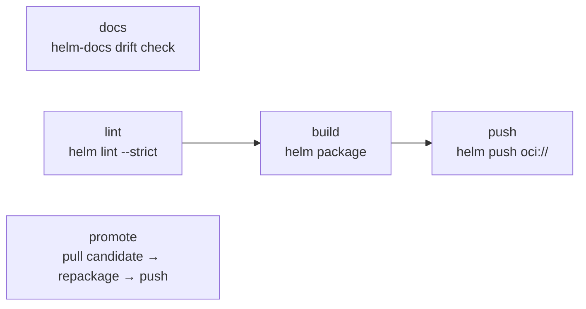

| Workflow · Job | Description |
|---|---|
| `chart.yml` · `docs` | Regenerates `chart/README.md` with `helm-docs` and fails on drift, showing the diff and the exact command in the summary. |
| `chart.yml` · `lint` | `helm lint --strict`, with optional inline value overrides. |
| `chart.yml` · `unittest` | **Optional, opt-in** (`run-unittest: true`, default `false`). Renders the mock consumer chart at `mock-chart` (default `test`) with `helm unittest --strict` and uploads `chart-unittest-report`. For repositories that *ship* a chart others depend on; requires the `unittest` Helm plugin in the job image. |
| `chart.yml` · `build` | `helm package --version --app-version`. Uploads `chart-package`. |
| `chart.yml` · `push` | `helm push` to the OCI repository. Writes `CHART_INFO.md`. |
| `chart.yml` · `promote` | Release-mode only. Pulls the exact candidate, repackages at the release tag, pushes to production. |
| `scan.yml` (`scan-type: config`, `config-type: chart`) | Renders templates, then runs a Trivy misconfiguration scan. |
| `check.yml` · `chart-existence` / `chart-dependency` | Version collision and development-dependency guards. |

---

### terraform

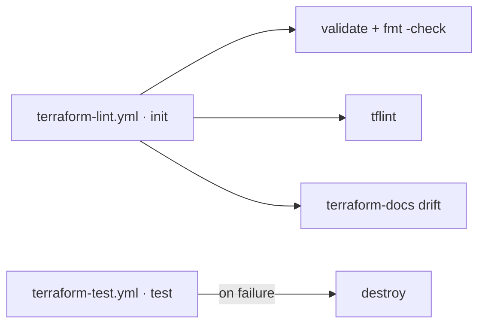

| Workflow · Job | Description |
|---|---|
| `terraform-lint.yml` · `init` | `terraform init` with the backend workspace key prefix. Caches providers by `.terraform.lock.hcl`. |
| `terraform-lint.yml` · `validate` | `terraform validate` and `terraform fmt -recursive -check`. |
| `terraform-lint.yml` · `tflint` | Recursive `tflint` across all module call types. |
| `terraform-lint.yml` · `docs` | `terraform-docs` drift check for the root and every `modules/*`. |
| `terraform-test.yml` · `test` | `go test` module suite with a configurable timeout. |
| `terraform-test.yml` · `destroy` | Runs **only on test failure**, so a crashed test cannot strand real infrastructure. |
| `scan.yml` (`scan-type: config`, `config-type: terraform`) | Trivy IaC misconfiguration scan. |

#### Consuming a module — no packaging step

Modules are consumed directly from git. There is no package, no registry upload and no
publish job to maintain: the git ref *is* the version.

```hcl
module "vpc" {
  source = "git::git@github.com:grootan-devops/terraform-modules.git//modules/vpc?ref=1.0.0"
}

module "eks" {
  # git::<repo_url>//<sub_folder>?ref=<tag | branch | commit>
  source = "git::git@github.com:grootan-devops/terraform-modules.git//modules/eks?ref=b4f8d29"
}
```

> [!IMPORTANT]
> Always pin `?ref=` to a tag or commit SHA. A branch ref (`?ref=main`) re-resolves on every
> `terraform init`, so a plan can change without the consuming repository changing.

---

### sonarqube

| Workflow · Job | Description |
|---|---|
| `sonarqube.yml` · `sonarqube` | Runs in the SonarSource scanner container. Fetches full history (Sonar attributes issues to authors and measures new code against a baseline), downloads any `*-test-reports` artifacts for coverage, and waits on the quality gate. A monorepo child analyses as its own project, keyed by its subpath. |

---

### secret-scanning

| Workflow · Job | Description |
|---|---|
| `secret-scanning.yml` · `secret-scan` | betterleaks over git history. On a pull request only the branch range is scanned; elsewhere the full history. Findings are redacted in the log. |

---

### license

Licence compliance is a mode of the shared scanner rather than a separate workflow:

```yaml
uses: grootan-devops/github-ci-library/.github/workflows/scan.yml@1.0.0
with:
  scan-type: license
```

Dependencies are classified as `notice`, `permissive`, `reciprocal`, `restricted` or
`unrecognized`. **Restricted** licences fail the scan; **reciprocal** and **unrecognized**
warn. Suppress per package in `ignored-cves.yml` under `license:`.

---

### sbom

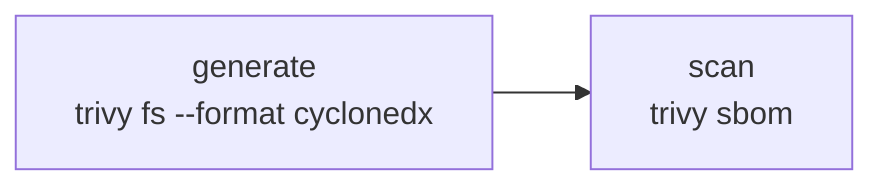

| Workflow · Job | Description |
|---|---|
| `sbom.yml` · `generate` | CycloneDX `sbom.cdx.json`. Links the Maven cache into place first so Java components resolve completely. Uploads `sbom`. |
| `sbom.yml` · `scan` | Scans the generated document for CVEs. Separate job, so a scan failure is distinguishable from a generation failure and the SBOM is published either way. |

---

### deploy/gitops

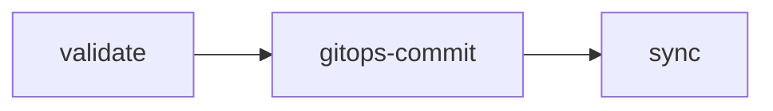

#### Komodo (`deploy-komodo-gitops.yml`)

Docker Compose stacks. Verifies the image exists, patches the compose file in the GitOps
repository, and triggers a Komodo stack redeploy.

| Input | Required | Description |
|---|:--:|---|
| `environment` | ✅ | Target environment |
| `stack-name` | ✅ | Komodo stack to redeploy |
| `gitops-repo` | ✅ | GitOps repository holding the compose file |
| `compose-file` | ✅ | Path to the compose file within it |
| `image-repository`, `image-tag` | ✅ | Image to deploy |
| `komodo-server` | | Defaults to `vars.KOMODO_SERVER` |

#### ArgoCD (`deploy-argocd-gitops.yml`)

Kubernetes. Supports both **Helm mode** (patch `targetRevision` / values) and **manifest
mode** (patch an image reference), then syncs and waits for `Healthy`.

| Input | Required | Description |
|---|:--:|---|
| `environment` | ✅ | Target environment |
| `gitops-repo` | ✅ | GitOps repository |
| `app-path` | ✅ | Path to the application within it |
| `chart-name` / `chart-version` | | Helm mode |
| `manifest-file` / `new-image` | | Manifest mode |
| `argocd-server` | | Defaults to `vars.ARGOCD_SERVER` |

---

### release & notify

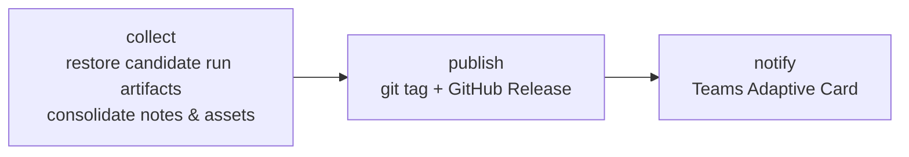

| Workflow · Job | Description |
|---|---|
| `release.yml` · `collect` | Downloads this run's artifacts and, via `gh run download`, the candidate run's. Consolidates `RELEASE_CHANGELOG.md`, `RELEASE_MIGRATION.md`, image/chart/Terraform info and every scan report into the release body, and stages the assets. |
| `release.yml` · `publish` | Creates the git tag and the GitHub Release with all staged assets. |
| `release.yml` · `notify` | Microsoft Teams Adaptive Card with the rendered release notes and links. |
| `notify.yml` | The same card, standalone. |

Release assets: the Trivy report bundle, `installed_pkgs.txt`, `sbom.cdx.json`, the chart
`.tgz`, the test report archive, `RELEASE_CHANGELOG.md`, `RELEASE_MIGRATION.md`, plus
anything named in `additional-artifacts`.

---

### mono

GitHub cannot call a reusable workflow from a matrix, so there is no child-pipeline
equivalent. `mono.yml` answers the question the parent pipeline existed to answer — which
projects changed — and returns a matrix the caller fans out over.

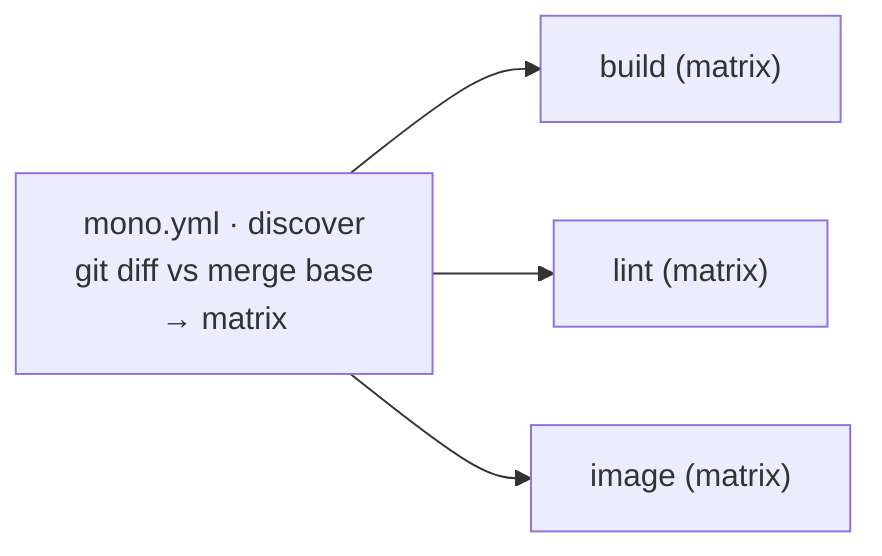

| Output | Description |
|---|---|
| `matrix` | `strategy.matrix` object covering only the changed projects |
| `any-changed` | `true` when at least one project changed |
| `changed-count` | Number of projects selected |

Declare projects once in `vars.MONO_PROJECTS`:

```json
[{"name":"api","path":"services/api"},{"name":"web","path":"services/web"}]
```

Pass `always-run-all: true` on release runs so a release never skips a project.

---

## Key Variables & Configuration

The GitLab library sets everything once in a group-level `variables:` block and each project
overrides almost nothing. This library does the same with **organisation variables**, which
is why callers pass so few inputs.

Set these under **Settings → Secrets and variables → Actions**, at organisation level
wherever possible.

### Required variables

| Variable | Description |
|---|---|
| `IMAGE_REGISTRY` | Container and chart registry host, e.g. `registry.domain.local`. |
| `IMAGE_REPOSITORY` | Image repository path, e.g. `myapp/order-backend`. |
| `TOOLKIT_BUILD_IMAGE` | Default build container, e.g. `devops/build-containers/bt-container:3.2.1`. |

> [!IMPORTANT]
> Build and base image coordinates carry **no library defaults**. A container variable that
> is unset produces a pull failure naming the empty reference, which is a better failure
> than silently running a plausible-but-wrong image version. Set them at organisation level
> once and every repository inherits them.

### Build & base image variables

| Variable | Used by | Description |
|---|---|---|
| `TOOLKIT_BUILD_IMAGE` | every `*-build`, `*-lint`, `buildah`, `terraform-*` | The one build container. Go, JDK + Maven, Python, Node, buildah and the linters are all baked into it; there is no per-language build image. |
| `SONAR_SCANNER_IMAGE` | `sonarqube` | SonarSource scanner container |
| `BUILDKIT_IMAGE` | `docker` | Buildx driver image |
| `MICRO_ROOT_BASE_IMAGE` | `docker`, `buildah` | Golang / scratch base, injected as a build arg |
| `PYTHON_312_MICRO_BASE_IMAGE` | `docker` | Python runtime base |
| `NODE_JS_24_MICRO_BASE_IMAGE` | `docker` | Node runtime base |
| `NGINX_MICRO_BASE_IMAGE` | `docker` | Nginx SPA base |
| `JAVA_25_MICRO_BASE_IMAGE` | `docker` | JRE runtime base |

### Behavioural variables

| Variable | Default | Description |
|---|---|---|
| `CI_RUNNER` | `ubuntu-26.04` | Runner label for every job. Pinned rather than tracking `ubuntu-latest`, so a platform migration cannot change the build environment under a release. |
| `PROJECT_PATH` | `.` | Root directory of the application inside the repository. |
| `CHART_DIR` | `./chart` | Path to the Helm chart folder. |
| `CHART_FILE` | `Chart.yaml` | Chart manifest filename. |
| `CHART_REPOSITORY` | `helm` | Chart repository path in the registry. |
| `DOCKERFILE` | `Dockerfile` | Dockerfile path for linting and building. |
| `MASTER_BRANCH_REGEX` | `^(.*/)?master$` | **Additional** protected branches treated as release branches. The repository's own default branch always is, whatever it is called — leave this alone unless you release from a second branch such as `release/master`. |
| `IMAGE_DEV_REPOSITORY_SUFFIX` | automatic | Appended for candidate images: `-dev` on Docker Hub and `/dev` on other registries. Set an explicit value to override. |
| `CHART_DEV_REPOSITORY_SUFFIX` | `/dev` | Appended for candidate charts. |
| `RELEASE_VERSION_SUFFIX` | — | Suffix appended to the version, e.g. `backend` → `1.5.0-backend`. |
| `CHANGELOG_FILE_NAME` | `./CHANGELOG.md` | Changelog path. |
| `MIGRATION_FILE_NAME` | `./MIGRATION.md` | Migration guide path. |
| `UPSTREAM_WORKFLOW` | `pr.yml` | Workflow file whose successful run produced the candidate artifacts. |
| `MONO_PROJECTS` | — | JSON array of `{name, path}` for monorepos. |
| `HADOLINT_IGNORE` | — | Comma-separated extra hadolint rules to ignore. |
| `MD_LINT_IGNORE_RULE` | — | Space-separated extra markdownlint rules to exclude. |

### Security & quality variables

| Variable | Default | Description |
|---|---|---|
| `TRIVY_HOST` | — | Shared Trivy server. **Unset means every scan downloads the ~1.2 GB database.** |
| `TRIVY_TIMEOUT` | `60m` | Scan timeout. |
| `TRIVY_IGNORE_CONFIG_FILE` | `ignored-cves.yml` | Suppression configuration path. |
| `TRIVY_IGNORE_CVES` | `KSV-0011 KSV-0014 KSV-0015 KSV-0016 KSV-0018 KSV-0110 KSV-0113 KSV-0125` | Space-separated misconfiguration IDs suppressed platform-wide (set by the platform at deploy time, not by the chart). |
| `TRIVY_IGNORED_LICENSE_CLASSIFICATIONS` | `notice,permissive,unencumbered` | Licence classes that never warn. |
| `SKIP_CVE_SCAN` | `false` | Emergency global scan bypass. |
| `SONAR_URL` / `SONAR_EXTERNAL_URL` / `SONAR_PROJECT_KEY` | — | SonarQube server, dashboard link and project key. |
| `ARGOCD_SERVER` / `KOMODO_SERVER` | — | GitOps endpoints. |

### Secrets

| Secret | Required | Description |
|---|:--:|---|
| `IMAGE_REGISTRY_USERNAME` / `IMAGE_REGISTRY_PASSWORD` | ✅ | Pull the build containers; push images and charts. Every job needs these because every job is containerised. |
| `CI_LIBRARY_TOKEN` | | Only when this library lives in a repository `GITHUB_TOKEN` cannot read. |
| `TRIVY_TOKEN` | | Authenticate to a shared Trivy server. |
| `SONARQUBE_TOKEN` | | SonarQube analysis. |
| `RELEASE_MESSAGE_TEAMS_WORKFLOWS_URL` | | Comma-separated Power Automate webhook URLs. |
| `ARGOCD_AUTH_TOKEN` | | ArgoCD API token. |
| `KOMODO_API_KEY` / `KOMODO_API_SECRET` | | Komodo API credentials. |
| `GITOPS_TOKEN` | | GitOps repository write access. Falls back to `GITHUB_TOKEN`. |

> [!NOTE]
> **Organisation limits.** GitHub allows up to 1,000 organisation variables and 1,000
> organisation secrets, each up to 48 KB. A single workflow can read at most **100
> organisation secrets** — if a repository is granted access to more, only the first 100
> alphabetically are visible. This library uses 44 variables and 11 secrets, so the caps
> are not a practical constraint. Verify current limits in the GitHub documentation.

---

## Ignored CVEs & Licenses (`ignored-cves.yml`)

Create `ignored-cves.yml` in your project root to suppress verified findings:

```yaml
image:
  - id: CVE-2023-12345
    reason: "Vulnerability does not affect our usage — we do not call the affected code path"
  - id: CVE-2024-99999
    reason: "No upstream fix available; mitigated by network policy restricting inbound traffic"

iac:
  chart:
    - id: KSV-0016
      reason: "Memory requests not required for batch workloads"
  terraform:
    - id: AVD-AWS-0001
      reason: "S3 bucket is private and only accessed via VPC endpoint"

license:
  - id: LGPL-3.0-or-later
    package: "org.hibernate.orm:hibernate-core"
    reason: "Dynamically linked backend ORM library compliant with server architecture"
  - id: MPL-2.0
    package: "*"
    reason: "File-level copyleft unmodified library used as standalone module"

sbom:
  - id: CVE-2024-11111
    reason: "Dev-only dependency not bundled in production artifact"
```

> [!IMPORTANT]
> **Reason validation.** Every `reason` must be at least **10 characters** and must not be a
> placeholder (`todo`, `tbd`, `n/a`, `fix`, `fixme`, `later`, `wip`, `none`, `unknown`,
> `ignore`, `skip`, `test`, `temp`). A failing reason fails the scan.
>
> **Stale suppressions fail the scan.** An entry for a finding that is no longer present is
> an error, not a warning — the file cannot rot.
>
> **Licence scoping.** Set `package` to scope a copyleft exception to one package, so a
> future dependency under the same licence is not silently ignored. Use `package: "*"` or
> omit for a global exception.

When a scan finds something not yet suppressed, it prints a ready-to-paste
`ignored-cves.yml` fragment at the end of the job log.

---

## Scan Exit Codes

All scanning jobs evaluate results with the same status codes:

| Exit code | Meaning | Job result |
|---|---|---|
| `0` | Clean scan — all checks passed. | Success ✅ |
| `1` | Fixable vulnerabilities, stale ignore entries, or invalid reasons. | Failed ❌ |
| `2` | Warnings only — unfixable vulnerabilities or approved suppressions. | Success with warning ⚠️ |

GitHub has no equivalent of GitLab's `allow_failure: exit_codes: [2]`, so exit code 2 is
handled in the workflow: it annotates and summarises but does not fail. Pass
`fail-on-warnings: true` to `scan.yml` or `sbom.yml` to make warnings blocking.

---

## DevOps Reference & Platform Defaults

### Organisation-injected configuration

Configure once at the GitHub organisation level to propagate to every repository:

- **Registries** — `vars.IMAGE_REGISTRY`, `secrets.IMAGE_REGISTRY_USERNAME`,
  `secrets.IMAGE_REGISTRY_PASSWORD`. One registry serves both images and charts; OCI is the
  protocol for both.
- **Build containers** — `vars.TOOLKIT_BUILD_IMAGE`, `vars.SONAR_SCANNER_IMAGE`.
- **Base images** — the `*_MICRO_BASE_IMAGE` set, injected into image builds as build args.
- **Security & quality** — `vars.SONAR_URL`, `vars.SONAR_EXTERNAL_URL`,
  `secrets.SONARQUBE_TOKEN`, `vars.TRIVY_HOST`, `secrets.TRIVY_TOKEN`.
- **Deployment** — `vars.ARGOCD_SERVER`, `secrets.ARGOCD_AUTH_TOKEN`, `vars.KOMODO_SERVER`,
  `secrets.KOMODO_API_KEY`, `secrets.KOMODO_API_SECRET`, `secrets.GITOPS_TOKEN`.
- **Notifications** — `secrets.RELEASE_MESSAGE_TEAMS_WORKFLOWS_URL`.

### Helm chart publishing & authentication

Charts publish over **OCI** to `oci://${IMAGE_REGISTRY}/${CHART_REPOSITORY}`.

- **Auth**: `helm registry login` with `IMAGE_REGISTRY_USERNAME` / `IMAGE_REGISTRY_PASSWORD`.
  The same credential covers images and charts.
- **Dev vs production**: candidates publish to `${CHART_REPOSITORY}${CHART_DEV_REPOSITORY_SUFFIX}`.
  At release, `chart.yml` · `promote` pulls the exact candidate, repackages it at the release
  version and pushes to the production repository.
- **Consuming a published chart**:

  ```bash
  helm registry login "${IMAGE_REGISTRY}" --username "${USER}" --password-stdin
  helm pull "oci://${IMAGE_REGISTRY}/helm/order-backend" --version 1.4.0
  ```

### Container image publishing & authentication

- **Target**: `${IMAGE_REGISTRY}/${IMAGE_REPOSITORY}${IMAGE_DEV_REPOSITORY_SUFFIX}:${TAG}`
  for candidates, `${IMAGE_REGISTRY}/${IMAGE_REPOSITORY}:${TAG}` for releases.
- **Auth**: `docker/login-action` for the build job, `crane auth login` for the containerised
  promote and check jobs.
- **Dev vs production**: `docker.yml` · `promote` uses `crane mutate --tag` to copy the
  manifest **layerlessly** from the dev path to the production path, rewriting only the
  version label, then tags `${TAG}`, `latest`, `${MAJOR}` and `${MINOR}`. The released
  digest is the scanned digest.
- **Digest pinning**: `docker.yml` and `buildah.yml` output `image-ref-digest`
  (`registry/repo@sha256:...`). Feed it to `scan.yml` as `image-ref` so the scan cannot
  resolve a different tag than the one that was built.

---

## Project-Level Integration Examples (All Permutations)

Every example assumes the organisation variables and secrets above are set, and pins the
library with `@1.0.0`.

> [!IMPORTANT]
> `@1.0.0` throughout these examples is **illustrative**. Replace it with a ref this
> repository has actually published — `git ls-remote --tags` says which. A caller pinned to
> a ref that does not exist fails to resolve, and the error names your workflow rather than
> the missing tag. While tracking an unreleased branch, pin that branch (`@dev`) and accept
> that it moves.

### 1. Language + Docker Image + Helm Chart

The complete single-service shape: an application build, an image and a chart that
versions with it. `init.yml` resolves every version once, the `<language>-*` pair builds
and tests, `docker.yml` and `chart.yml` publish, `scan.yml` covers both artifacts,
`check.yml` gates the release and `release.yml` promotes it. `buildah.yml` does not apply
because the image is built from a Dockerfile; `terraform-*` and `mono.yml` belong to other
repository shapes; `deploy-*-gitops.yml` is a separate deploy workflow, not part of
verification. Add `sbom.yml` and a `scan-type: license` job beside the scans if the project
must ship an attestation.

```yaml
# .github/workflows/pr.yml
name: CI · PR Verification

on:
  pull_request:
    branches: [main]

concurrency:
  group: "${{ github.workflow }}-${{ github.ref }}"
  cancel-in-progress: true

permissions:
  contents: read

jobs:
  init:
    permissions:
      contents: read
      actions: read
      pull-requests: read
    uses: grootan-devops/github-ci-library/.github/workflows/init.yml@1.0.0
    secrets: inherit

  # The guards ask whether the tag, changelog section, chart version and image tag
  # are still free. No build can change that answer, so they depend on init alone.
  check:
    needs: init
    uses: grootan-devops/github-ci-library/.github/workflows/check.yml@1.0.0
    secrets: inherit
    with:
      tag: ${{ needs.init.outputs.tag }}
      chart-name: ${{ needs.init.outputs.chart-name }}
      chart-version: ${{ needs.init.outputs.chart-version }}
      chart-repository: ${{ needs.init.outputs.chart-repository }}
      image-tag: ${{ needs.init.outputs.image-tag }}
      image-repository: ${{ needs.init.outputs.image-repository }}

  # Dockerfile, YAML, Markdown, changelog and migration guide. The Dockerfile lint
  # lives here, not in docker.yml.
  lint:
    uses: grootan-devops/github-ci-library/.github/workflows/lint.yml@1.0.0
    secrets: inherit

  node-lint:
    uses: grootan-devops/github-ci-library/.github/workflows/node-lint.yml@1.0.0
    secrets: inherit

  build:
    permissions:
      contents: read
      checks: write
    uses: grootan-devops/github-ci-library/.github/workflows/node-build.yml@1.0.0
    secrets: inherit
    with:
      build-command: npm run build
      test-command: npm run test:ci

  # Pulls the Trivy databases once so every scan restores them instead of
  # re-downloading roughly 1GB each.
  trivy-cache:
    needs: init
    permissions:
      contents: read
      actions: write
    uses: grootan-devops/github-ci-library/.github/workflows/trivy-cache.yml@1.0.0
    secrets: inherit

  image:
    needs: [init, build]
    permissions:
      contents: read
      packages: write
    uses: grootan-devops/github-ci-library/.github/workflows/docker.yml@1.0.0
    secrets: inherit
    with:
      image-tag: ${{ needs.init.outputs.image-push-tag }}
      image-repository: ${{ needs.init.outputs.image-push-repository }}

  # The chart's appVersion is the image tag, so it must not publish ahead of the image.
  chart:
    needs: [init, image]
    permissions:
      contents: read
      packages: write
    uses: grootan-devops/github-ci-library/.github/workflows/chart.yml@1.0.0
    secrets: inherit
    with:
      chart-name: ${{ needs.init.outputs.chart-name }}
      chart-version: ${{ needs.init.outputs.chart-push-version }}
      chart-app-version: ${{ needs.init.outputs.chart-app-version }}
      chart-repository: ${{ needs.init.outputs.chart-push-repository }}

  image-scan:
    needs: [image, trivy-cache]
    permissions:
      contents: read
      checks: write
    uses: grootan-devops/github-ci-library/.github/workflows/scan.yml@1.0.0
    secrets: inherit
    with:
      scan-type: image
      image-ref: ${{ needs.image.outputs.image-ref-digest }}

  chart-scan:
    needs: [chart, trivy-cache]
    permissions:
      contents: read
      checks: write
    uses: grootan-devops/github-ci-library/.github/workflows/scan.yml@1.0.0
    secrets: inherit
    with:
      scan-type: config
      config-type: chart

  secret-scan:
    uses: grootan-devops/github-ci-library/.github/workflows/secret-scanning.yml@1.0.0
    secrets: inherit

  sonarqube:
    needs: [init, build]
    uses: grootan-devops/github-ci-library/.github/workflows/sonarqube.yml@1.0.0
    secrets: inherit
    with:
      project-version: ${{ needs.init.outputs.tag }}
```

Swap the `node-lint.yml` / `node-build.yml` pair for the `python-`, `golang-` or `java-`
equivalent; nothing else in the shape changes. For Java, also set
`enable-java-db: "true"` on `trivy-cache.yml`.

> [!IMPORTANT]
> `pull-requests: read` is not optional. `init.yml` requests it, and a caller that omits it
> fails at **startup** — before any job begins, with no log to read.

```yaml
# .github/workflows/release.yml
name: CD · Production Release

on:
  push:
    branches: [main]
  workflow_dispatch:

concurrency:
  group: "release-${{ github.ref }}"
  cancel-in-progress: false

permissions:
  contents: read

jobs:
  # workflow_dispatch can target any ref, so without this a release could be cut
  # from a feature branch and publish work that never passed a pull request.
  guard-ref:
    name: Verify Ref
    if: ${{ github.event_name == 'workflow_dispatch' }}
    runs-on: ${{ vars.CI_RUNNER || 'ubuntu-26.04' }}
    timeout-minutes: 5
    permissions:
      contents: read
    steps:
      - name: Refuse A Release From A Non-Default Ref
        env:
          DEFAULT_BRANCH: ${{ github.event.repository.default_branch }}
        run: |
          set -euo pipefail
          if [[ "${GITHUB_REF_NAME}" != "${DEFAULT_BRANCH}" ]]; then
            echo "::error title=Release refused::A release may only be cut from '${DEFAULT_BRANCH}', not '${GITHUB_REF_NAME}'."
            exit 1
          fi

  init:
    needs: guard-ref
    # guard-ref is skipped on a push, which would skip this job too: accept
    # skipped, refuse failure.
    if: ${{ !cancelled() && needs.guard-ref.result != 'failure' }}
    permissions:
      contents: read
      actions: read
      pull-requests: read
    uses: grootan-devops/github-ci-library/.github/workflows/init.yml@1.0.0
    secrets: inherit

  # Re-run on the default branch: the guards gate the release and extract its notes.
  check:
    needs: init
    uses: grootan-devops/github-ci-library/.github/workflows/check.yml@1.0.0
    secrets: inherit
    with:
      tag: ${{ needs.init.outputs.tag }}
      chart-name: ${{ needs.init.outputs.chart-name }}
      chart-version: ${{ needs.init.outputs.chart-version }}
      chart-repository: ${{ needs.init.outputs.chart-repository }}
      image-tag: ${{ needs.init.outputs.image-tag }}
      image-repository: ${{ needs.init.outputs.image-repository }}

  trivy-cache:
    needs: init
    permissions:
      contents: read
      actions: write
    uses: grootan-devops/github-ci-library/.github/workflows/trivy-cache.yml@1.0.0
    secrets: inherit

  # The candidate is re-scanned here rather than trusted from the pull request
  # run: it may have sat in the dev repository for days. `image-repository` is the
  # PRODUCTION one: scan.yml appends the dev suffix itself for any target that is
  # not a bare x.y.z, so passing image-dev-repository would resolve to
  # `<repo>-dev-dev:<tag>`, which does not exist.
  image-scan:
    needs: [init, trivy-cache]
    permissions:
      contents: read
      checks: write
    uses: grootan-devops/github-ci-library/.github/workflows/scan.yml@1.0.0
    secrets: inherit
    with:
      scan-type: image
      image-repository: ${{ needs.init.outputs.image-repository }}
      target-version: ${{ needs.init.outputs.candidate-image-tag }}

  chart-scan:
    needs: [init, trivy-cache]
    permissions:
      contents: read
      checks: write
    uses: grootan-devops/github-ci-library/.github/workflows/scan.yml@1.0.0
    secrets: inherit
    with:
      scan-type: config
      config-type: chart

  # `check` is in `needs` so a failed tag / changelog / migration / collision guard
  # stops the promotion. Without it the production image is published anyway and
  # only the git tag is blocked.
  image:
    needs: [init, check, image-scan]
    permissions:
      contents: read
      packages: write
    uses: grootan-devops/github-ci-library/.github/workflows/docker.yml@1.0.0
    secrets: inherit
    with:
      is-release: true
      image-tag: ${{ needs.init.outputs.tag }}
      release-tag: ${{ needs.init.outputs.tag }}
      candidate-tag: ${{ needs.init.outputs.candidate-image-tag }}
      image-repository: ${{ needs.init.outputs.image-repository }}
      image-dev-repository: ${{ needs.init.outputs.image-dev-repository }}
      # Required. docker.yml cannot depend on a scan that lives here, so it
      # refuses to promote unless the verdict is handed to it.
      scan-result: ${{ needs.image-scan.result }}

  # Promotion pulls the exact candidate named by `candidate-version` and
  # re-packages it at the release tag — the released chart carries the content the
  # pull request scanned, re-stamped, not a fresh build from the working tree.
  chart:
    needs: [init, check, image, chart-scan]
    permissions:
      contents: read
      packages: write
    uses: grootan-devops/github-ci-library/.github/workflows/chart.yml@1.0.0
    secrets: inherit
    with:
      is-release: true
      chart-name: ${{ needs.init.outputs.chart-name }}
      chart-version: ${{ needs.init.outputs.chart-version }}
      chart-app-version: ${{ needs.init.outputs.chart-app-version }}
      chart-repository: ${{ needs.init.outputs.chart-repository }}
      chart-dev-repository: ${{ needs.init.outputs.chart-dev-repository }}
      release-tag: ${{ needs.init.outputs.tag }}
      candidate-version: ${{ needs.init.outputs.candidate-chart-version }}

  release:
    needs: [init, check, image, chart]
    permissions:
      contents: write
      actions: read
    uses: grootan-devops/github-ci-library/.github/workflows/release.yml@1.0.0
    secrets: inherit
    with:
      tag: ${{ needs.init.outputs.tag }}
      upstream-run-id: ${{ needs.init.outputs.upstream-run-id }}
```

The remaining files are on-demand entry points into the same modules. None of them
publishes anything.

```yaml
# .github/workflows/lint.yml
name: Lint · Dockerfile, YAML & Markdown

on:
  workflow_dispatch:

concurrency:
  group: "${{ github.workflow }}-${{ github.ref }}"
  cancel-in-progress: true

permissions:
  contents: read

jobs:
  lint:
    uses: grootan-devops/github-ci-library/.github/workflows/lint.yml@1.0.0
    secrets: inherit

  node-lint:
    uses: grootan-devops/github-ci-library/.github/workflows/node-lint.yml@1.0.0
    secrets: inherit
```

```yaml
# .github/workflows/secret-scan.yml
name: Audit · Secret Scanning

on:
  workflow_dispatch:
  schedule:
    - cron: "0 2 * * 1"

concurrency:
  group: "${{ github.workflow }}-${{ github.ref }}"
  cancel-in-progress: true

permissions:
  contents: read

jobs:
  secret-scan:
    uses: grootan-devops/github-ci-library/.github/workflows/secret-scanning.yml@1.0.0
    secrets: inherit
    with:
      # The pull request run scans the diff; the sweep walks every commit ever pushed.
      full-history: true
```

```yaml
# .github/workflows/sonarqube.yml
name: Audit · SonarQube

on:
  workflow_dispatch:

concurrency:
  group: "${{ github.workflow }}-${{ github.ref }}"
  cancel-in-progress: true

permissions:
  contents: read

jobs:
  init:
    permissions:
      contents: read
      actions: read
      pull-requests: read
    uses: grootan-devops/github-ci-library/.github/workflows/init.yml@1.0.0
    secrets: inherit

  # Coverage comes from the build's test report, so the analysis has to follow it.
  build:
    permissions:
      contents: read
      checks: write
    uses: grootan-devops/github-ci-library/.github/workflows/node-build.yml@1.0.0
    secrets: inherit
    with:
      test-command: npm run test:ci

  sonarqube:
    needs: [init, build]
    uses: grootan-devops/github-ci-library/.github/workflows/sonarqube.yml@1.0.0
    secrets: inherit
    with:
      project-version: ${{ needs.init.outputs.tag }}
```

```yaml
# .github/workflows/image-scan.yml
name: Audit · Published Image Vulnerabilities

on:
  workflow_dispatch:
    inputs:
      target-version:
        description: Image tag to scan. Defaults to the current version.
        required: false
        type: string
  schedule:
    - cron: "0 3 * * 1"

concurrency:
  group: "${{ github.workflow }}-${{ github.ref }}"
  cancel-in-progress: true

permissions:
  contents: read

jobs:
  init:
    permissions:
      contents: read
      actions: read
      pull-requests: read
    uses: grootan-devops/github-ci-library/.github/workflows/init.yml@1.0.0
    secrets: inherit

  trivy-cache:
    needs: init
    permissions:
      contents: read
      actions: write
    uses: grootan-devops/github-ci-library/.github/workflows/trivy-cache.yml@1.0.0
    secrets: inherit

  # Re-scans a tag that is already in production: new CVEs land against images
  # that have not been rebuilt.
  image-scan:
    needs: [init, trivy-cache]
    permissions:
      contents: read
      checks: write
    uses: grootan-devops/github-ci-library/.github/workflows/scan.yml@1.0.0
    secrets: inherit
    with:
      scan-type: image
      image-repository: ${{ needs.init.outputs.image-repository }}
      target-version: ${{ inputs.target-version || needs.init.outputs.image-tag }}

  chart-scan:
    needs: [init, trivy-cache]
    permissions:
      contents: read
      checks: write
    uses: grootan-devops/github-ci-library/.github/workflows/scan.yml@1.0.0
    secrets: inherit
    with:
      scan-type: config
      config-type: chart
```

```yaml
# .github/workflows/check.yml
name: Check · Release Prerequisites

on:
  workflow_dispatch:

concurrency:
  group: "${{ github.workflow }}-${{ github.ref }}"
  cancel-in-progress: true

permissions:
  contents: read

jobs:
  init:
    permissions:
      contents: read
      actions: read
      pull-requests: read
    uses: grootan-devops/github-ci-library/.github/workflows/init.yml@1.0.0
    secrets: inherit

  check:
    needs: init
    uses: grootan-devops/github-ci-library/.github/workflows/check.yml@1.0.0
    secrets: inherit
    with:
      tag: ${{ needs.init.outputs.tag }}
      chart-name: ${{ needs.init.outputs.chart-name }}
      chart-version: ${{ needs.init.outputs.chart-version }}
      chart-repository: ${{ needs.init.outputs.chart-repository }}
      image-tag: ${{ needs.init.outputs.image-tag }}
      image-repository: ${{ needs.init.outputs.image-repository }}
```

Answers "can this version be released?" without building anything — git tag availability,
changelog section, migration section, chart version collision and image tag collision, in
one verdict.

---

### 2. Terraform Infrastructure / Module Registry

Terraform repositories build nothing and push nothing: no image, no chart, no language
artifact. That leaves `init.yml`, `terraform-lint.yml`, `terraform-test.yml`, the
`config`/`terraform` mode of `scan.yml`, `check.yml`, `release.yml`, `secret-scanning.yml`,
`sonarqube.yml` and `trivy-cache.yml`. `docker.yml`, `buildah.yml`, `chart.yml` and the
`<language>-build.yml` workflows do not apply, and neither does `sbom.yml` — there is no
built artifact to describe. The release publishes only a git tag; consumers pin it.

A Terraform repository has no `package.json`, `pyproject.toml`, `pom.xml` or `Chart.yaml`, so
it keeps its version in a `VERSION` file — which `init.yml` reads directly. Nothing else is
needed to resolve a version here.

```yaml
# .github/workflows/pr.yml
name: CI · PR Verification

on:
  pull_request:
    branches: [main]
    paths:
      - "**.tf"
      - "**.tfvars"
      - "**.tftpl"
      - "tests/**"
      - "VERSION"
      - ".github/**"

concurrency:
  group: "${{ github.workflow }}-${{ github.ref }}"
  cancel-in-progress: true

# No `packages: write`: this shape publishes no image and no chart.
permissions:
  contents: read

jobs:
  init:
    permissions:
      contents: read
      actions: read
      pull-requests: read
    uses: grootan-devops/github-ci-library/.github/workflows/init.yml@1.0.0
    secrets: inherit
    with:
      ignore-chart: "true"
      ignore-docker: "true"

  trivy-cache:
    permissions:
      contents: read
      actions: write
    uses: grootan-devops/github-ci-library/.github/workflows/trivy-cache.yml@1.0.0
    secrets: inherit

  # The guards ask whether the tag and changelog section are free; no lint, scan or test
  # can change that answer, so they hang off init alone and report even when the rest fails.
  check:
    needs: init
    uses: grootan-devops/github-ci-library/.github/workflows/check.yml@1.0.0
    secrets: inherit
    with:
      tag: ${{ needs.init.outputs.tag }}

  lint:
    uses: grootan-devops/github-ci-library/.github/workflows/lint.yml@1.0.0
    secrets: inherit

  terraform-lint:
    uses: grootan-devops/github-ci-library/.github/workflows/terraform-lint.yml@1.0.0
    secrets: inherit
    with:
      state-name: network

  terraform-scan:
    needs: trivy-cache
    permissions:
      contents: read
      checks: write
    uses: grootan-devops/github-ci-library/.github/workflows/scan.yml@1.0.0
    secrets: inherit
    with:
      scan-type: config
      config-type: terraform
      scan-path: "."

  secret-scan:
    uses: grootan-devops/github-ci-library/.github/workflows/secret-scanning.yml@1.0.0
    secrets: inherit

  sonarqube:
    needs: init
    uses: grootan-devops/github-ci-library/.github/workflows/sonarqube.yml@1.0.0
    secrets: inherit
    with:
      project-version: ${{ needs.init.outputs.tag }}
```

The module test is a **separate workflow**, not a job in `pr.yml`. It provisions real
infrastructure and destroys it in a post-failure job, so it must run with
`cancel-in-progress: false` — a PR workflow cancels superseded runs, which would kill
teardown and leave the fixtures standing.

```yaml
# .github/workflows/terraform-test.yml
name: CI · Terraform Module Test

on:
  pull_request:
    branches: [main]
    paths:
      - "**.tf"
      - "**.tfvars"
      - "tests/**"
      - ".github/**"
  workflow_dispatch:

# Deliberately NOT cancel-in-progress. The test provisions real infrastructure and tears it
# down in a post-failure job; cancelling a superseded run kills teardown and strands it.
concurrency:
  group: "${{ github.workflow }}-${{ github.ref }}"
  cancel-in-progress: false

permissions:
  contents: read

jobs:
  terraform-test:
    uses: grootan-devops/github-ci-library/.github/workflows/terraform-test.yml@1.0.0
    secrets: inherit
    with:
      test-timeout: 45m
```

```yaml
# .github/workflows/release.yml
name: CD · Tag & Release

on:
  push:
    branches: [main]
    # A pipeline-only change is verified by its own PR; it must never cut a release.
    paths-ignore:
      - ".github/**"
  workflow_dispatch:

concurrency:
  group: "${{ github.workflow }}-${{ github.ref }}"
  cancel-in-progress: false

permissions:
  contents: read

jobs:
  # workflow_dispatch can target ANY ref, so a release cut from a feature branch would tag
  # work that never passed a pull request. Refuse any non-default ref.
  guard-ref:
    name: Verify Ref
    if: ${{ github.event_name == 'workflow_dispatch' }}
    runs-on: ${{ vars.CI_RUNNER || 'ubuntu-26.04' }}
    timeout-minutes: 5
    permissions:
      contents: read
    steps:
      - name: Refuse A Release From A Non-Default Ref
        env:
          DEFAULT_BRANCH: ${{ github.event.repository.default_branch }}
        run: |
          set -euo pipefail
          if [[ "${GITHUB_REF_NAME}" != "${DEFAULT_BRANCH}" ]]; then
            echo "::error title=Release refused::A release may only be cut from '${DEFAULT_BRANCH}', not '${GITHUB_REF_NAME}'."
            exit 1
          fi

  init:
    needs: guard-ref
    # guard-ref is skipped on a push, which would skip this job too: accept skipped, refuse failure.
    if: ${{ !cancelled() && needs.guard-ref.result != 'failure' }}
    permissions:
      contents: read
      actions: read
      pull-requests: read
    uses: grootan-devops/github-ci-library/.github/workflows/init.yml@1.0.0
    secrets: inherit
    with:
      ignore-chart: "true"
      ignore-docker: "true"

  check:
    needs: init
    uses: grootan-devops/github-ci-library/.github/workflows/check.yml@1.0.0
    secrets: inherit
    with:
      tag: ${{ needs.init.outputs.tag }}

  # Nothing is promoted: consumers pin the git tag, so there is no image or chart to copy
  # from a candidate repository and no scan-result gate to pass.
  release:
    needs: [init, check]
    permissions:
      contents: write
      actions: read
    uses: grootan-devops/github-ci-library/.github/workflows/release.yml@1.0.0
    secrets: inherit
    with:
      tag: ${{ needs.init.outputs.tag }}
      notify: true
```

```yaml
# .github/workflows/check.yml
name: Check · Release Prerequisites

on:
  workflow_dispatch:

permissions:
  contents: read

jobs:
  init:
    permissions:
      contents: read
      actions: read
      pull-requests: read
    uses: grootan-devops/github-ci-library/.github/workflows/init.yml@1.0.0
    secrets: inherit
    with:
      ignore-chart: "true"
      ignore-docker: "true"

  check:
    needs: init
    uses: grootan-devops/github-ci-library/.github/workflows/check.yml@1.0.0
    secrets: inherit
    with:
      tag: ${{ needs.init.outputs.tag }}
```

With no `chart-name` and no `image-tag`, `check.yml` runs the git tag, changelog and
migration guards only — the chart and image guards switch themselves off.

```yaml
# .github/workflows/lint.yml
name: Lint · YAML, Markdown & Terraform

on:
  workflow_dispatch:

permissions:
  contents: read

jobs:
  lint:
    uses: grootan-devops/github-ci-library/.github/workflows/lint.yml@1.0.0
    secrets: inherit

  terraform-lint:
    uses: grootan-devops/github-ci-library/.github/workflows/terraform-lint.yml@1.0.0
    secrets: inherit
    with:
      state-name: network
      check-docs: true
```

```yaml
# .github/workflows/config-scan.yml
name: Scan · Terraform Configuration

on:
  workflow_dispatch:
  schedule:
    - cron: "0 2 * * 1"

permissions:
  contents: read

jobs:
  trivy-cache:
    permissions:
      contents: read
      actions: write
    uses: grootan-devops/github-ci-library/.github/workflows/trivy-cache.yml@1.0.0
    secrets: inherit

  # Every scan job needs trivy-cache, or each one re-downloads the ~1GB vulnerability DB.
  terraform-scan:
    needs: trivy-cache
    permissions:
      contents: read
      checks: write
    uses: grootan-devops/github-ci-library/.github/workflows/scan.yml@1.0.0
    secrets: inherit
    with:
      scan-type: config
      config-type: terraform
      scan-path: "."
      fail-on-warnings: true
```

```yaml
# .github/workflows/secret-scan.yml
name: Scan · Secrets

on:
  workflow_dispatch:
  schedule:
    - cron: "0 3 * * 1"

permissions:
  contents: read

jobs:
  secret-scan:
    uses: grootan-devops/github-ci-library/.github/workflows/secret-scanning.yml@1.0.0
    secrets: inherit
    with:
      full-history: true
```

```yaml
# .github/workflows/sonarqube.yml
name: Quality · SonarQube

on:
  workflow_dispatch:

permissions:
  contents: read

jobs:
  init:
    permissions:
      contents: read
      actions: read
      pull-requests: read
    uses: grootan-devops/github-ci-library/.github/workflows/init.yml@1.0.0
    secrets: inherit
    with:
      ignore-chart: "true"
      ignore-docker: "true"

  sonarqube:
    needs: init
    uses: grootan-devops/github-ci-library/.github/workflows/sonarqube.yml@1.0.0
    secrets: inherit
    with:
      project-version: ${{ needs.init.outputs.tag }}
```

There is no publish step. The release tags the repository and consumers pin that tag:

```hcl
module "network" {
  source = "git::git@github.com:grootan-devops/terraform-modules.git//modules/network?ref=1.0.0"
}
```

---

### 3. Helm Chart Only

A chart-only repository publishes one OCI artifact and nothing else. `init.yml` reads the
version from `Chart.yaml` and `ignore-docker: "true"` stops it looking for a Dockerfile, so
`chart.yml` is the whole build. `docker.yml` / `buildah.yml` have no subject here, and
neither does `sbom.yml` or `scan-type: license` — both describe an application's dependency
tree, and a chart ships none. What remains is the chart's own pipeline: `lint.yml`,
`chart.yml`, a `config` / `chart` scan, the `check.yml` guards, `secret-scanning.yml`,
`sonarqube.yml` and `release.yml`.

```yaml
# .github/workflows/pr.yml
name: CI · PR Verification

on:
  pull_request:
    branches: [main]
    paths:
      - "chart/**"
      - "CHANGELOG.md"
      - "MIGRATION.md"
      # Without this a change to the pipeline itself merges unverified.
      - ".github/**"

concurrency:
  group: "${{ github.workflow }}-${{ github.ref }}"
  cancel-in-progress: true

permissions:
  contents: read

jobs:
  init:
    permissions:
      contents: read
      actions: read
      pull-requests: read
    uses: grootan-devops/github-ci-library/.github/workflows/init.yml@1.0.0
    secrets: inherit
    with:
      ignore-docker: "true"

  trivy-cache:
    permissions:
      contents: read
      actions: write
    uses: grootan-devops/github-ci-library/.github/workflows/trivy-cache.yml@1.0.0
    secrets: inherit

  # Guards depend on init alone: they ask whether the tag, changelog entry and
  # chart version are still free, which packaging cannot change.
  check:
    needs: init
    uses: grootan-devops/github-ci-library/.github/workflows/check.yml@1.0.0
    secrets: inherit
    with:
      tag: ${{ needs.init.outputs.tag }}
      chart-name: ${{ needs.init.outputs.chart-name }}
      chart-version: ${{ needs.init.outputs.chart-version }}
      chart-repository: ${{ needs.init.outputs.chart-repository }}

  lint:
    uses: grootan-devops/github-ci-library/.github/workflows/lint.yml@1.0.0
    secrets: inherit

  chart:
    needs: init
    permissions:
      contents: read
      packages: write
    uses: grootan-devops/github-ci-library/.github/workflows/chart.yml@1.0.0
    secrets: inherit
    with:
      chart-name: ${{ needs.init.outputs.chart-name }}
      chart-version: ${{ needs.init.outputs.chart-push-version }}
      chart-app-version: ${{ needs.init.outputs.chart-app-version }}
      chart-repository: ${{ needs.init.outputs.chart-push-repository }}

  chart-scan:
    needs: [chart, trivy-cache]
    permissions:
      contents: read
      checks: write
    uses: grootan-devops/github-ci-library/.github/workflows/scan.yml@1.0.0
    secrets: inherit
    with:
      scan-type: config
      config-type: chart

  secret-scan:
    uses: grootan-devops/github-ci-library/.github/workflows/secret-scanning.yml@1.0.0
    secrets: inherit

  sonarqube:
    needs: init
    uses: grootan-devops/github-ci-library/.github/workflows/sonarqube.yml@1.0.0
    secrets: inherit
    with:
      project-version: ${{ needs.init.outputs.tag }}
```

```yaml
# .github/workflows/release.yml
name: CD · Production Release

on:
  push:
    branches: [main]
  workflow_dispatch:

concurrency:
  group: "release-${{ github.ref }}"
  cancel-in-progress: false

permissions:
  contents: read

jobs:
  # workflow_dispatch can target any ref, so a release cut from a feature branch
  # would publish a chart that never passed a pull request. Refuse it.
  guard-ref:
    name: Verify Ref
    if: ${{ github.event_name == 'workflow_dispatch' }}
    runs-on: ${{ vars.CI_RUNNER || 'ubuntu-26.04' }}
    timeout-minutes: 5
    permissions:
      contents: read
    steps:
      - name: Refuse A Release From A Non-Default Ref
        env:
          DEFAULT_BRANCH: ${{ github.event.repository.default_branch }}
        run: |
          set -euo pipefail
          if [[ "${GITHUB_REF_NAME}" != "${DEFAULT_BRANCH}" ]]; then
            echo "::error title=Release refused::A release may only be cut from '${DEFAULT_BRANCH}', not '${GITHUB_REF_NAME}'."
            exit 1
          fi

  init:
    needs: guard-ref
    # guard-ref is skipped on a push, which would skip this job too: accept skipped, refuse failure.
    if: ${{ !cancelled() && needs.guard-ref.result != 'failure' }}
    permissions:
      contents: read
      actions: read
      pull-requests: read
    uses: grootan-devops/github-ci-library/.github/workflows/init.yml@1.0.0
    secrets: inherit
    with:
      ignore-docker: "true"

  trivy-cache:
    needs: init
    permissions:
      contents: read
      actions: write
    uses: grootan-devops/github-ci-library/.github/workflows/trivy-cache.yml@1.0.0
    secrets: inherit

  check:
    needs: init
    uses: grootan-devops/github-ci-library/.github/workflows/check.yml@1.0.0
    secrets: inherit
    with:
      tag: ${{ needs.init.outputs.tag }}
      chart-name: ${{ needs.init.outputs.chart-name }}
      chart-version: ${{ needs.init.outputs.chart-version }}
      chart-repository: ${{ needs.init.outputs.chart-repository }}

  # Re-scanned here, not trusted from the pull request run: the candidate may
  # have sat in the dev repository for days.
  chart-scan:
    needs: [init, trivy-cache]
    permissions:
      contents: read
      checks: write
    uses: grootan-devops/github-ci-library/.github/workflows/scan.yml@1.0.0
    secrets: inherit
    with:
      scan-type: config
      config-type: chart

  chart:
    needs: [init, check, chart-scan]
    permissions:
      contents: read
      packages: write
    uses: grootan-devops/github-ci-library/.github/workflows/chart.yml@1.0.0
    secrets: inherit
    with:
      is-release: true
      chart-name: ${{ needs.init.outputs.chart-name }}
      chart-version: ${{ needs.init.outputs.tag }}
      chart-app-version: ${{ needs.init.outputs.tag }}
      chart-repository: ${{ needs.init.outputs.chart-repository }}
      chart-dev-repository: ${{ needs.init.outputs.chart-dev-repository }}
      release-tag: ${{ needs.init.outputs.tag }}
      candidate-version: ${{ needs.init.outputs.candidate-chart-version }}

  release:
    needs: [init, chart]
    permissions:
      contents: write
      actions: read
    uses: grootan-devops/github-ci-library/.github/workflows/release.yml@1.0.0
    secrets: inherit
    with:
      tag: ${{ needs.init.outputs.tag }}
      upstream-run-id: ${{ needs.init.outputs.upstream-run-id }}
```

`chart.yml` · `promote` pulls the exact candidate named by `candidate-version`, repackages
it at the release tag and pushes it to production — the released bytes are the scanned
bytes. It has no `scan-result` input: unlike `docker.yml` / `buildah.yml`, it is gated by
the caller's `needs:` alone, which is why `chart` needs `chart-scan` above.

```yaml
# .github/workflows/check.yml
name: Check · Release Prerequisites

on:
  workflow_dispatch:

permissions:
  contents: read

jobs:
  init:
    permissions:
      contents: read
      actions: read
      pull-requests: read
    uses: grootan-devops/github-ci-library/.github/workflows/init.yml@1.0.0
    secrets: inherit
    with:
      ignore-docker: "true"

  check:
    needs: init
    uses: grootan-devops/github-ci-library/.github/workflows/check.yml@1.0.0
    secrets: inherit
    with:
      tag: ${{ needs.init.outputs.tag }}
      chart-name: ${{ needs.init.outputs.chart-name }}
      chart-version: ${{ needs.init.outputs.chart-version }}
      chart-repository: ${{ needs.init.outputs.chart-repository }}
```

```yaml
# .github/workflows/lint.yml
name: Lint · Config & Documentation

on:
  workflow_dispatch:

permissions:
  contents: read

jobs:
  lint:
    uses: grootan-devops/github-ci-library/.github/workflows/lint.yml@1.0.0
    secrets: inherit
```

```yaml
# .github/workflows/chart-scan.yml
name: Scan · Helm Chart

on:
  workflow_dispatch:

permissions:
  contents: read

jobs:
  trivy-cache:
    permissions:
      contents: read
      actions: write
    uses: grootan-devops/github-ci-library/.github/workflows/trivy-cache.yml@1.0.0
    secrets: inherit

  chart-scan:
    needs: trivy-cache
    permissions:
      contents: read
      checks: write
    uses: grootan-devops/github-ci-library/.github/workflows/scan.yml@1.0.0
    secrets: inherit
    with:
      scan-type: config
      config-type: chart
```

```yaml
# .github/workflows/secret-scan.yml
name: Security · Secret Scan

on:
  workflow_dispatch:
  schedule:
    - cron: "0 2 * * 1"

permissions:
  contents: read

jobs:
  secret-scan:
    uses: grootan-devops/github-ci-library/.github/workflows/secret-scanning.yml@1.0.0
    secrets: inherit
    with:
      full-history: true
```

```yaml
# .github/workflows/sonarqube.yml
name: Quality · SonarQube

on:
  workflow_dispatch:

permissions:
  contents: read

jobs:
  init:
    permissions:
      contents: read
      actions: read
      pull-requests: read
    uses: grootan-devops/github-ci-library/.github/workflows/init.yml@1.0.0
    secrets: inherit
    with:
      ignore-docker: "true"

  sonarqube:
    needs: init
    uses: grootan-devops/github-ci-library/.github/workflows/sonarqube.yml@1.0.0
    secrets: inherit
    with:
      project-version: ${{ needs.init.outputs.tag }}
```

> A `type: library` chart (such as `tpllib`) is exempt from the application-chart standard:
> no `values.schema.json`, no `manifest.yaml`, and `check-docs: false` if it ships no
> `README.gotmpl`. A repository whose chart *is* consumed by others should also set
> `run-unittest: true` on `chart.yml` to render the mock consumer chart under
> `chart/test` with `helm unittest --strict`.

---

### 4. Image Only, Built With Docker

A repository that ships a container image and nothing else: a `Dockerfile`, the files it copies
in, and the release paperwork. `init.yml` resolves the tags and repositories, `docker.yml` builds
the candidate and later promotes it, `scan.yml` scans the image, and `check.yml`, `release.yml`,
`secret-scanning.yml`, `sonarqube.yml`, `lint.yml` and `trivy-cache.yml` behave as they do
everywhere else. There is no language build or lint workflow and no `chart.yml`. `sbom.yml` and
the license scan are left out too: both read a dependency manifest this repository does not have,
and what is actually inside the image is already covered by the image scan. That same missing
manifest means `init.yml` has no version to discover, so the caller hands it one from `VERSION`.

```yaml
# .github/workflows/pr.yml
name: CI · PR Verification

on:
  pull_request:
    branches: [main]
    paths:
      - "Dockerfile"
      - ".dockerignore"
      - "rootfs/**"
      - "VERSION"
      - "CHANGELOG.md"
      - "MIGRATION.md"
      # Without this a change to the pipeline itself is never verified.
      - ".github/**"

concurrency:
  group: "${{ github.workflow }}-${{ github.ref }}"
  cancel-in-progress: true

permissions:
  contents: read

jobs:
  init:
    permissions:
      contents: read
      actions: read
      pull-requests: read
    uses: grootan-devops/github-ci-library/.github/workflows/init.yml@1.0.0
    secrets: inherit
    with:
      ignore-chart: "true"

  # Hadolint lives here. docker.yml builds; it does not lint.
  lint:
    uses: grootan-devops/github-ci-library/.github/workflows/lint.yml@1.0.0
    secrets: inherit

  secret-scan:
    uses: grootan-devops/github-ci-library/.github/workflows/secret-scanning.yml@1.0.0
    secrets: inherit

  # Pulls the Trivy databases once so every scan restores them.
  trivy-cache:
    needs: init
    permissions:
      contents: read
      actions: write
    uses: grootan-devops/github-ci-library/.github/workflows/trivy-cache.yml@1.0.0
    secrets: inherit

  image:
    needs: init
    permissions:
      contents: read
      packages: write
    uses: grootan-devops/github-ci-library/.github/workflows/docker.yml@1.0.0
    secrets: inherit
    with:
      image-tag: ${{ needs.init.outputs.image-push-tag }}
      image-repository: ${{ needs.init.outputs.image-push-repository }}
      # Runs ci_image_test.sh inside the candidate before anything scans it.
      test: true

  image-scan:
    needs: [image, trivy-cache]
    permissions:
      contents: read
      checks: write
    uses: grootan-devops/github-ci-library/.github/workflows/scan.yml@1.0.0
    secrets: inherit
    with:
      scan-type: image
      image-ref: ${{ needs.image.outputs.image-ref-digest }}

  # Guards depend on init alone: they ask whether the tag, changelog entry and
  # image version are still free, which no build can change.
  check:
    needs: init
    uses: grootan-devops/github-ci-library/.github/workflows/check.yml@1.0.0
    secrets: inherit
    with:
      tag: ${{ needs.init.outputs.tag }}
      image-tag: ${{ needs.init.outputs.image-tag }}
      image-repository: ${{ needs.init.outputs.image-repository }}

  sonarqube:
    needs: init
    uses: grootan-devops/github-ci-library/.github/workflows/sonarqube.yml@1.0.0
    secrets: inherit
    with:
      project-version: ${{ needs.init.outputs.tag }}
```

```yaml
# .github/workflows/release.yml
name: CD · Production Release

on:
  push:
    branches: [main]
  workflow_dispatch:

concurrency:
  group: "release-${{ github.ref }}"
  cancel-in-progress: false

permissions:
  contents: read

jobs:
  # workflow_dispatch can target any ref, so a release cut from a feature
  # branch would publish an image that never passed a pull request.
  guard-ref:
    name: Verify Ref
    if: ${{ github.event_name == 'workflow_dispatch' }}
    runs-on: ${{ vars.CI_RUNNER || 'ubuntu-26.04' }}
    timeout-minutes: 5
    steps:
      - name: Refuse A Release From A Non-Default Ref
        env:
          DEFAULT_BRANCH: ${{ github.event.repository.default_branch }}
        run: |
          set -euo pipefail
          if [[ "${GITHUB_REF_NAME}" != "${DEFAULT_BRANCH}" ]]; then
            echo "::error title=Release refused::A release may only be cut from '${DEFAULT_BRANCH}', not '${GITHUB_REF_NAME}'."
            exit 1
          fi

  init:
    needs: guard-ref
    # guard-ref is skipped on a push, which would skip this job too: accept skipped, refuse failure.
    if: ${{ !cancelled() && needs.guard-ref.result != 'failure' }}
    permissions:
      contents: read
      actions: read
      pull-requests: read
    uses: grootan-devops/github-ci-library/.github/workflows/init.yml@1.0.0
    secrets: inherit
    with:
      ignore-chart: "true"

  trivy-cache:
    needs: init
    permissions:
      contents: read
      actions: write
    uses: grootan-devops/github-ci-library/.github/workflows/trivy-cache.yml@1.0.0
    secrets: inherit

  # The candidate is re-scanned here, not trusted from the pull request run: it
  # may have sat in the dev repository for days. `image-repository` is the
  # PRODUCTION one — scan.yml appends the dev suffix itself for a target that is
  # not a bare x.y.z, so `image-dev-repository` would double it.
  scan:
    needs: [init, trivy-cache]
    permissions:
      contents: read
      checks: write
    uses: grootan-devops/github-ci-library/.github/workflows/scan.yml@1.0.0
    secrets: inherit
    with:
      scan-type: image
      image-repository: ${{ needs.init.outputs.image-repository }}
      target-version: ${{ needs.init.outputs.candidate-image-tag }}

  check:
    needs: init
    uses: grootan-devops/github-ci-library/.github/workflows/check.yml@1.0.0
    secrets: inherit
    with:
      tag: ${{ needs.init.outputs.tag }}
      image-tag: ${{ needs.init.outputs.image-tag }}
      image-repository: ${{ needs.init.outputs.image-repository }}

  image:
    needs: [init, scan, check]
    permissions:
      contents: read
      packages: write
    uses: grootan-devops/github-ci-library/.github/workflows/docker.yml@1.0.0
    secrets: inherit
    with:
      is-release: true
      image-tag: ${{ needs.init.outputs.tag }}
      release-tag: ${{ needs.init.outputs.tag }}
      candidate-tag: ${{ needs.init.outputs.candidate-image-tag }}
      image-repository: ${{ needs.init.outputs.image-repository }}
      image-dev-repository: ${{ needs.init.outputs.image-dev-repository }}
      # Required. docker.yml cannot depend on a scan that lives here, so it
      # refuses to promote unless the verdict is handed to it.
      scan-result: ${{ needs.scan.result }}

  release:
    needs: [init, image]
    permissions:
      contents: write
      actions: read
    uses: grootan-devops/github-ci-library/.github/workflows/release.yml@1.0.0
    secrets: inherit
    with:
      tag: ${{ needs.init.outputs.tag }}
      upstream-run-id: ${{ needs.init.outputs.upstream-run-id }}
```

The rest are dispatchable on their own, for when one dimension has to be re-run without a build.

```yaml
# .github/workflows/lint.yml
name: Lint · Dockerfile, YAML & Docs

on:
  workflow_dispatch:

permissions:
  contents: read

jobs:
  lint:
    uses: grootan-devops/github-ci-library/.github/workflows/lint.yml@1.0.0
    secrets: inherit
```

```yaml
# .github/workflows/secret-scan.yml
name: Security · Secret Scan

on:
  workflow_dispatch:
  schedule:
    - cron: "0 2 * * 1"

permissions:
  contents: read

jobs:
  secret-scan:
    uses: grootan-devops/github-ci-library/.github/workflows/secret-scanning.yml@1.0.0
    secrets: inherit
    with:
      full-history: true
```

```yaml
# .github/workflows/sonarqube.yml
name: Quality · SonarQube

on:
  workflow_dispatch:

permissions:
  contents: read

jobs:
  sonarqube:
    uses: grootan-devops/github-ci-library/.github/workflows/sonarqube.yml@1.0.0
    secrets: inherit
```

```yaml
# .github/workflows/image-scan.yml
name: Scan · Released Image

on:
  workflow_dispatch:
    inputs:
      tag:
        description: Released version to re-scan
        required: true
        type: string

permissions:
  contents: read

jobs:
  init:
    permissions:
      contents: read
      actions: read
      pull-requests: read
    uses: grootan-devops/github-ci-library/.github/workflows/init.yml@1.0.0
    secrets: inherit
    with:
      tag: ${{ inputs.tag }}
      ignore-chart: "true"

  trivy-cache:
    needs: init
    permissions:
      contents: read
      actions: write
    uses: grootan-devops/github-ci-library/.github/workflows/trivy-cache.yml@1.0.0
    secrets: inherit

  image-scan:
    needs: [init, trivy-cache]
    permissions:
      contents: read
      checks: write
    uses: grootan-devops/github-ci-library/.github/workflows/scan.yml@1.0.0
    secrets: inherit
    with:
      scan-type: image
      image-repository: ${{ needs.init.outputs.image-repository }}
      target-version: ${{ needs.init.outputs.image-tag }}
```

```yaml
# .github/workflows/check.yml
name: Check · Release Prerequisites

on:
  workflow_dispatch:
    inputs:
      tag:
        description: Version to test for release readiness
        required: true
        type: string

permissions:
  contents: read

jobs:
  init:
    permissions:
      contents: read
      actions: read
      pull-requests: read
    uses: grootan-devops/github-ci-library/.github/workflows/init.yml@1.0.0
    secrets: inherit
    with:
      tag: ${{ inputs.tag }}
      ignore-chart: "true"

  check:
    needs: init
    uses: grootan-devops/github-ci-library/.github/workflows/check.yml@1.0.0
    secrets: inherit
    with:
      tag: ${{ needs.init.outputs.tag }}
      image-tag: ${{ needs.init.outputs.image-tag }}
      image-repository: ${{ needs.init.outputs.image-repository }}
```

Re-scanning a released image needs no build: `scan.yml` resolves it from `image-repository` and
`target-version`. A finding on a tag that is already out is a re-release, not a re-promotion —
the old digest stays where it is until a new version goes through the pipeline.

---

### 5. Image Only, Built with Buildah

A Dockerfile-free image repository: a hardened base or runtime image assembled by
`buildah.yml` from `vars.MICRO_ROOT_BASE_IMAGE`. It uses `init`, `lint`, `buildah`,
`scan` (`image` and `license`), `sbom`, `check`, `release`, `secret-scanning`,
`sonarqube` and `trivy-cache`. `docker.yml` does not apply — there is no Dockerfile —
and neither do `chart.yml` or the `config` scans, because nothing here is packaged or
templated. There is no application source, so no `<language>-build.yml` or
`<language>-lint.yml` either.

Two things follow from having no Dockerfile and no manifest: `init.yml`'s `auto`
detection would switch the image side *off*, so `ignore-docker: "false"` is declared
explicitly, and there is no `package.json`/`Chart.yaml` to read a version from, so `tag`
is the one hand-stamped value in the repository.

```yaml
# .github/workflows/pr.yml
name: CI · PR Verification

on:
  pull_request:
    branches: [main]

concurrency:
  group: "${{ github.workflow }}-${{ github.ref }}"
  cancel-in-progress: true

permissions: { contents: read }

jobs:
  init:
    permissions:
      contents: read
      actions: read
      pull-requests: read
    uses: grootan-devops/github-ci-library/.github/workflows/init.yml@1.0.0
    secrets: inherit
    with:
      # There is no Dockerfile for `auto` to find, so the image side has to be
      # turned on explicitly, and no manifest carries the version — `tag` is the
      # one hand-stamped value in the repository. Bump it in the PR that ships
      # the change; release.yml repeats it.
      ignore-docker: "false"
      ignore-chart: "true"
      tag: "1.4.0"

  trivy-cache:
    permissions:
      contents: read
      actions: write
    uses: grootan-devops/github-ci-library/.github/workflows/trivy-cache.yml@1.0.0
    secrets: inherit

  check:
    needs: init
    uses: grootan-devops/github-ci-library/.github/workflows/check.yml@1.0.0
    secrets: inherit
    with:
      tag: ${{ needs.init.outputs.tag }}
      image-tag: ${{ needs.init.outputs.image-tag }}
      image-repository: ${{ needs.init.outputs.image-repository }}

  lint:
    uses: grootan-devops/github-ci-library/.github/workflows/lint.yml@1.0.0
    secrets: inherit

  secret-scan:
    uses: grootan-devops/github-ci-library/.github/workflows/secret-scanning.yml@1.0.0
    secrets: inherit

  sonarqube:
    needs: init
    uses: grootan-devops/github-ci-library/.github/workflows/sonarqube.yml@1.0.0
    secrets: inherit
    with:
      project-version: ${{ needs.init.outputs.tag }}

  image:
    needs: init
    permissions:
      contents: read
      packages: write
    uses: grootan-devops/github-ci-library/.github/workflows/buildah.yml@1.0.0
    secrets: inherit
    with:
      image-tag: ${{ needs.init.outputs.image-push-tag }}
      image-repository: ${{ needs.init.outputs.image-push-repository }}
      # base-image-repo is omitted: vars.MICRO_ROOT_BASE_IMAGE supplies it.
      install-packages: "tzdata ca-certificates"
      # Kept when the package manager is purged out of the finished image.
      required-packages: "tzdata ca-certificates glibc-minimal-langpack"
      container-path-env: "/opt/app/bin"
      container-entrypoint: "/opt/app/bin/entrypoint"

  image-scan:
    needs: [image, trivy-cache]
    permissions:
      contents: read
      checks: write
    uses: grootan-devops/github-ci-library/.github/workflows/scan.yml@1.0.0
    secrets: inherit
    with:
      scan-type: image
      image-ref: ${{ needs.image.outputs.image-ref-digest }}

  license-scan:
    needs: trivy-cache
    permissions:
      contents: read
      checks: write
    uses: grootan-devops/github-ci-library/.github/workflows/scan.yml@1.0.0
    secrets: inherit
    with:
      scan-type: license

  sbom:
    needs: trivy-cache
    uses: grootan-devops/github-ci-library/.github/workflows/sbom.yml@1.0.0
    secrets: inherit
```

> The Dockerfile lint lives in `lint.yml`, not in the image workflow — and with no
> Dockerfile present it is a no-op here, leaving YAML, markdown, `CHANGELOG.md` and
> `MIGRATION.md`. For anything `install-packages` cannot express, drop a `buildah.sh`
> in the project root: `buildah.yml` sources it mid-build with `BASE_CONTAINER` and
> `CONTAINER_MOUNT` in scope.

```yaml
# .github/workflows/release.yml
name: CD · Promote, Tag & Release

on:
  push:
    branches: [main]
  workflow_dispatch:

concurrency:
  group: "${{ github.workflow }}-${{ github.ref }}"
  cancel-in-progress: false

permissions: { contents: read }

jobs:
  # workflow_dispatch accepts any ref, so a release could otherwise be cut from a
  # branch that never passed a pull request.
  guard-ref:
    name: Verify Ref
    if: ${{ github.event_name == 'workflow_dispatch' }}
    runs-on: ${{ vars.CI_RUNNER || 'ubuntu-26.04' }}
    timeout-minutes: 5
    permissions:
      contents: read
    steps:
      - name: Refuse A Release From A Non-Default Ref
        env:
          DEFAULT_BRANCH: ${{ github.event.repository.default_branch }}
        run: |
          set -euo pipefail
          if [[ "${GITHUB_REF_NAME}" != "${DEFAULT_BRANCH}" ]]; then
            echo "::error title=Release refused::A release may only be cut from '${DEFAULT_BRANCH}', not '${GITHUB_REF_NAME}'."
            exit 1
          fi

  init:
    needs: guard-ref
    # guard-ref is skipped on a push, which would skip this job too.
    if: ${{ !cancelled() && needs.guard-ref.result != 'failure' }}
    permissions:
      contents: read
      actions: read
      pull-requests: read
    uses: grootan-devops/github-ci-library/.github/workflows/init.yml@1.0.0
    secrets: inherit
    with:
      ignore-docker: "false"
      ignore-chart: "true"
      tag: "1.4.0" # same hand-stamped version as pr.yml

  # Guards only ever depend on init: they ask whether the tag, changelog and
  # image version are free, which no build can change.
  check:
    needs: init
    uses: grootan-devops/github-ci-library/.github/workflows/check.yml@1.0.0
    secrets: inherit
    with:
      tag: ${{ needs.init.outputs.tag }}
      image-tag: ${{ needs.init.outputs.image-tag }}
      image-repository: ${{ needs.init.outputs.image-repository }}

  trivy-cache:
    permissions:
      contents: read
      actions: write
    uses: grootan-devops/github-ci-library/.github/workflows/trivy-cache.yml@1.0.0
    secrets: inherit

  # Re-scans the candidate sitting in the dev repository. Nothing is rebuilt, so
  # the digest promoted below is the digest scanned here.
  image-scan:
    needs: [init, trivy-cache]
    permissions:
      contents: read
      checks: write
    uses: grootan-devops/github-ci-library/.github/workflows/scan.yml@1.0.0
    secrets: inherit
    with:
      scan-type: image
      image-repository: ${{ needs.init.outputs.image-repository }}
      target-version: ${{ needs.init.outputs.candidate-image-tag }}

  image:
    needs: [init, check, image-scan]
    permissions:
      contents: read
      packages: write
    uses: grootan-devops/github-ci-library/.github/workflows/buildah.yml@1.0.0
    secrets: inherit
    with:
      is-release: true
      # `tag` / `image-repository`, never the `*-push-*` pair: a workflow_dispatch
      # release is a manual run on the release branch, and init.yml forces the dev
      # repositories and a candidate suffix for those. Promoting with the push
      # outputs would copy dev to dev and leave production untouched.
      image-tag: ${{ needs.init.outputs.tag }}
      image-repository: ${{ needs.init.outputs.image-repository }}
      image-dev-repository: ${{ needs.init.outputs.image-dev-repository }}
      release-tag: ${{ needs.init.outputs.tag }}
      candidate-tag: ${{ needs.init.outputs.candidate-image-tag }}
      # Without this the promotion refuses: the scan lives here, not in the library.
      scan-result: ${{ needs.image-scan.result }}

  release:
    needs: [init, check, image]
    permissions:
      contents: write
      actions: read
    uses: grootan-devops/github-ci-library/.github/workflows/release.yml@1.0.0
    secrets: inherit
    with:
      tag: ${{ needs.init.outputs.tag }}
      # Pulls the candidate run's SBOM, licence and scan reports in as release assets.
      upstream-run-id: ${{ needs.init.outputs.upstream-run-id }}
      additional-artifacts: "installed_pkgs.txt"
```

> [!IMPORTANT]
> `scan-result` is not optional. `buildah.yml` · `promote` fails closed: omit it and the
> release errors rather than silently promoting an unscanned image. The SBOM and licence
> reports are not re-run on the release — `upstream-run-id` restores them from the
> candidate run that produced the image being promoted.

The remaining workflows are the same modules on `workflow_dispatch`, for running one
concern on its own.

```yaml
# .github/workflows/build.yml
name: Build · Rebuild Candidate Image

on:
  workflow_dispatch:

permissions: { contents: read }

jobs:
  init:
    permissions:
      contents: read
      actions: read
      pull-requests: read
    uses: grootan-devops/github-ci-library/.github/workflows/init.yml@1.0.0
    secrets: inherit
    with:
      ignore-docker: "false"
      ignore-chart: "true"
      tag: "1.4.0"

  trivy-cache:
    permissions:
      contents: read
      actions: write
    uses: grootan-devops/github-ci-library/.github/workflows/trivy-cache.yml@1.0.0
    secrets: inherit

  image:
    needs: init
    permissions:
      contents: read
      packages: write
    uses: grootan-devops/github-ci-library/.github/workflows/buildah.yml@1.0.0
    secrets: inherit
    with:
      image-tag: ${{ needs.init.outputs.image-push-tag }}
      image-repository: ${{ needs.init.outputs.image-push-repository }}
      install-packages: "tzdata ca-certificates"
      required-packages: "tzdata ca-certificates glibc-minimal-langpack"
      container-path-env: "/opt/app/bin"
      container-entrypoint: "/opt/app/bin/entrypoint"

  image-scan:
    needs: [image, trivy-cache]
    permissions:
      contents: read
      checks: write
    uses: grootan-devops/github-ci-library/.github/workflows/scan.yml@1.0.0
    secrets: inherit
    with:
      scan-type: image
      image-ref: ${{ needs.image.outputs.image-ref-digest }}
```

```yaml
# .github/workflows/check.yml
name: Check · Release Prerequisites

on:
  workflow_dispatch:

permissions: { contents: read }

jobs:
  init:
    permissions:
      contents: read
      actions: read
      pull-requests: read
    uses: grootan-devops/github-ci-library/.github/workflows/init.yml@1.0.0
    secrets: inherit
    with:
      ignore-docker: "false"
      ignore-chart: "true"
      tag: "1.4.0"

  check:
    needs: init
    uses: grootan-devops/github-ci-library/.github/workflows/check.yml@1.0.0
    secrets: inherit
    with:
      tag: ${{ needs.init.outputs.tag }}
      image-tag: ${{ needs.init.outputs.image-tag }}
      image-repository: ${{ needs.init.outputs.image-repository }}
```

```yaml
# .github/workflows/image-scan.yml
name: Scan · Published Image

on:
  workflow_dispatch:
    inputs:
      target-version:
        description: Image tag to scan (defaults to the current version)
        required: false
        type: string
  schedule:
    - cron: "0 3 * * *"

permissions: { contents: read }

jobs:
  init:
    permissions:
      contents: read
      actions: read
      pull-requests: read
    uses: grootan-devops/github-ci-library/.github/workflows/init.yml@1.0.0
    secrets: inherit
    with:
      ignore-docker: "false"
      ignore-chart: "true"
      tag: "1.4.0"

  trivy-cache:
    permissions:
      contents: read
      actions: write
    uses: grootan-devops/github-ci-library/.github/workflows/trivy-cache.yml@1.0.0
    secrets: inherit

  # A published base image accumulates CVEs without any commit, so this runs on a
  # schedule too. An `x.y.z` target resolves to the production repository; anything
  # with a candidate suffix resolves to the dev one.
  image-scan:
    needs: [init, trivy-cache]
    permissions:
      contents: read
      checks: write
    uses: grootan-devops/github-ci-library/.github/workflows/scan.yml@1.0.0
    secrets: inherit
    with:
      scan-type: image
      image-repository: ${{ needs.init.outputs.image-repository }}
      target-version: ${{ inputs.target-version || needs.init.outputs.tag }}
```

```yaml
# .github/workflows/sbom.yml
name: SBOM · Generate & Licence Audit

on:
  workflow_dispatch:

permissions: { contents: read }

jobs:
  trivy-cache:
    permissions:
      contents: read
      actions: write
    uses: grootan-devops/github-ci-library/.github/workflows/trivy-cache.yml@1.0.0
    secrets: inherit

  sbom:
    needs: trivy-cache
    uses: grootan-devops/github-ci-library/.github/workflows/sbom.yml@1.0.0
    secrets: inherit

  license-scan:
    needs: trivy-cache
    permissions:
      contents: read
      checks: write
    uses: grootan-devops/github-ci-library/.github/workflows/scan.yml@1.0.0
    secrets: inherit
    with:
      scan-type: license
```

```yaml
# .github/workflows/lint.yml
name: Lint · YAML, Changelog & Migration

on:
  workflow_dispatch:

permissions: { contents: read }

jobs:
  # There is no Dockerfile here, so hadolint has nothing to lint and the job
  # covers YAML, markdown, CHANGELOG.md and MIGRATION.md only.
  lint:
    uses: grootan-devops/github-ci-library/.github/workflows/lint.yml@1.0.0
    secrets: inherit
```

```yaml
# .github/workflows/secret-scan.yml
name: Secret Scan · Full History

on:
  workflow_dispatch:
  schedule:
    - cron: "0 2 * * 1"

permissions: { contents: read }

jobs:
  secret-scan:
    uses: grootan-devops/github-ci-library/.github/workflows/secret-scanning.yml@1.0.0
    secrets: inherit
    with:
      full-history: true
```

```yaml
# .github/workflows/sonarqube.yml
name: SonarQube · Quality Gate

on:
  workflow_dispatch:

permissions: { contents: read }

jobs:
  sonarqube:
    uses: grootan-devops/github-ci-library/.github/workflows/sonarqube.yml@1.0.0
    secrets: inherit
```

> [!TIP]
> Every job that scans `needs` the `trivy-cache` job. Without that edge each scan
> re-downloads roughly 1GB of vulnerability database, and `actions: write` on the caller
> is what lets the warm job save the cache entry back.

---

### 6. Language Library (No Image, No Chart)

A library ships a distributable, not a container: `init.yml` runs with `ignore-docker` and
`ignore-chart` set to `"true"`, and the whole image and chart half of the library — `docker.yml`,
`buildah.yml`, `chart.yml`, image and config scans, promotion — has no subject. What remains is the
language pair (`python-lint.yml` / `python-build.yml`), supply-chain evidence (`sbom.yml` and a
`license` scan behind `trivy-cache.yml`), `secret-scanning.yml`, `sonarqube.yml`, the `check.yml`
guards and `release.yml`. Swap the two `python-*` calls for the `golang-*`, `node-*` or `java-build.yml`
equivalents; the rest of the shape is unchanged.

```yaml
# .github/workflows/pr.yml
name: CI · PR Verification

on:
  pull_request:
    branches: [main]
    paths:
      - "src/**"
      - "tests/**"
      - "pyproject.toml"
      - "uv.lock"
      # A change to the pipeline must re-verify the pipeline.
      - ".github/**"

concurrency:
  group: "${{ github.workflow }}-${{ github.ref }}"
  cancel-in-progress: true

permissions:
  contents: read

jobs:
  init:
    permissions:
      contents: read
      actions: read
      pull-requests: read
    uses: grootan-devops/github-ci-library/.github/workflows/init.yml@1.0.0
    secrets: inherit
    with:
      ignore-docker: "true"
      ignore-chart: "true"

  trivy-cache:
    permissions:
      contents: read
      actions: write
    uses: grootan-devops/github-ci-library/.github/workflows/trivy-cache.yml@1.0.0
    secrets: inherit

  # Guards depend on `init` alone. They ask whether the tag, changelog and
  # migration section are free — no build can change that answer.
  check:
    needs: init
    uses: grootan-devops/github-ci-library/.github/workflows/check.yml@1.0.0
    secrets: inherit
    with:
      tag: ${{ needs.init.outputs.tag }}

  lint:
    uses: grootan-devops/github-ci-library/.github/workflows/lint.yml@1.0.0
    secrets: inherit

  python-lint:
    uses: grootan-devops/github-ci-library/.github/workflows/python-lint.yml@1.0.0
    secrets: inherit

  build:
    permissions:
      contents: read
      checks: write
    uses: grootan-devops/github-ci-library/.github/workflows/python-build.yml@1.0.0
    secrets: inherit

  sbom:
    needs: trivy-cache
    uses: grootan-devops/github-ci-library/.github/workflows/sbom.yml@1.0.0
    secrets: inherit

  license-scan:
    needs: trivy-cache
    permissions:
      contents: read
      checks: write
    uses: grootan-devops/github-ci-library/.github/workflows/scan.yml@1.0.0
    secrets: inherit
    with:
      scan-type: license

  secret-scan:
    uses: grootan-devops/github-ci-library/.github/workflows/secret-scanning.yml@1.0.0
    secrets: inherit

  sonarqube:
    needs: [init, build]
    uses: grootan-devops/github-ci-library/.github/workflows/sonarqube.yml@1.0.0
    secrets: inherit
    with:
      project-version: ${{ needs.init.outputs.tag }}
```

```yaml
# .github/workflows/release.yml
name: CD · Tag, Release & Notify

on:
  push:
    branches: [main]
    paths-ignore:
      - ".github/**"
  workflow_dispatch:

concurrency:
  group: "${{ github.workflow }}-${{ github.ref }}"
  cancel-in-progress: false

permissions:
  contents: read

jobs:
  # workflow_dispatch accepts any ref, so a release cut from a feature branch
  # would tag and publish work that never passed a pull request.
  guard-ref:
    name: Verify Ref
    if: ${{ github.event_name == 'workflow_dispatch' }}
    runs-on: ${{ vars.CI_RUNNER || 'ubuntu-26.04' }}
    timeout-minutes: 5
    permissions:
      contents: read
    steps:
      - name: Refuse A Release From A Non-Default Ref
        env:
          DEFAULT_BRANCH: ${{ github.event.repository.default_branch }}
        run: |
          set -euo pipefail
          if [[ "${GITHUB_REF_NAME}" != "${DEFAULT_BRANCH}" ]]; then
            echo "::error title=Release refused::A release may only be cut from '${DEFAULT_BRANCH}', not '${GITHUB_REF_NAME}'."
            exit 1
          fi
          echo "Releasing from the default branch '${DEFAULT_BRANCH}'."

  init:
    needs: guard-ref
    # guard-ref is skipped on a push, which would skip this job too: accept skipped, refuse failure.
    if: ${{ !cancelled() && needs.guard-ref.result != 'failure' }}
    permissions:
      contents: read
      actions: read
      pull-requests: read
    uses: grootan-devops/github-ci-library/.github/workflows/init.yml@1.0.0
    secrets: inherit
    with:
      ignore-docker: "true"
      ignore-chart: "true"

  check:
    needs: init
    uses: grootan-devops/github-ci-library/.github/workflows/check.yml@1.0.0
    secrets: inherit
    with:
      tag: ${{ needs.init.outputs.tag }}

  # The distributable is the release. Rebuilding it into this run puts the sdist
  # and wheel among the assets even when the candidate run's artifacts expired.
  build:
    needs: init
    permissions:
      contents: read
      checks: write
    uses: grootan-devops/github-ci-library/.github/workflows/python-build.yml@1.0.0
    secrets: inherit

  release:
    needs: [init, check, build]
    permissions:
      contents: write
      actions: read
    uses: grootan-devops/github-ci-library/.github/workflows/release.yml@1.0.0
    secrets: inherit
    with:
      tag: ${{ needs.init.outputs.tag }}
      upstream-run-id: ${{ needs.init.outputs.upstream-run-id }}
      notify: true
```

```yaml
# .github/workflows/build.yml
name: Build · Verify

on:
  workflow_dispatch:

permissions:
  contents: read

jobs:
  init:
    permissions:
      contents: read
      actions: read
      pull-requests: read
    uses: grootan-devops/github-ci-library/.github/workflows/init.yml@1.0.0
    secrets: inherit
    with:
      ignore-docker: "true"
      ignore-chart: "true"

  build:
    permissions:
      contents: read
      checks: write
    uses: grootan-devops/github-ci-library/.github/workflows/python-build.yml@1.0.0
    secrets: inherit
```

```yaml
# .github/workflows/check.yml
name: Check · Release Prerequisites

on:
  workflow_dispatch:

permissions:
  contents: read

jobs:
  init:
    permissions:
      contents: read
      actions: read
      pull-requests: read
    uses: grootan-devops/github-ci-library/.github/workflows/init.yml@1.0.0
    secrets: inherit
    with:
      ignore-docker: "true"
      ignore-chart: "true"

  check:
    needs: init
    uses: grootan-devops/github-ci-library/.github/workflows/check.yml@1.0.0
    secrets: inherit
    with:
      tag: ${{ needs.init.outputs.tag }}
```

```yaml
# .github/workflows/lint.yml
name: Lint · Config, Docs & Source

on:
  workflow_dispatch:

permissions:
  contents: read

jobs:
  lint:
    uses: grootan-devops/github-ci-library/.github/workflows/lint.yml@1.0.0
    secrets: inherit

  python-lint:
    uses: grootan-devops/github-ci-library/.github/workflows/python-lint.yml@1.0.0
    secrets: inherit
```

```yaml
# .github/workflows/secret-scan.yml
name: Security · Secret Scan

on:
  workflow_dispatch:
  schedule:
    - cron: "0 2 * * 1"

permissions:
  contents: read

jobs:
  secret-scan:
    uses: grootan-devops/github-ci-library/.github/workflows/secret-scanning.yml@1.0.0
    secrets: inherit
    with:
      full-history: true
```

```yaml
# .github/workflows/sbom.yml
name: Supply Chain · SBOM & Licenses

on:
  workflow_dispatch:
  schedule:
    - cron: "0 3 * * 1"

permissions:
  contents: read

jobs:
  trivy-cache:
    permissions:
      contents: read
      actions: write
    uses: grootan-devops/github-ci-library/.github/workflows/trivy-cache.yml@1.0.0
    secrets: inherit

  # Both jobs restore the warmed database. Without the `needs`, each pulls ~1GB of its own.
  sbom:
    needs: trivy-cache
    uses: grootan-devops/github-ci-library/.github/workflows/sbom.yml@1.0.0
    secrets: inherit

  license-scan:
    needs: trivy-cache
    permissions:
      contents: read
      checks: write
    uses: grootan-devops/github-ci-library/.github/workflows/scan.yml@1.0.0
    secrets: inherit
    with:
      scan-type: license
```

```yaml
# .github/workflows/sonarqube.yml
name: Quality · SonarQube

on:
  workflow_dispatch:

permissions:
  contents: read

jobs:
  init:
    permissions:
      contents: read
      actions: read
      pull-requests: read
    uses: grootan-devops/github-ci-library/.github/workflows/init.yml@1.0.0
    secrets: inherit
    with:
      ignore-docker: "true"
      ignore-chart: "true"

  # Coverage reaches Sonar as the build's test-report artifact; without this
  # job the analysis still runs, but reports zero coverage.
  build:
    permissions:
      contents: read
      checks: write
    uses: grootan-devops/github-ci-library/.github/workflows/python-build.yml@1.0.0
    secrets: inherit

  sonarqube:
    needs: [init, build]
    uses: grootan-devops/github-ci-library/.github/workflows/sonarqube.yml@1.0.0
    secrets: inherit
    with:
      project-version: ${{ needs.init.outputs.tag }}
```

> [!NOTE]
> There is no `scan-result` wiring anywhere in this shape. The fail-closed promotion gate belongs
> to `docker.yml` and `buildah.yml`; with no image to promote, the release is the git tag plus the
> assets `release.yml` collects.

---

### 7. Monorepo with Matrix Fan-Out

Orthogonal to the six shapes above: `mono.yml` decides *which* projects a change touched,
and each one then runs whichever of those shapes it is. Nothing else in the library fans
out on its own.

```yaml
# .github/workflows/pr.yml
name: CI · PR Verification

on: { pull_request: { branches: [main] } }

permissions: { contents: read }

jobs:
  discover:
    uses: grootan-devops/github-ci-library/.github/workflows/mono.yml@1.0.0
    secrets: inherit

  build:
    needs: discover
    if: ${{ needs.discover.outputs.any-changed == 'true' }}
    strategy:
      fail-fast: false
      matrix: ${{ fromJSON(needs.discover.outputs.matrix) }}
    permissions:
      contents: read
      checks: write
    uses: grootan-devops/github-ci-library/.github/workflows/node-build.yml@1.0.0
    secrets: inherit
    with:
      project-path: ${{ matrix.path }}

  lint:
    needs: discover
    if: ${{ needs.discover.outputs.any-changed == 'true' }}
    strategy:
      fail-fast: false
      matrix: ${{ fromJSON(needs.discover.outputs.matrix) }}
    uses: grootan-devops/github-ci-library/.github/workflows/lint.yml@1.0.0
    secrets: inherit
    with:
      project-path: ${{ matrix.path }}
```

With `vars.MONO_PROJECTS` set to:

```json
[{"name":"api","path":"services/api"},{"name":"web","path":"services/web"}]
```

A pull request touching only `services/api/**` builds and lints `api` alone. On the release
workflow, pass `always-run-all: true` so a release never skips a project.

---

### 8. Security & Code Quality Audit Only

The one shape with no release at all: a repository that ships no artifact but must still be
audited, or a nightly sweep bolted onto a repository that already has one of the six
pipelines above.

```yaml
# .github/workflows/audit.yml
name: Audit · Security & Quality

on:
  workflow_dispatch:
  schedule:
    - cron: "0 2 * * 1"

permissions:
  contents: read

jobs:
  trivy-cache:
    permissions:
      contents: read
      actions: write
    uses: grootan-devops/github-ci-library/.github/workflows/trivy-cache.yml@1.0.0
    secrets: inherit

  secret-scan:
    uses: grootan-devops/github-ci-library/.github/workflows/secret-scanning.yml@1.0.0
    secrets: inherit
    with:
      full-history: true

  license-scan:
    needs: trivy-cache
    permissions:
      contents: read
      checks: write
    uses: grootan-devops/github-ci-library/.github/workflows/scan.yml@1.0.0
    secrets: inherit
    with:
      scan-type: license

  sbom:
    needs: trivy-cache
    uses: grootan-devops/github-ci-library/.github/workflows/sbom.yml@1.0.0
    secrets: inherit

  sonarqube:
    uses: grootan-devops/github-ci-library/.github/workflows/sonarqube.yml@1.0.0
    secrets: inherit
```

No `init.yml`, so no `pull-requests: read` and no version resolution — nothing here is
versioned. `sonarqube.yml` runs without `project-version`, which analyses the branch
without stamping a release version on the Sonar project.

---

### 9. GitOps Deploy Entry Point

Deployment is deliberately outside every shape above: `pr.yml` and `release.yml` verify and
publish, and a *separate* dispatchable workflow moves a published version into an
environment. Add this alongside Section 1, 3, 4 or 5 when the repository deploys through
GitOps.

```yaml
# .github/workflows/deploy.yml
name: CD · GitOps Deploy

on:
  workflow_dispatch:
    inputs:
      environment:
        description: Target environment
        required: true
        type: choice
        options: [dev, staging, production]
      target-version:
        description: Version to deploy (defaults to the current chart version)
        required: false
        type: string

# One deploy per environment at a time, and never cancel one in flight: it commits to the
# GitOps repository and then waits for ArgoCD to report Healthy.
concurrency:
  group: "deploy-${{ inputs.environment }}"
  cancel-in-progress: false

permissions: { contents: read }

jobs:
  init:
    permissions:
      contents: read
      actions: read
      pull-requests: read
    uses: grootan-devops/github-ci-library/.github/workflows/init.yml@1.0.0
    secrets: inherit

  deploy:
    needs: init
    uses: grootan-devops/github-ci-library/.github/workflows/deploy-argocd-gitops.yml@1.0.0
    secrets: inherit
    with:
      environment: ${{ inputs.environment }}
      gitops-repo: contoso/app-gitops
      gitops-branch: main
      # Helm mode: the values file to patch, and the yq path inside it. Setting
      # `manifest-file` instead selects manifest mode; setting both is refused.
      chart-values-file: apps/${{ inputs.environment }}/values.yaml
      chart-app-yq-path: .apps.order-backend
      chart-name: ${{ needs.init.outputs.chart-name }}
      chart-version: ${{ inputs.target-version || needs.init.outputs.chart-version }}
      chart-repository: ${{ needs.init.outputs.chart-repository }}
      image-repository: ${{ needs.init.outputs.image-repository }}
      argocd-app-name: order-backend-${{ inputs.environment }}
      # Routes the GitOps commit through a GitHub Environment, so a protected
      # environment's reviewers approve before anything is written.
      github-environment-name: ${{ inputs.environment }}
```

`gitops-branch` and `argocd-app-name` are required inputs; the deploy refuses at
`validate` without them, and equally without either `chart-values-file` (Helm mode) or
`manifest-file` plus `new-image` (manifest mode). Swap
`deploy-argocd-gitops.yml` for `deploy-komodo-gitops.yml` to patch a Docker Compose stack
instead; its inputs are in the [deploy/gitops](#deploygitops) module catalog.

---

## Migration Guide & Standard

Breaking changes between library versions are documented in [MIGRATION.md](MIGRATION.md),
and every change is recorded in [CHANGELOG.md](CHANGELOG.md).

Consuming projects are expected to follow the same standard the library applies to itself:

- **`CHANGELOG.md`** — Keep a Changelog format. Every release needs a `## [x.y.z]` section;
  `check.yml` extracts it as the release notes and fails without it.
- **`MIGRATION.md`** — every release needs a section covering the upgrade path, headed
  `## [previous...current]`, `## [current]` or `## [prevMajor...currentMajor]`. State
  "No migration required" when there is nothing to do; an empty section fails the check.
- **Semantic versioning** — the version lives in the project manifest (`package.json`,
  `pyproject.toml`, `pom.xml`) or `Chart.yaml`. `init.yml` discovers it; nothing is
  hand-stamped.

### The library's own pipeline

`self-ci.yml` (pull request) and `self-cd.yml` (push to the default branch) are this library's counterpart of
`ci-templates/.gitlab-ci.yml`. They run the library against itself:

| Phase | Jobs |
|---|---|
| Lint | `actionlint`, `shellcheck`, plus `lint.yml` for YAML, changelog and migration guide |
| Check | `check.yml` — git tag availability, changelog section, migration section |
| Release | `self-cd.yml` → `release.yml` — tags the repository, publishes the GitHub Release with the extracted notes, posts the Teams card |

The released version is the contents of `VERSION`. Bump it in the pull request that ships
the change, the same way `RELEASE_VERSION` is bumped in the GitLab library's own
`.gitlab-ci.yml`.

## License

Copyright 2026 Grootan Technologies Pvt Ltd.

Licensed under the [GNU Affero General Public License v3.0](./LICENSE.md)
(`AGPL-3.0-only`). External contributions are not accepted; see
[CONTRIBUTING.md](./CONTRIBUTING.md) for bug and security reporting.
