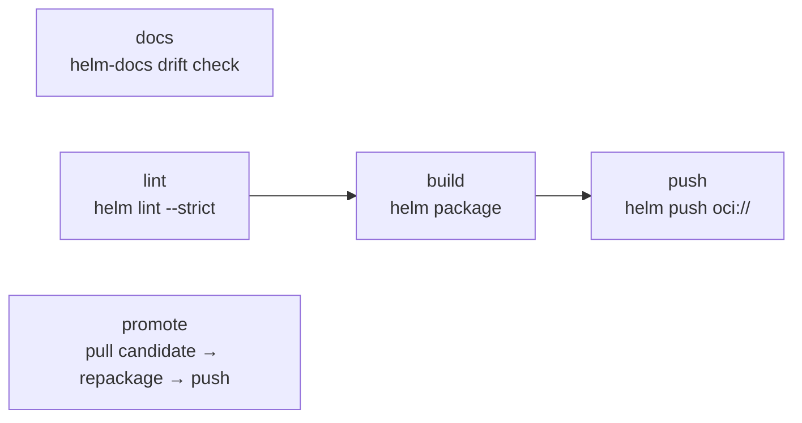

# chart

Helm chart packaging and publishing over **OCI**, the registry protocol both platforms
share. GitHub requires `CHART_REGISTRY` for publishing; there is no package-registry fallback.
See [registry configuration](../configuration.md#helm-chart-publishing--authentication).

| Workflow · Job | Description |
| --- | --- |
| `chart.yml` · `docs` | Regenerates `chart/README.md` with `helm-docs` and fails on drift, showing the diff and the exact command in the summary. |
| `chart.yml` · `lint` | `helm lint --strict`, with optional inline value overrides. |
| `chart.yml` · `unittest` | **Optional, opt-in** (`run-unittest: true`, default `false`). Renders the mock consumer chart at `mock-chart` (default `test`) with `helm unittest --strict` and uploads `chart-unittest-report`. For repositories that *ship* a chart others depend on; requires the `unittest` Helm plugin in the job image. |
| `chart.yml` · `build` | `helm package --version --app-version`. Uploads `chart-package`. |
| `chart.yml` · `push` | `helm push` to the OCI repository when `publish-candidate: true` (default). Set it to `false` for PR verification when the candidate OCI repository is not provisioned; release promotion remains separate. Writes `CHART_INFO.md` when it runs. On Docker Hub, candidate and release versions use the same namespace-root repository. |
| `chart.yml` · `promote` | Release-mode only. Pulls the exact candidate, repackages at the release tag, and pushes to production. On Docker Hub, the source and destination repository are intentionally the same. |
| `scan.yml` (`scan-type: config`, `config-type: chart`) | Renders templates, then runs a Trivy misconfiguration scan. |
| `check.yml` · `chart-existence` / `chart-dependency` | Version collision and development-dependency guards. |

[Documentation index](../../README.md)
