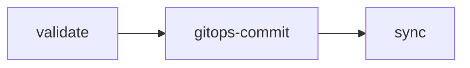

# deploy/gitops

## Komodo (`deploy-komodo-gitops.yml`)

Docker Compose stacks. Verifies the image exists, patches the compose file in the GitOps
repository, and triggers a Komodo stack redeploy.

| Input | Required | Description |
| --- | :--: | --- |
| `environment` | ✅ | Target environment |
| `komodo-stack-name` | ✅ | Komodo stack to redeploy |
| `gitops-repo` | ✅ | GitOps repository holding the compose file |
| `gitops-branch` | ✅ | Branch in that repository to commit to |
| `gitops-service-image-yq-path` | ✅ | `yq` path to the service's image field in the compose file |
| `image-repository`, `image-tag` | ✅ | Image to deploy |
| `gitops-compose-file` | | Compose file path (default `docker-compose.yml`) |
| `komodo-server` | ✅ | Komodo API endpoint |
| `dev-repository-suffix` | | Appended to the image repository (default `/dev`; normalised to `-dev` on Docker Hub) |
| `build-env` | | Extra `KEY=VALUE` lines exported before the deploy |

## ArgoCD (`deploy-argocd-gitops.yml`)

Kubernetes. Supports both **Helm mode** (patch `targetRevision` / values) and **manifest
mode** (patch an image reference), then syncs and waits for `Healthy`.

| Input | Required | Description |
| --- | :--: | --- |
| `environment` | ✅ | Target environment |
| `gitops-repo` | ✅ | GitOps repository |
| `gitops-branch` | ✅ | Branch in that repository to commit to |
| `argocd-app-name` | ✅ | ArgoCD application to sync |
| `chart-name` / `chart-version` / `chart-repository` | | Helm mode |
| `chart-values-file` / `chart-app-yq-path` | | Helm mode: which file, and the `yq` path within it |
| `manifest-file` / `new-image` | | Manifest mode |
| `image-values-file` / `image-repo-yq-path` / `image-tag-yq-path` | | Image-values mode |
| `image-repository` | | Image to deploy, when `new-image` is not given |
| `argocd-server` | ✅ | ArgoCD API endpoint |
| `argocd-version` | | ArgoCD CLI to download (default `v3.2.6`) |
| `dev-repository-suffix` | | Appended to the repository paths (default `/dev`); Docker Hub uses one chart namespace-root repository and ignores this suffix for Helm charts |
| `github-environment-name` / `github-environment-url` | | Deployment environment to record against |

[Documentation index](../../README.md)
