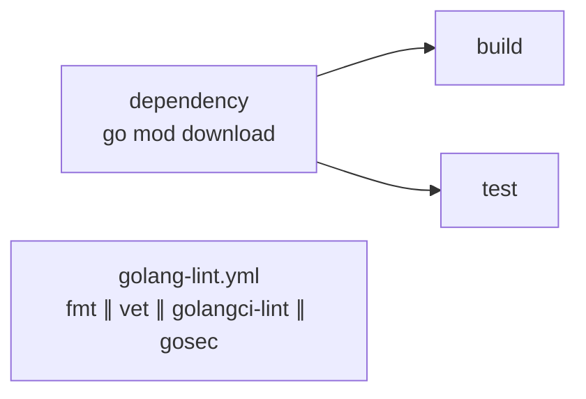

# golang

| Workflow · Job | Description |
| --- | --- |
| `golang-build.yml` · `dependency` | `go mod download`. Caches `.go-cache` keyed by `go.sum`. |
| `golang-build.yml` · `build` | `go build -trimpath -o bin/ ./...`. Uploads `go-binaries`. |
| `golang-build.yml` · `test` | `go test` piped through `go-junit-report`. |
| `golang-lint.yml` · `fmt` | `go fmt ./...`, then fails on a dirty tree. |
| `golang-lint.yml` · `vet` | `go vet`, honouring a `// govet:ignore` pragma on the preceding line. |
| `golang-lint.yml` · `golangci-lint` | Full linter aggregate. |
| `golang-lint.yml` · `gosec` | Security static analysis, excluding generated code. |

[Documentation index](../../README.md)
