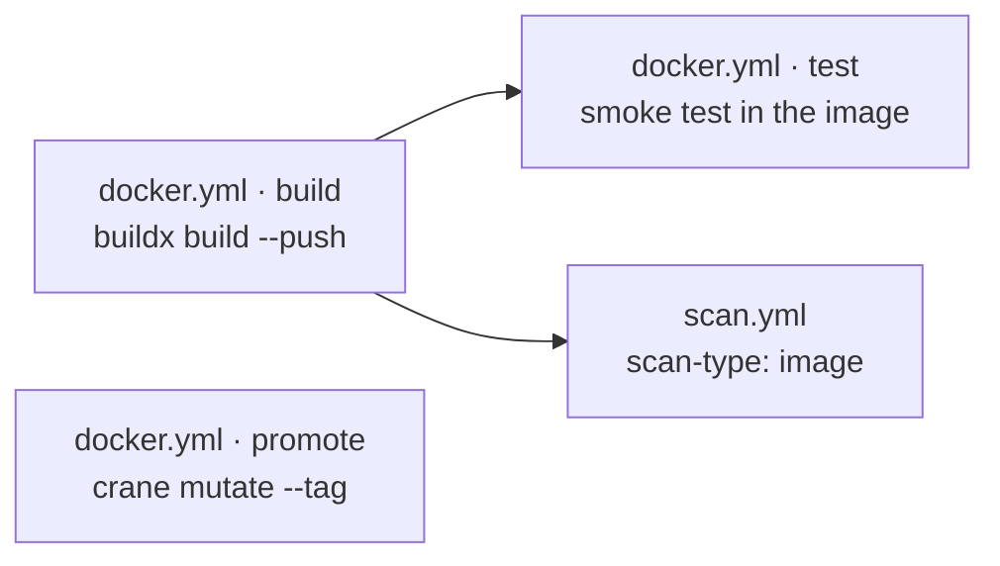

# image

Container image building and registry management, supporting both Docker/BuildKit and
Buildah.



| Workflow · Job | Description |
| --- | --- |
| `docker.yml` · `build` | Buildx build and push, with every organisation base image injected as a build argument and registry layer cache. Outputs `image-ref-digest`. |
| `docker.yml` · `test` | Optional smoke test executed **inside** the built image. Off by default. |
| `docker.yml` · `promote` | Release-mode only. Refuses unless the caller passes a successful `scan-result`. Resolves the candidate and copies it by digest with `crane mutate --tag`, then tags `latest`, `MAJOR`, `MINOR`. |
| `buildah.yml` · `build` | Dockerfile-free minimal image assembly from a base image: `microdnf install`, package-manager purge, documentation/systemd/PAM strip, `USER 10001`. |
| `buildah.yml` · `promote` | Same digest-preserving promotion as `docker.yml`. |

> [!IMPORTANT]
> `docker.yml` · `build` is the **only** job in the library that does not run inside an
> organisation build container. Building an image needs the daemon and BuildKit on the
> runner itself. Every other job, `docker.yml` · `promote` included, is
> containerised.

## Image smoke test — off unless asked for

`docker.yml` and `buildah.yml` can run a script **inside the built image** before anything
pushes or scans it. It is `test: false` by default, so a pipeline that never sets it builds
an artifact nobody executed.

| Input | Default | Meaning |
| --- | --- | --- |
| `test` | `false` | Run the smoke test at all. |
| `test-script` | `ci_image_test.sh` | Script executed inside the image, relative to `test-path`. |
| `test-path` | the project path | Directory mounted into the image at `/tmp`. |
| `test-shell` | `bash` | Interpreter the image runs it with. |

```yaml
  image:
    needs: [init, build]
    permissions:
      contents: read
      packages: write
    uses: grootan-devops/github-ci-library/.github/workflows/docker.yml@1.0.0
    secrets: inherit
    with:
      test: true
      image-tag: ${{ needs.init.outputs.image-push-tag }}
      image-repository: ${{ needs.init.outputs.image-push-repository }}
```

Assert the contract the image publishes, not the base image's contents: the entrypoint is
on `PATH` and reports the expected version, the port named in `EXPOSE` is listening, the
process is running as `10001`. A test that greps the package manifest passes on any image
and tells you nothing. GitLab's equivalent is `.Image:Test`, on the same script name.

[Dockerfile standards and examples](../docker.md) · [Documentation index](../../README.md)
