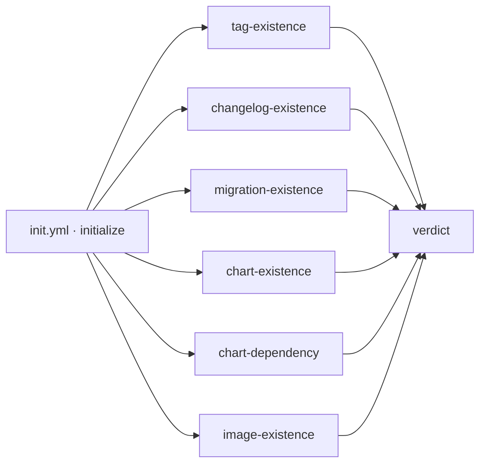

# init & check

Environment initialisation, version discovery and the release prerequisite guards.

| Workflow · Job | Description |
| --- | --- |
| `init.yml` · `initialize` | Discovers the application version from `VERSION`, `package.json`, `pyproject.toml`, `pom.xml` or `Chart.yaml`; computes the candidate suffix; resolves dev/production repositories (one shared namespace-root chart repository on Docker Hub); and on a release resolves the merged pull request and its successful run. **27 outputs.** |
| `check.yml` · `library-pin` | Fails when a reusable-workflow call pins a branch, a commit SHA or a pre-release instead of a published tag. Runs by default; set `check-library-pinning: false` temporarily while testing against a library branch, or use `allow-unstable-library-refs: true` to downgrade it to a warning. |
| `check.yml` · `tag-existence` | Fails when the git tag already exists on a different commit. A tag already on *this* commit is treated as a re-run, not a collision. |
| `check.yml` · `changelog-existence` | Extracts the `## [x.y.z]` section from `CHANGELOG.md` and renders it as an Adaptive Card fragment. Uploads `release-changelog`. |
| `check.yml` · `migration-existence` | Extracts the `previous...current` section from `MIGRATION.md`. Skipped for an initial release, or disabled with `check-migration: false` for artifacts that intentionally have no migration contract. Uploads `release-migration`. |
| `check.yml` · `chart-existence` | Fails when the chart version is already published. Candidate versions skip the collision check. |
| `check.yml` · `chart-dependency` | Fails when a chart dependency resolves to a development repository. Docker Hub uses one namespace-root chart repository, so its candidate/release path check is skipped. |
| `check.yml` · `image-existence` | Fails when the image tag is already published. |
| `check.yml` · `verdict` | Consolidates every guard into one table and one required status check. |

> [!TIP]
> Set the branch protection **required status check** to `Verdict`. It reports
> `success` only when every applicable guard passed, and names the failures when not.

## `init.yml` outputs

| Output | Example | Used by |
| --- | --- | --- |
| `tag` | `1.4.0` | `check`, `release`, promote jobs |
| `release-version` | `1.4.0` | scan target resolution |
| `is-release` | `true` | promote vs build routing |
| `version-suffix` | `-42.891` | diagnostics |
| `image-tag` / `image-push-tag` | `1.4.0` / `1.4.0-42.891` | `docker`, `buildah` |
| `image-repository` / `image-dev-repository` / `image-push-repository` | `contoso/order-backend[-dev]` on Docker Hub | `docker`, `check`, promote |
| `chart-name` / `chart-version` / `chart-app-version` / `chart-push-version` | `order-backend` / `1.4.0` / `1.4.0-42.891` | `chart` |
| `chart-repository` / `chart-dev-repository` / `chart-push-repository` | `helm[/dev]` on registries with nested paths; the same namespace root on Docker Hub | `chart`, `check` |
| `ignore-chart` / `ignore-docker` | `false` | conditional job gating |
| `upstream-run-id` / `merged-pr-number` | `18234567` / `891` | `release` artifact restore |
| `candidate-image-tag` / `candidate-chart-version` | `1.4.0-42.891` | exact promotion source |
| `major-version` / `minor-version` | `1` / `1.4` | image aliases |

[Documentation index](../../README.md)
