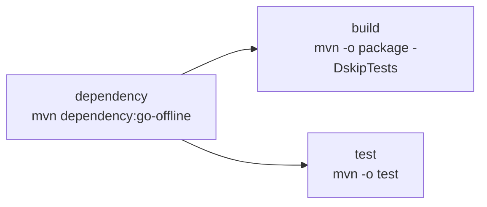

# java

| Workflow · Job | Description |
| --- | --- |
| `java-build.yml` · `dependency` | `mvn dependency:go-offline`. Caches `.m2` keyed by `pom.xml`. |
| `java-build.yml` · `build` | Offline `mvn package`. Uploads `java-artifacts` (`*.jar`, `*.war`). |
| `java-build.yml` · `test` | Offline `mvn test`; Surefire XML published as a GitHub Check. |

[Documentation index](../../README.md)
