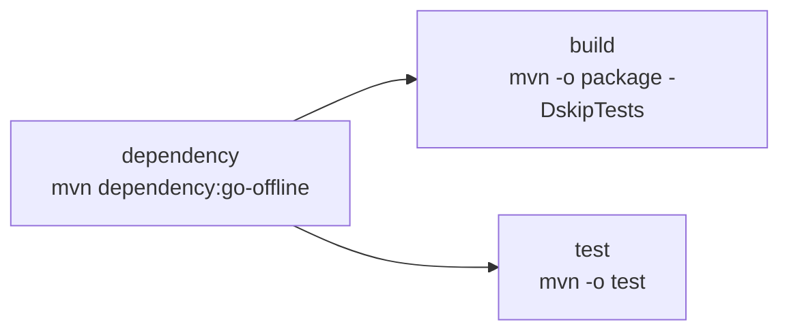

# java

```mermaid
flowchart LR
    D["dependency<br/>mvn dependency:go-offline"] --> B["build<br/>mvn -o package -DskipTests"]
    D --> T["test<br/>mvn -o test"]
```

| Workflow · Job | Description |
| --- | --- |
| `java-build.yml` · `dependency` | `mvn dependency:go-offline`. Caches `.m2` keyed by `pom.xml`. |
| `java-build.yml` · `build` | Offline `mvn package`. Uploads `java-artifacts` (`*.jar`, `*.war`). |
| `java-build.yml` · `test` | Offline `mvn test`; Surefire XML published as a GitHub Check. |

## Project rules

- Maven runs in batch mode (`mvn -B`), or the log fills with download progress.
- `package -DskipTests` and `test` are separate, so a test failure does not rebuild.
- The local repository (`~/.m2`, or Gradle's cache) is cached under one stable key shared by
  its warmer and its readers.

[Documentation index](../../README.md)
