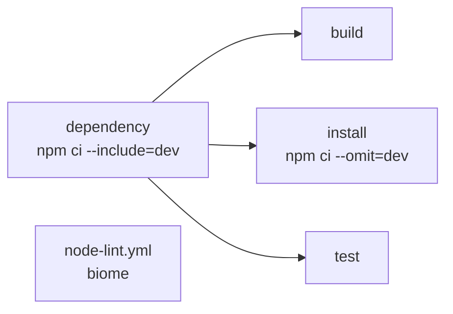

# nodejs

| Workflow · Job | Description |
| --- | --- |
| `node-build.yml` · `dependency` | `npm ci --include=dev --prefer-offline`. Caches `.npm` keyed by `package-lock.json`. |
| `node-build.yml` · `build` | Runs `build-command` (default `npm run build`). Uploads `node-dist`. |
| `node-build.yml` · `test` | Runs `test-command`, publishes JUnit as a GitHub Check. |
| `node-lint.yml` · `lint` | Biome. Fails with a starter `biome.json` in the summary when the config is missing. |

[Documentation index](../../README.md)
