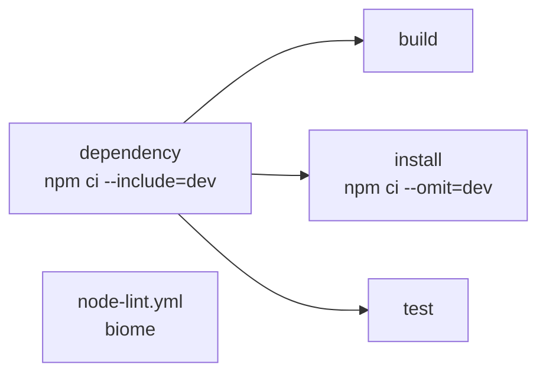

# nodejs

```mermaid
flowchart LR
    D["dependency<br/>npm ci --include=dev"] --> B["build"]
    D --> I["install<br/>npm ci --omit=dev"]
    D --> T["test"]
    L["node-lint.yml<br/>biome"]
```

| Workflow · Job | Description |
| --- | --- |
| `node-build.yml` · `dependency` | `npm ci --include=dev --prefer-offline`. Caches `.npm` keyed by `package-lock.json`. |
| `node-build.yml` · `build` | Runs `build-command` (default `npm run build`). Uploads `node-dist`. |
| `node-build.yml` · `test` | Runs `test-command`, publishes JUnit as a GitHub Check. |
| `node-lint.yml` · `lint` | Biome. Fails with a starter `biome.json` in the summary when the config is missing. |

## Project rules

- `npm ci`, never `npm install`, in a job script: `install` can rewrite the lockfile, so the
  tree tested is not the tree committed.
- Build-time variables of a single-page application (`VITE_*`, `NEXT_PUBLIC_*`) are baked into
  the bundle and readable by anyone who loads the page. Never pass a secret that way; substitute
  a placeholder at container start instead.
- A monorepo caches on the workspace lockfile and fans out per package rather than one job that
  builds everything.

[Documentation index](../../README.md)
