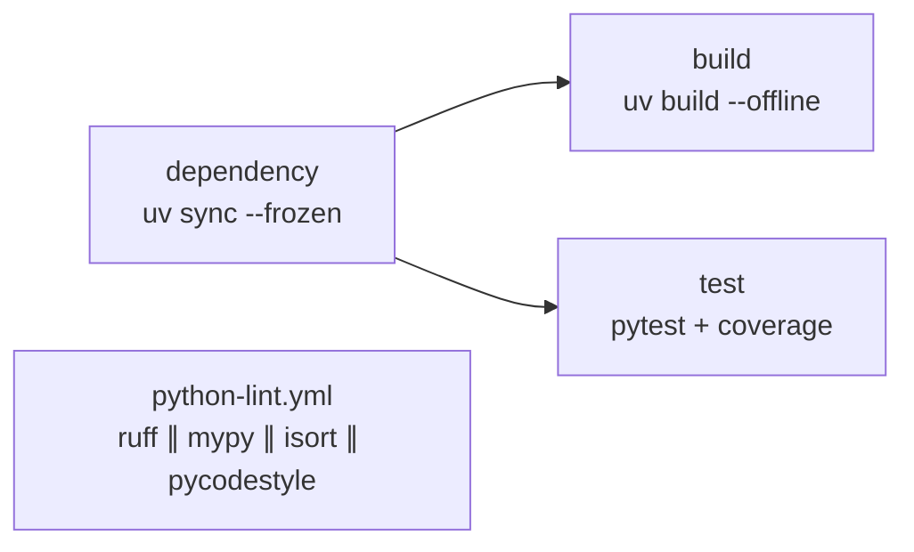

# python

| Workflow · Job | Description |
| --- | --- |
| `python-build.yml` · `dependency` | `uv sync --frozen --no-install-project`. Caches `.uv-cache` keyed by `uv.lock`. Strictly frozen — never mutates the lockfile. |
| `python-build.yml` · `build` | `uv build --offline`. Uploads `python-dist`. Not created when `build-command` is empty — an interpreted service goes `dependency` → `test`. |
| `python-build.yml` · `test` | `pytest --junitxml --cov`, published as a GitHub Check. |
| `python-lint.yml` · `lint` | Matrix of `ruff`, `mypy`, `isort`, `pycodestyle`, all in parallel. |

[Documentation index](../../README.md)
