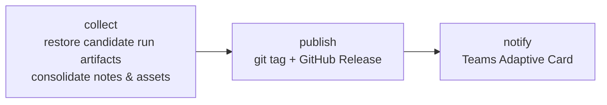

# release & notify

| Workflow · Job | Description |
| --- | --- |
| `release.yml` · `collect` | Downloads this run's artifacts and, via `gh run download`, the candidate run's. Consolidates `RELEASE_CHANGELOG.md`, `RELEASE_MIGRATION.md`, image/chart/Terraform info and every scan report into the release body, and stages the assets. |
| `release.yml` · `publish` | Creates the git tag and the GitHub Release with all staged assets. |
| `release.yml` · `notify` | Microsoft Teams Adaptive Card with the rendered release notes and links. |
| `notify.yml` | The same card, standalone. |

Release assets: the Trivy report bundle, `installed_pkgs.txt`, `sbom.cdx.json`, the chart
`.tgz`, the test report archive, `RELEASE_CHANGELOG.md`, `RELEASE_MIGRATION.md`, plus
anything named in `additional-artifacts`.

## A release promotes; it does not rebuild

`docker.yml` and `buildah.yml` gate `build` and `test` behind `!inputs.is-release`, and
`promote` behind `inputs.is-release`. A release caller therefore creates no build job at
all — it retags, by digest, the candidate its pull request already produced. The same holds
for `chart.yml`.

That leaves a choice about how much of the pull request's verification to repeat on the
default-branch push:

| Shape | Jobs on a release | Trade-off |
| --- | --- | --- |
| **Fail-closed** | `init`, `trivy-cache`, `scan`, `check`, `image`, `release` | `promote` refuses an image this run did not see scanned. Costs a second scan of an artifact that has not changed. |
| **GitLab parity** | `init`, `image`, `release` | Matches the GitLab library, where `.image-build-workflow-rules`, `.image-scan-workflow-rules` and `.image-check-rules` all end in `when: never` for a default-branch push, and `Image:Promote` declares `needs: [Common:Init]` alone. Requires `require-scan: false`. |

The second shape trusts that the candidate was scanned on its pull request. That holds only
while nothing reaches the default branch outside a pull request — so it belongs with a
protected branch, not with one anybody can push to.

**Every `release.yml` [integration example](../examples/README.md) takes the GitLab parity shape**, so each one passes
`require-scan: false` to `docker.yml` / `buildah.yml`. Drop that input and `promote` refuses
with an empty `scan-result`, which is the correct behaviour for the fail-closed shape and a
confusing failure in this one. If your default branch is not protected, use the fail-closed
shape instead and restore the `trivy-cache`, `scan` and `check` jobs alongside it.

Keeping `check` while dropping `scan` is a reasonable middle: it needs only `init`, costs
one fast job, and still refuses to re-release over a tag or image version that already
exists.

[Documentation index](../../README.md)
