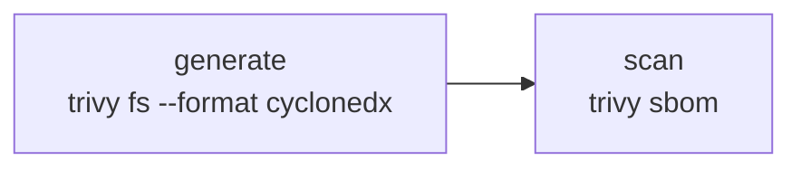

# sbom

| Workflow · Job | Description |
| --- | --- |
| `sbom.yml` · `generate` | CycloneDX `sbom.cdx.json`. Links the Maven cache into place first so Java components resolve completely. Uploads `sbom`. |
| `sbom.yml` · `scan` | Scans the generated document for CVEs. Separate job, so a scan failure is distinguishable from a generation failure and the SBOM is published either way. |

[Documentation index](../../README.md)
