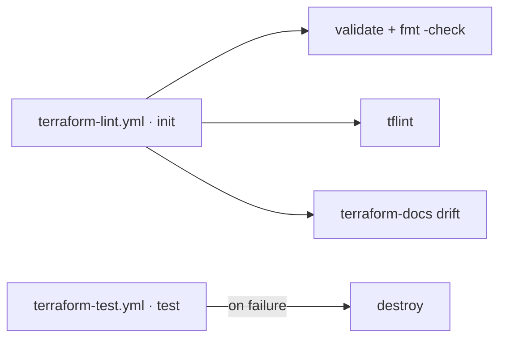

# terraform



| Workflow · Job | Description |
| --- | --- |
| `terraform-lint.yml` · `init` | `terraform init` with the backend workspace key prefix. Caches providers by `.terraform.lock.hcl`. |
| `terraform-lint.yml` · `validate` | `terraform validate` and `terraform fmt -recursive -check`. |
| `terraform-lint.yml` · `tflint` | Recursive `tflint` across all module call types. |
| `terraform-lint.yml` · `docs` | `terraform-docs` drift check for the root and every `modules/*`. |
| `terraform-test.yml` · `test` | `go test` module suite with a configurable timeout. |
| `terraform-test.yml` · `destroy` | Runs **only on test failure**, so a crashed test cannot strand real infrastructure. |
| `scan.yml` (`scan-type: config`, `config-type: terraform`) | Trivy IaC misconfiguration scan. |

## Consuming a module — no packaging step

Modules are consumed directly from git. There is no package, no registry upload and no
publish job to maintain: the git ref *is* the version.

```hcl
module "vpc" {
  source = "git::git@github.com:grootan-devops/terraform-modules.git//modules/vpc?ref=1.0.0"
}

module "eks" {
  # git::<repo_url>//<sub_folder>?ref=<tag | branch | commit>
  source = "git::git@github.com:grootan-devops/terraform-modules.git//modules/eks?ref=b4f8d29"
}
```

> [!IMPORTANT]
> Always pin `?ref=` to a tag or commit SHA. A branch ref (`?ref=main`) re-resolves on every
> `terraform init`, so a plan can change without the consuming repository changing.

[Documentation index](../../README.md)
