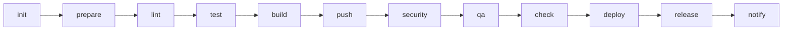
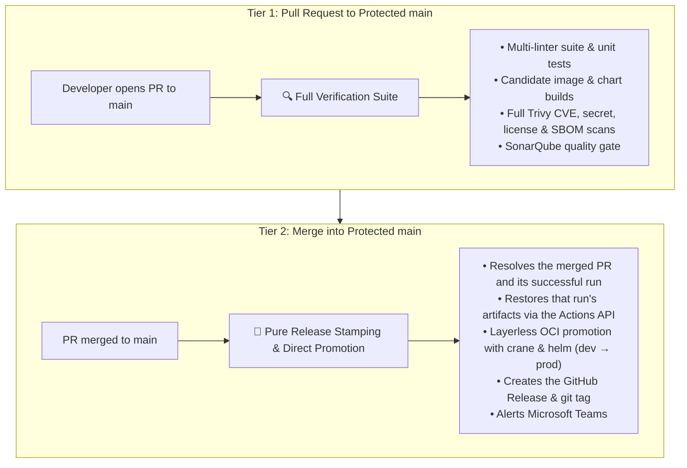
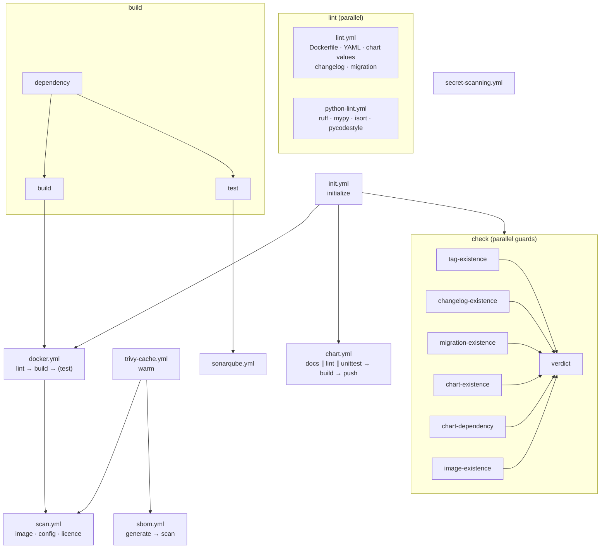
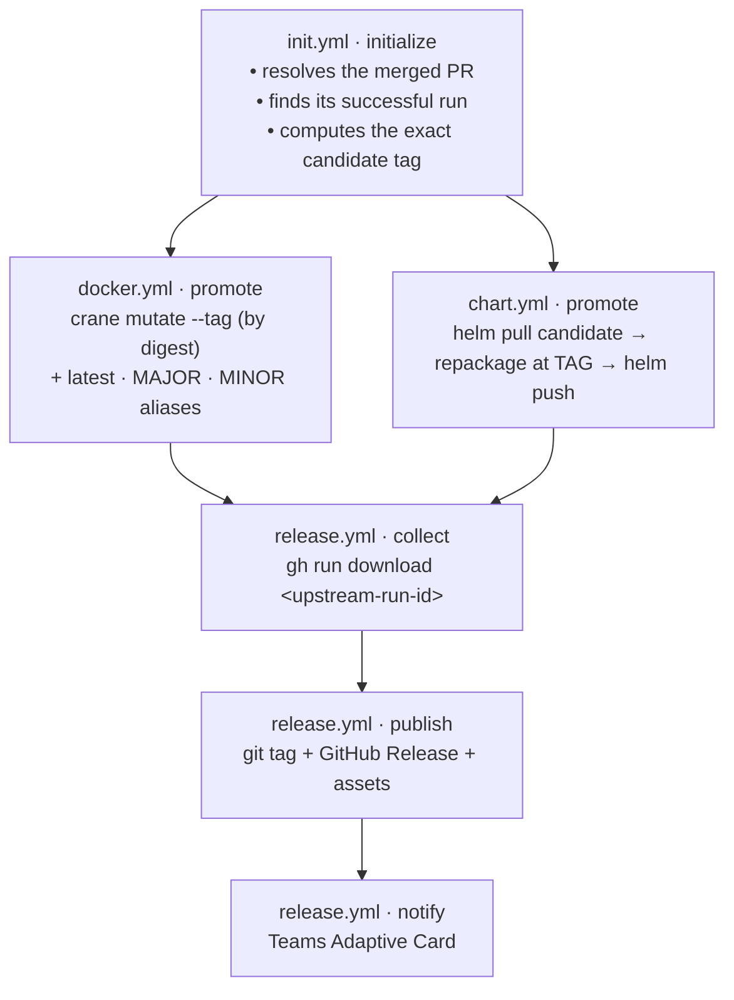
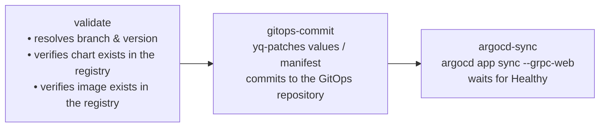
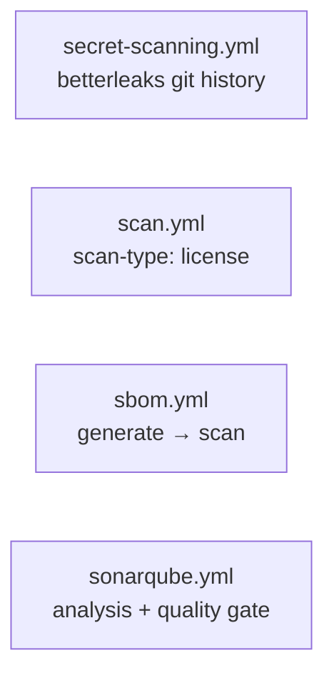

# Pipeline lifecycle

## Concurrency & cancellation

GitLab pins `interruptible: false` on the release jobs (`release/.gitlab-ci.yml:7`) and on
both deploy jobs (`deploy/gitops/.argocd.gitlab-ci.yml:148`,
`deploy/gitops/.komodo.gitlab-ci.yml:78`), so the project-level
`auto_cancel.on_new_commit: conservative` can never cancel a promotion or a deploy that is
already running.

**A reusable workflow cannot declare `concurrency:`** — the key is only valid on the
calling workflow. The guarantee therefore does not survive the port on its own; it is the
caller's to reinstate.

| Calling scenario | `group:` | `cancel-in-progress:` |
| --- | --- | :--: |
| Pull request verification | `${{ github.workflow }}-${{ github.ref }}` | `true` |
| Production release (`release.yml`) | `release-${{ github.ref }}` | **`false`** |
| GitOps deploy (`deploy-*-gitops.yml`) | `deploy-${{ inputs.environment }}` | **`false`** |

A release caller that carries `workflow_dispatch` should also refuse a ref that is not the
default branch. GitLab forbids a manual release outright (`.release-rules` sends `web` and
`api` pipelines to `when: never`); a GitHub dispatch is looser still, because it can target
any ref, so without that guard a release can be cut from a feature branch.

> [!WARNING]
> Leave a release or deploy caller at `cancel-in-progress: true` and the next push or
> dispatch cancels the run already in flight. A release cancelled between `publish` and
> `notify` leaves the git tag and the GitHub Release created but the assets and the Teams
> card never sent — and the next run will not re-cut it, because the tag is now taken. A
> deploy cancelled between the GitOps commit and the Komodo or ArgoCD sync leaves the
> cluster on the old image while the GitOps repository claims the new one. Cancelling PR
> verification costs a rebuild; cancelling a promotion costs a broken release.

## Pipeline Phases & Lifecycle

GitHub Actions has no `stages:` keyword. The GitLab stage order is expressed as `needs:`
edges between jobs, which means a job starts the moment its own inputs are ready rather
than waiting for an entire stage to drain.



| Phase | Purpose | Workflow · Job |
| --- | --- | --- |
| `init` | Version discovery, registry target resolution, promotion provenance | `init.yml` · `initialize` |
| `prepare` | Warm package manager and Trivy database caches | `*-build.yml` · `dependency`, `trivy-cache.yml` · `warm` |
| `lint` | Style, syntax, YAML, Dockerfile and chart linting | `lint.yml`, `python-lint.yml`, `golang-lint.yml`, `node-lint.yml`, `terraform-lint.yml`, `chart.yml` · `lint` |
| `test` | Unit tests and coverage, published as GitHub Checks | `*-build.yml` · `test` |
| `build` | Compile, package images and charts, generate SBOM | `*-build.yml` · `build`, `docker.yml`, `buildah.yml`, `chart.yml` · `build`, `sbom.yml` · `generate` |
| `push` | Publish candidate artifacts to the dev repositories | `docker.yml` · `build`, `chart.yml` · `push` |
| `security` | Trivy CVE, misconfiguration, license and secret scans | `scan.yml`, `sbom.yml` · `scan`, `secret-scanning.yml` |
| `qa` | Quality gates and container verification | `sonarqube.yml`, `docker.yml` · `test`, `terraform-test.yml` |
| `check` | Release prerequisite guards | `check.yml` · six guards + `verdict` |
| `deploy` | GitOps repository updates and sync | `deploy-argocd-gitops.yml`, `deploy-komodo-gitops.yml` |
| `release` | Tag, GitHub Release, OCI promotion | `release.yml`, `docker.yml` · `promote`, `chart.yml` · `promote` |
| `notify` | Microsoft Teams Adaptive Card | `release.yml` · `notify`, `notify.yml` |

> [!NOTE]
> There is no `trigger` phase. GitHub cannot call a reusable workflow from a matrix, so the
> GitLab monorepo child-pipeline pattern has no counterpart here. A repository that needs
> per-project pipelines gets one workflow file per project.

---

## Caller Dependency Map

In GitLab every job carried its own `needs:`, so the dependency graph shipped **inside** the
library. In GitHub the library ships jobs, but the edges *between* library workflows belong
to the calling workflow. This table gives, for each library workflow, the GitLab job it
ports and the `needs:` a caller must declare — derived from the GitLab `needs:` graph rather
than guessed.

Edges marked *internal* are already declared inside the library workflow; a caller must not
repeat them.

| Library workflow · job | GitLab job(s) | Caller must declare | Derived from |
| --- | --- | --- | --- |
| `init.yml` · `initialize` | `Common:Init` | *(nothing — it is the root)* | — |
| `trivy-cache.yml` · `warm` | `Trivy:Cache:Warm` | `needs: init` | `Common:Init` |
| `lint.yml` | `.YAML:Lint`, `Changelog:Lint`, Dockerfile & chart-values lint | `needs: init` | `Common:Init` |
| `node-lint.yml` | `Node:Lint` | `needs: init` | `Common:Init` |
| `python-lint.yml` | `.python-lint-common` | `needs: [init, build]` | `Python:Dependency:Download` |
| `golang-lint.yml` | `.go-lint-common` | `needs: [init, build]` | `Go:Dependency:Download` |
| `*-build.yml` · `dependency` → `build` ∥ `test` | `.Node:Build`, `.Python:Build`, `.Go`, `.java-common` | `needs: init` | `Common:Init`; the `*:Dependency:Download` edge is *internal* |
| `docker.yml` / `buildah.yml` · `lint` → `build` → `test` / `promote` | `Image:Build`, `Image:Push`, `.Image:Test`, `Image:Promote` | `needs: [init, build]` when the image copies build output, else `needs: init` | `Common:Init`; `Image:Push` → `Image:Build` is *internal* |
| `chart.yml` · `docs` ∥ `lint` → `build` → `push` / `promote` | `Chart:Check:README`, `Chart:Lint`, `Chart:Build`, `Chart:Push`, `Chart:Promote` | `needs: init` | `Common:Init`; `Chart:Build` → `Chart:Lint` is *internal* |
| `scan.yml` (`scan-type: image`) | `Image:Scan` | `needs: [init, image, trivy-cache]` | `Common:Init`, `Image:Build`, `Trivy:Cache:Warm` |
| `scan.yml` (`scan-type: config`) | `Chart:Scan` | `needs: [init, chart, trivy-cache]` | `Common:Init`, `Chart:Lint`, `Trivy:Cache:Warm` |
| `scan.yml` (`scan-type: license`) | `License:Scan` | `needs: [init, trivy-cache]` | `Common:Init` |
| `sbom.yml` · `generate` → `scan` | `SBOM:Generate`, `SBOM:Scan` | `needs: [init, trivy-cache]` | `Common:Init`, `Trivy:Cache:Warm`, `Java:Dependency:Download`; `SBOM:Scan` → `SBOM:Generate` is *internal* |
| `secret-scanning.yml` | `Git:Secret:Scan` | `needs: init` | `Common:Init` |
| `sonarqube.yml` | `Sonarqube` | `needs: [init, build]` | `Common:Init`, `Project:Build`, `Project:Unit:Test` |
| `terraform-lint.yml` | `Terraform:Init`, `Terraform:Validate`, `Terraform:Lint`, `Terraform:Check:README` | `needs: init` | `Common:Init`; `Terraform:Init` → `Validate` / `Lint` is *internal* |
| `terraform-test.yml` | `Terraform:Test` | `needs: [init, terraform-lint]` | `Terraform:Validate` **(required)**. It runs `terraform test`; the Terraform config scan lives in `scan.yml` with `scan-type: config`, `config-type: terraform`, and that is the job needing `trivy-cache`. |
| `check.yml` · six guards → `verdict` | `Tag:Tag Existence`, `Changelog:Check Existence`, `Migration:Check Existence`, `Chart:Check Existence`, `Chart:Check:Dependency`, `Image:Check Existence` | **`needs: init` — and nothing else** | `.check-job-common` → `Common:Init`. See the warning below. |
| `deploy-komodo-gitops.yml` · `validate` → `komodo-deploy` | `Deploy:Komodo:Validate:Image:<env>`, `Deploy:Komodo:<env>` | `needs: init`; add `image` when the same run pushed it | `Common:Init`, `Image:Push`; the `Validate:Image` edge is now *internal* |
| `deploy-argocd-gitops.yml` · `validate` → `gitops-commit` → `sync` | `Deploy:ArgoCD:Validate:Chart/Image:<env>`, `Deploy:ArgoCD:<env>` | `needs: init`; add `image` / `chart` when the same run published them | `Common:Init`, `Image:Push`, `Chart:Push`; the `Validate:*` edges are *internal* |
| `release.yml` · `collect` → `publish` → `notify` | `Release:Upload`, `Release`, `Release:Notification:Teams` | `needs: [init, image, chart]` — whichever of `image` / `chart` this run promotes | `Release:Upload` → `Common:Init`, `Image:Promote`, `Chart:Promote`; `Release` → `Release:Upload` **(required)** is *internal* |
| `notify.yml` | `Release:Notification:Teams` | `needs: init` **(required, not optional)**; add `check` for the changelog artifact | `Common:Init` — the library's only `optional: false` edge |

> [!WARNING]
> **`check.yml` depends on `init` alone. Never write `needs: [init, build]` or
> `needs: [init, scan]` for it.** Every guard extends GitLab's `.check-job-common`
> (`common/.gitlab-ci.yml:405`), whose only edge is `Common:Init` — not `build`, not `scan`,
> not `image`. The guards ask questions about the *repository*: does this git tag already
> exist, is this chart version taken, does a chart dependency still point at a dev
> repository. Nothing a build or a scan does can change any of those answers. Chaining the
> guards behind `build` delays the one signal that should fail fastest and, because
> `Verdict` is the required status check, holds the pull request open on a verdict
> that was knowable in seconds.

A note on the GitLab edges the table is derived from: `optional: true` there means *"ignore
this edge if the job is not in this pipeline"*, **not** *"ignore it if the job failed"*. The
GitHub equivalent is to list a job in `needs:` only when the caller actually includes it —
which is why the single-focus scenario files declare `needs: init` and nothing more. Where
the library tolerates a skipped upstream *within* its own graph it uses
`needs.<job>.result != 'failure'` rather than dropping the edge.

---

## Execution Model & Trigger Strategy

### The Two-Tier Release Model

The library implements the same **Two-Tier Release Model** as the GitLab library: maximum
developer velocity, zero redundant builds, and complete supply-chain traceability.



- **Silenced feature branches.** `on: pull_request: branches: [main]` and
  `on: push: branches: [main]` mean pushes to `dev` or `feature/*`, and pull requests
  between non-release branches, produce **zero runs**.
- **Release-branch protection on manual runs.** When a workflow is dispatched manually on
  the default branch or a protected `*/master`, `init.yml` forces a
  `-<run_number>.r<run_attempt>` candidate suffix and routes every push to the **dev**
  repositories. A manual run can never overwrite a published artifact.
- **Nothing is rebuilt for production.** `docker.yml` and `chart.yml` in `is-release: true`
  mode do not build. They resolve the candidate the pull request scanned and promote it by
  digest, so the released bytes are provably the scanned bytes.
- **Every dependency is explicit.** Jobs declare `needs:`, and optional upstreams are
  tolerated with `needs.<job>.result != 'failure'` so single-focus workflows run without
  waiting on skipped jobs.

---

### Available Scenario Workflows

GitLab exposes a `WORKFLOW` dropdown on manual runs. GitHub greys out skipped jobs in the
run graph, so **one workflow file per scenario** keeps each graph clean and lets `run-name`
be specific. Add `workflow_dispatch` to any of these for on-demand runs.

| Scenario file | Calls | Description | Key dispatch inputs |
| --- | --- | --- | --- |
| `pr.yml` | `init` + `lint` + `*-build` + `docker` + `scan` + `check` | Full pre-merge verification. | — |
| `release.yml` | `init` + `docker`/`chart` promote + `release` | Tag, promote, publish, notify. | — |
| `deploy.yml` | `deploy-argocd-gitops` / `deploy-komodo-gitops` | Targeted GitOps deployment without building. | `environment` *(required)*, `target-version` |
| `image-scan.yml` | `scan` (`scan-type: image`) | Scans an existing remote image tag. | `target-version` *(required)* |
| `chart-scan.yml` | `scan` (`scan-type: config`) | Renders and scans a local or remote chart. | `target-version`, `helm-values` |
| `license-scan.yml` | `scan` (`scan-type: license`) | Dependency licence compliance audit. | — |
| `sbom.yml` | `sbom` | CycloneDX SBOM generation + CVE scan. | — |
| `secret-scan.yml` | `secret-scanning` | Betterleaks git-history audit. | `full-history` |
| `sonarqube.yml` | `sonarqube` | Analysis and quality gate. | — |
| `lint.yml` | `lint` + language linters | Multi-linter suite. | — |
| `build.yml` | `init` + `*-build` | Build and unit test only. | — |
| `check.yml` | `init` + `check` | Release prerequisite guards only. | — |

### Only stable library versions reach a release

Three guards enforce it, and all three are on by default for every consumer:

| Guard | Rejects |
| --- | --- |
| `check.yml` · `library-pin` (GitHub) | `uses: …/workflows/x.yml@dev`, `@main`, a commit SHA, or a `-rc` tag |
| `Common:Check:Library:Pin` (GitLab) | `include: ref:` on a branch, and a `remote:` raw URL whose ref segment is not a tag |
| `check.yml` · `chart-dependency` | a `Chart.yaml` dependency on the dev repository, **or** a version that is a range (`^1.2.0`) or a pre-release |

A branch or a range moves underneath the repository: the pipeline that passed review is not
the one that ships, and the release cannot be reproduced from its tag. A commit SHA is
reproducible but opaque — it says nothing about which migrations the consumer still owes,
which is what `MIGRATION.md` chains are keyed on.

**The escape hatch is for testing only.** `allow-unstable-library-refs: true` (GitHub) and
`ALLOW_UNSTABLE_LIBRARY_REFS: "true"` (GitLab) downgrade the failure to a warning so a pull
request can track a library branch while that branch is still being written. The run then
says so loudly in its summary. Leaving it on defeats the guard entirely — a release cut with
it enabled is pinned to nothing.

```yaml
  check:
    needs: init
    uses: grootan-devops/github-ci-library/.github/workflows/check.yml@1.0.0
    secrets: inherit
    with:
      tag: ${{ needs.init.outputs.tag }}
      # TESTING ONLY -- remove before merging.
      allow-unstable-library-refs: true
```

> [!NOTE]
> The stable `1.0.0` tag is published and current consumers pin it. Keep the testing escape
> hatch limited to short-lived branch validation and remove it before releasing.

---

### Comprehensive Execution Matrix

| # | Scenario | Trigger | Automatic? | Jobs | Scope & Primary Purpose |
| --- | --- | --- | :---: | :---: | --- |
| **1** | **PR to the default branch** | `pull_request` → `main` | ✅ Yes | ~30 | **Full verification suite**: linters, unit tests, candidate image and chart builds, CVE scans, SonarQube gate. |
| **2** | **Production release** | `push` → `main` | ✅ Yes | 6 | **Release stamping & OCI promotion**: resolves the PR's run, promotes candidate image/chart by digest, creates the GitHub Release and tag, alerts Teams. Zero builds, tests or scans. |
| **3** | **Branch push / non-release PR** | `push` → `dev`, `feature/*` | ❌ No | 0 | **Silenced**: no runner minutes consumed on developer branches. |
| **4** | **Deploy (ArgoCD / Komodo)** | `workflow_dispatch` | 🔘 Manual | 3 | **Targeted GitOps deployment**: validates inputs, verifies the image and chart exist, commits to the GitOps repository, syncs. |
| **5** | **Container image scan** | `workflow_dispatch` | 🔘 Manual | 1 | **Remote image scan**: resolves the tag against the prod or dev repository and runs Trivy. |
| **6** | **Helm chart scan** | `workflow_dispatch` | 🔘 Manual | 1 | **Chart security scan**: `helm template` render, then Trivy config scan. |
| **7** | **Git secret scan** | `workflow_dispatch` | 🔘 Manual | 1 | **Secret audit**: full git history via betterleaks. |
| **8** | **Licence compliance scan** | `workflow_dispatch` | 🔘 Manual | 1 | **Open-source audit** against the licence classification policy. |
| **9** | **SBOM generation & scan** | `workflow_dispatch` | 🔘 Manual | 2 | **SBOM audit**: CycloneDX generation, then component CVE scan. |
| **10** | **SonarQube analysis** | `workflow_dispatch` | 🔘 Manual | 1 | **Code quality gate**. |
| **11** | **Multi-linter suite** | `workflow_dispatch` | 🔘 Manual | 5–9 | **Unified linting**: Dockerfile, YAML, chart values, changelog, migration guide, plus language linters in parallel. |
| **12** | **Image build & push** | `workflow_dispatch` | 🔘 Manual | 4 | **Isolated image pipeline**: lint, build, push to dev, scan. |
| **13** | **Chart build & push** | `workflow_dispatch` | 🔘 Manual | 4 | **Isolated chart pipeline**: docs check, lint, package, push. |
| **14** | **Build & unit test** | `workflow_dispatch` | 🔘 Manual | 3 | **Isolated build**: dependency resolution, build, unit tests. |
| **15** | **Release prerequisites check** | `workflow_dispatch` | 🔘 Manual | 7 | **Pre-flight verification**: git tag, changelog, migration guide, chart version, chart dependencies, image tag, verdict. |

---

## End-to-End Workflow DAGs & Architecture

### 1. Automatic Pull Request Verification

> **Trigger:** `pull_request` targeting the protected default branch (`main`).



Every leaf publishes a step summary and, where applicable, GitHub Check annotations on the
changed lines. `fail-fast: false` on every matrix means one run reports every problem
rather than the first.

---

### 2. Fast-Track Production Release Tagging & OCI Promotion

> **Trigger:** `push` to the default branch (a merged pull request).



Nothing is compiled, tested or scanned in this graph. The scan reports attached to the
release are the ones the pull request produced, restored from that run.

---

### 3. GitOps Targeted Deployment

> **Trigger:** `workflow_dispatch` with an `environment` input.



The validate job refuses to commit a GitOps change that cannot resolve, so a typo in a
version never reaches the cluster as a broken `Application`.

---

### 4. Standalone Quality & Security Audits

Each audit is a single reusable workflow with no `init.yml` dependency, so it runs in
isolation with no version-resolution overhead.



[Documentation index](../README.md)
